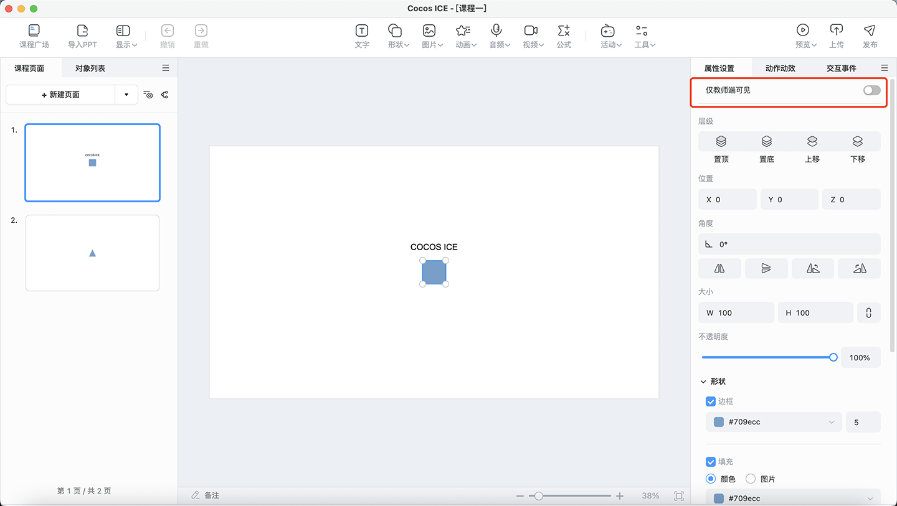
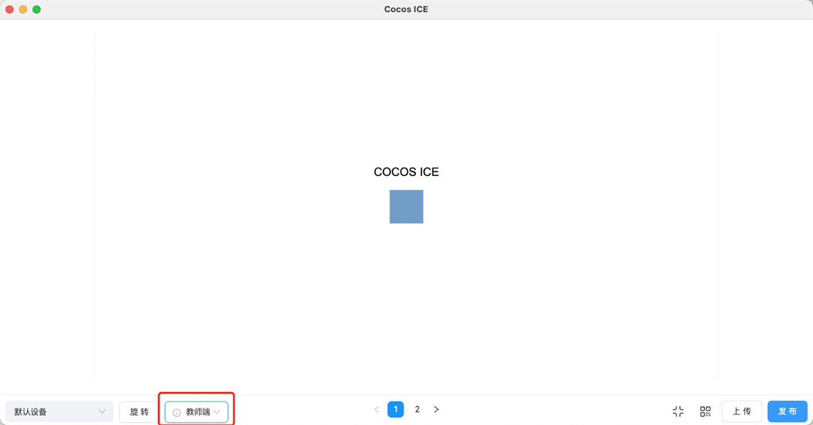

# 多端控制配置

该配置适用于 1 对 1、小班课、大班课、双师课等区分老师端和学生端的课程，可以通过配置让老师轻松控制部分内容对学生不显示。

- **配置类型**：`editor` 编辑器配置信息。

- **JSON 配置示例**：

    ```
    "client-mode": {
        // 是否启用教师端可见功能
        "enable": false,
    }
    ```

- 此时在 ICE 里面选中任意节点，就能看到仅教师端可见的开关，老师只要打开这个开关，就可以实现教师端可见的功能。

    

- 可以在预览窗口进行学生端画面或者教师端画面的预览。

    
