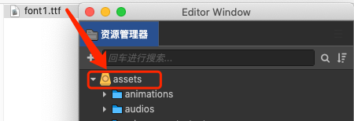
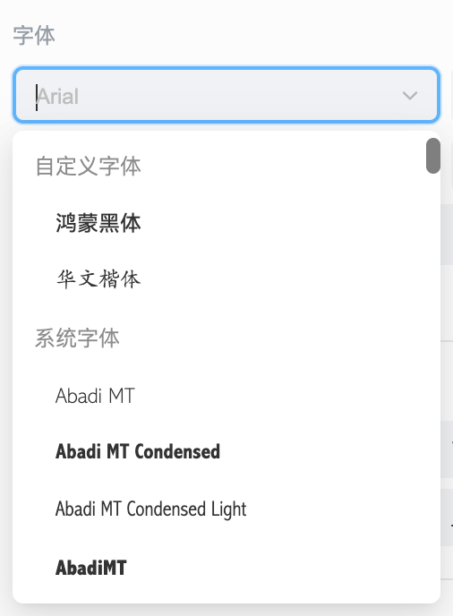

# 文字配置

## 字号配置

- **配置类型**：`editor` 编辑器配置信息。

- **类型定义**：

    ```ts
    type FontSizes = number[];
    ```

- **JSON 配置示例**：

    ```json
    {
      "font-sizes": [12, 24, 32, 48]
    }
    ```

## 字体配置

可以配置企业拥有版权的字体到下拉选项供用户选择使用。

- **导入字体**：首先，需要在编辑器中导入目标字体文件。切换到研发模式，将准备好的字体文件拖拽到资源管理器即可完成字体的导入工作，建议使用 `.ttf` 格式的字体文件。

  

- **配置类型**：`editor` 编辑器配置信息。

- **JSON 配置示例**：

  ```json
  {
    "font-families": [
      { "label": "楷体", "value": "kaiti" }
    ]
  }
  ```

  `label` 是列表显示的名字，`value` 为该选项的值，这个值必须是编辑器中的某个字体资源 uuid，否则也无法正常工作。uuid 需要通过以下方式获取：

    

- **配置效果**：选择字体时，配置的字体会按照顺序显示在 **自定义字体** 下。

    

> **注意**：在不同电脑导入字体 uuid 不同，使用时字体将无法被判断为相同，建议企业在一台电脑上导入并配置好字体后二次打包分发给企业内用户。
