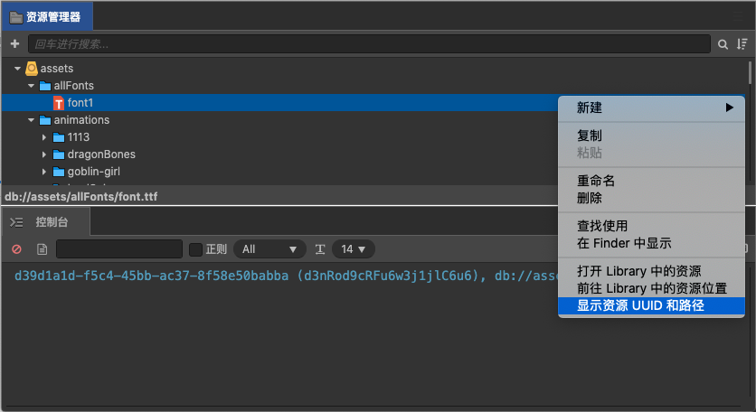

# 属性配置

## 属性分组配置

### 是否显示分组

只需要在配置文件 `edu-settings.json` 文件中进行如下配置，即可开启属性折叠功能。此时，属性面板就会按照脚本，把每条属性的折叠按钮显示出来。

```js
components: {
    collapsible: false,
},
```

### 自定义分组名字

#### eduClass 修饰器

| 属性 | 说明 | 默认值|
| :--- | :--- | :---: |
| name       | 定义组件在教育编辑器属性面板的分组名 | 类名 |
| collapsible|组件是否在教育编辑器属性面板显示分组标题名|true|

#### 示例

```js
import {eduClass} from "education"

@eduClasss({name:'图片', collapsible: true})
export default class EduImage extends EduElementAbstract{
}
```

## 文字属性配置

### 字号配置

- **配置类型**：`editor` 编辑器配置信息。

- **类型定义**：

    ```ts
    type FontSizes = number[];
    ```

- **JSON 配置示例**：

    ```json
    "fontSizes": [12, 24, 32, 48]
    ```

### 字体配置

可以配置企业拥有版权的字体到下拉选项供用户选择使用。

```json
{
  "font-families": [
    { "label": "楷体", "value": "kaiti" }
  ]
}
```

> **注意**：
>
> 1. 需要在编辑器中导入目标字体文件才能正常生效。进入到研发模式，将准备好的字体文件拖拽到资源管理器即可完成字体的导入工作，建议使用 `.ttf` 格式的字体文件。
>
>    
>
> 2. `label` 是列表显示的名字，`value` 为该选项的值，这个值必须是编辑器中的某个字体资源 uuid，否则也无法正常工作。 uuid 需要通过以下方式获取：
>
>    
>
> 3. 插入字体时，会自动使用第一项配置作为默认字体，若没有配置，默认使用 Arial。

## 颜色预设配置

- **配置类型**：`editor` 编辑器配置信息。

- **类型定义**：

    ```ts
    type presetColors = string[];
    ```

- **JSON 配置示例**：

    ```json
    "presetColors": ["#000000", "#ffffff"]
    ```
