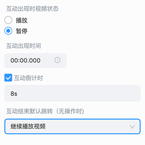

# 互动视频配置

## 播放器背景色配置

支持将视频的播放器背景由默认的黑色改为其他颜色。

- **配置类型**：`editor` 编辑器配置信息。

- **JSON配置示例**

  ```json
  components:{
    "EduMovie":{
        "background-color":"#ffffff"
    }
  }
  ```

>**注意**：部分平台或浏览器可能导致该修改无效，请注意充分测试。

## 互动组件结束互动时的默认跳转配置

互动组件结束互动时默认可以选择 **继续播放视频**，可以自定义选项提供给老师选择。



示例代码：

```ts
import { Action }, interactiveFinishAction  from 'InteractiveFinishAction'
interactiveFinishAction.register(
    new Action(
        '测试选项', // 选项的名字
        'test-key', // 选项的唯一标识名，不允许重复，否则会提示注册失败
        ()=>{
            // 选项的具体执行逻辑
            console.log('i am test ...')
        }
    )
)
```

如上所示，就能在该下拉选项中增加一个 **测试选项**，当用户配置了这个 **测试选项** 后，互动组件在结束互动时，就会执行对应的选项回调。
