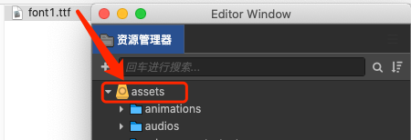
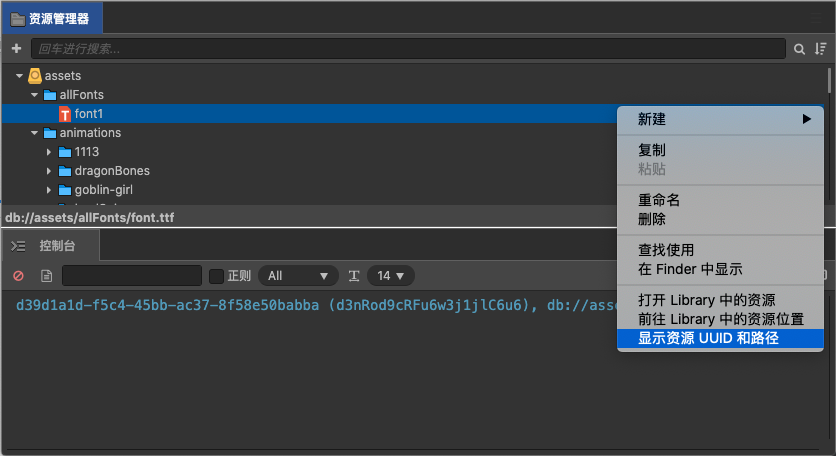

# 文字属性配置

## 配置字号下拉选项

```js
fontSizes: [
  10, 12, 14, 16, 20, 24, 28, 32, 36, 48, 64, 72, 96, 128,
]
```

## 配置字体下拉选项
可以配置企业拥有版权的字体到下拉选项供用户选择使用。
```js
fontFamilies: [
  { label: '楷体', value: 'kaiti' }
]
```
> **注意**： 
> 1. 需要在编辑器中导入目标字体文件才能正常生效。进入到研发模式，将准备好的字体文件拖拽到资源管理器即可完成字体的导入工作，建议使用 `.ttf` 格式的字体文件。
> 
>     
> 2. `label` 是列表显示的名字，`value` 为该选项的值，这个值必须是编辑器中的某个字体资源 uuid，否则也无法正常工作。 uuid需要通过以下方式获取：
>     
> 3. 插入字体时，会自动使用第一项配置作为默认字体，若没有配置，默认使用 Arial。
