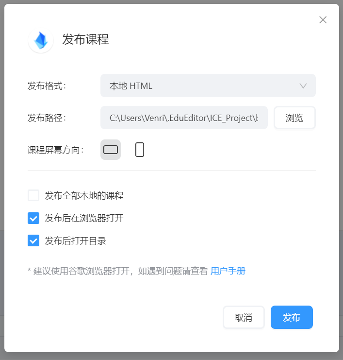
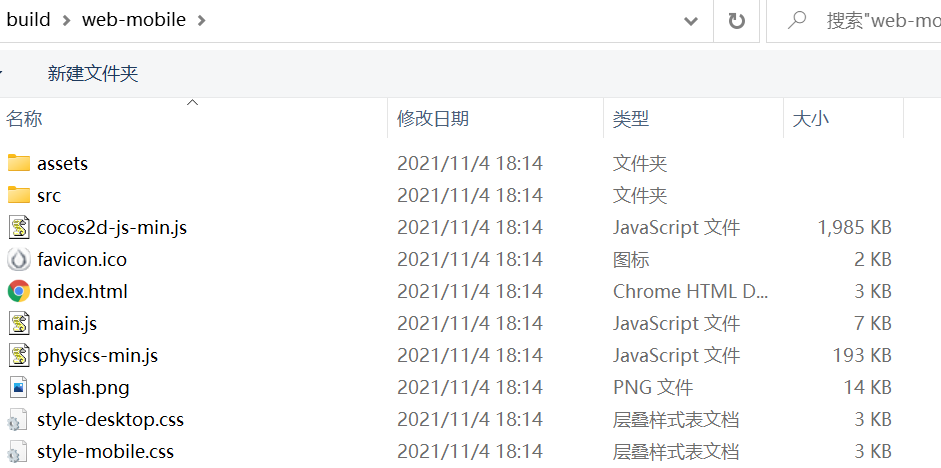

# 项目部署

Cocos ICE 课件创作完成后需要简单部署才能放在外网供他人使用。
- [课程发布](#课件发布)
- [服务器部署](#服务器部署)
    - [下载与安装](#下载与安装)
    - [环境搭建](#环境搭建)
    - [项目启动](#项目启动)

## 课件发布

第一步，点击编辑器右上角 **发布** 按钮进行项目发布。

 

课程发布格式默认为 **HTML** 格式，发布成功后文件结构如下：



## 服务器部署

课件发布后的项目不能直接通过打开 **index.html** 预览，需要部署到相应的环境访问 URL 预览。

### 下载与安装

下载最新 **Node.js** 安装包，推荐官网下载： `https://nodejs.org/zh-cn/`

安装完成之后检测是否安装成功，控制台输入 `node -v` ,出现如下图即为安装成功:


(更多安装细节请参考菜鸟教程：`https://www.runoob.com/nodejs/nodejs-tutorial.html`)

### 环境搭建

安装完 **Node.js** 之后，还需要安装相应的环境依赖，推荐使用 **Express框架** ,命令行环境执行下面的命令来安装：

```js
$ npm install express --save
$ npm install express-generator -g
```

安装完成后，在命令行环境下执行 `express -V` ，可以看到express的版本是 4.16.1。


现在我们使用express命令来创建一个默认的网站,在命令行环境下执行下面的命令：

```js
$ express iceDemo
```

可以看到控制台输出 **iceDemo** 工程目录：


( express 默认生成的是 jade 模板工程，如果想要使用 ejs 模板，请在命令后面加上 `--ejs` )

运行课件包我们只需要将打包好的课件 **web-mobile** 文件夹复制到public文件夹中，启动项目即可。

### 项目启动

安装所有依赖包（只需要执行一次）：

```js
$ cd iceDemo
$ npm install
```

在 MacOS 或 Linux 中，通过如下命令启动此应用：

```js
$ DEBUG=myapp:* npm start
```

在 Windows 命令行中，使用如下命令:

```js
> set DEBUG=myapp:* & npm start
```

然后在浏览器中打开 `http://localhost:3000/` 网址或您的外网网址就可以看到这个应用了。

