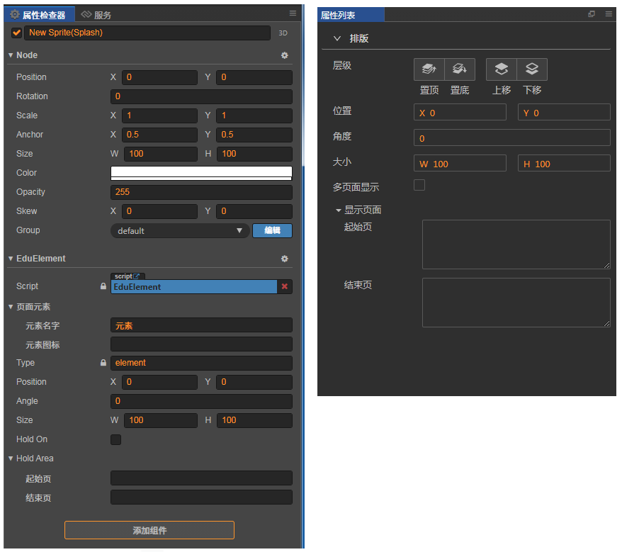
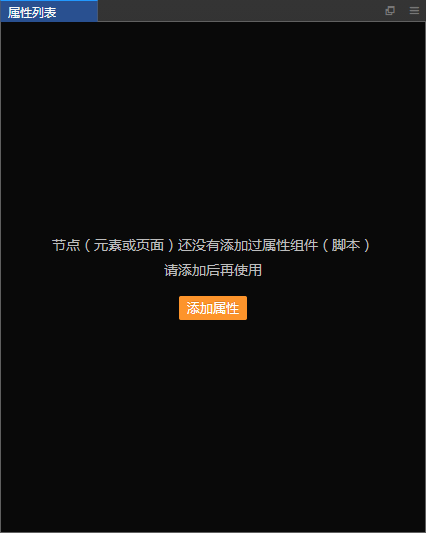
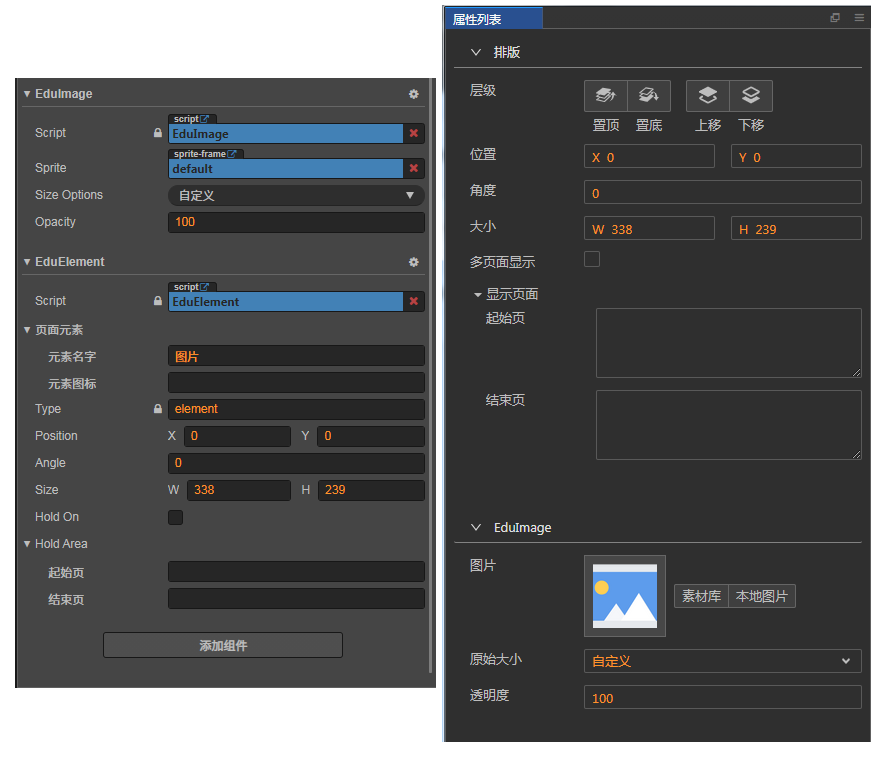

# 自定义属性

## 显示属性的条件

如果一个属性想要在属性面板中显示，必须满足以下规则：

1. 脚本必须继承 `EduElementAbstract`
2. 必须使用 `@eduProperty` 定义属性

> **注意**：`EduNodeProp`、`EduCompProp` 暂时不支持！

## 示例

`EduElement` 脚本自身也遵守该规则：

```
import { eduProperty, i18n } from "education";
import EduElementAbstract from 'EduElementAbstract'

// 继承自 EduElementAbstract
export default class EduElement extends EduElementAbstract {

  // ....
  
  // property 正常使用，不受影响
  @property({
      type: cc.Boolean, // 不再限制必须为：EduNodeProp，EduCompProp
      displayName: "多页面显示",
  })
  // 使用 @eduProperty 定义属性
  @eduProperty({
     displayOrder: 4,
     // 不要和 property.displayName 混淆，两者没有任何关系，这是为了降低学习成本而设计的。
     displayName: i18n('element.com.holdOn'), 
  })
  holdOn = false;
    
  // ....   
}
```

然后将 `EduElement` 脚本添加到节点上，属性面板便会默认将 `EduElement` 的 `attribute` 属性显示在 **排版** 中：



## 交互

如果节点上没有任何继承自 `EduElementAbstract` 的脚本，会如下图提示：



点击 **添加属性**，会默认添加 `EduElement` 脚本，内部细节，参考上述的例子。

## 扩展

当然，也支持添加多个继承 `EduElementAbstract` 的脚本，属性面板会罗列出所有继承 `EduElementAbstract` 的脚本，
并显示脚本中的属性。



如果你希望自己的组件，也能够显示到属性面板，有2种方式：

1. 在已有的脚本上进行修改:

    - 调整继承自 `EduElementAbstract`。

    - 将需要在属性面板显示的属性，增加 `@eduProperty` 修饰器。

2. 新建一个脚本，并添加到节点上：

    - 新建的脚本继承自 `EduElementAbstract`。

    - 将需要在属性面板显示的属性，增加 `@eduProperty` 修饰器。

你的选择取决于你喜欢哪种。

> 关于折叠组件的 head(`EduImage`) 自定义，需要进一步完善。

## `@eduProperty` 参考字段
 
| 字段 | 说明 |
| :-- | :-- |
| displayName  | 属性显示在面板上的名字，支持 i18n（`i18n:xxx`）|
| displayOrder | 属性的排序，按照 **1,2,3,4...** 的顺序，从上到下依次排列 |
| multiline    | 当属性是字符串时，支持多行编辑 |
| visible      | 属性是否显示，支持 `function` |
| inspect      | 为当前属性自定义面板  |
| enumDisplay  | 自定义属性的下拉可选值 |
| enumListType | 检索属性下拉可选值的类型，可选值为：`page`（所有页面）、`video`（当前页面的所有视频） |
| min          | 最小值，仅对 `number` 类型有效 |
| max          | 最大值，仅对 `number` 类型有效 |
