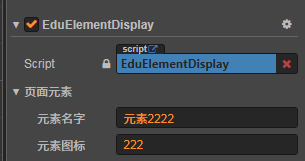

# 节点设置

## 节点树

节点树会显示当前画布上的所有组件，包括子组件

## 原理

如果节点添加了`EduDisplayComponent`脚本，那么节点树就会显示该节点。

```js
@ccclass('EduTreeInfo')
class EduTreeInfo {
    @property({ type: cc.String, displayName: '元素名字' })
    name = '元素';

    @property({ type: cc.String, displayName: '元素图标' })
    icon = '';
}

export class EduDisplayComponent extends EduBaseComponent {
    @property({ type: EduTreeInfo, displayName: '页面元素', tooltip: '该属性会被页面元素面板识别' })
    treeInfo = new EduTreeInfo();
}
```

- 节点树的名字会使用：treeInfo.name

- 节点树的图标会使用：treeInfo.icon


