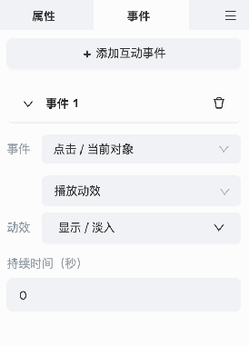

# 自定义事件

## 介绍

在介绍事件系统之前，有必要统一一下术语，如下图所示，我们将每个事件分解为 3 部分：


1. 事件：这里面会罗列出所有已经注册的事件名
2. 动作: 这里面会罗列出所有已经注册的动作名
3. 动作数据：罗列每个动作的具体参数

在上图中，大致运行逻辑可以解读为：

给某个元素添加了一个事件，当点击当前元素的时候，会从头 (`Start`) 播放选中的目标视频。

## 自定义事件

让我们先看一个点击事件的示例代码：

```javascript
import eventLibrary from 'EventLibrary';
import { Event, EventTargetType } from 'EventDecorator';

const { ccclass, property } = cc._decorator;
export const Type = 'click-self';

@ccclass
export default class EventClickSelfEmitter extends cc.Component {
    onEnable() {
        let node = this.node;
        node.once(
            cc.Node.EventType.TOUCH_START,
            () => {
                node.emit(Type);
            },
            node,
        );
    }
}

eventLibrary.registerEvent({
    name: '点击/当前',
    type: Type,
    target: EventTargetType.Self,
    requiredComponent: EventClickSelfEmitter,
});
```

使用 `eventLibrary.registerEvent` 接口，即可注册一个事件，具体的参数说明如下：

- `name`：在 UI 面板上展示的事件名字，如果名字中带有分隔符 `/`，会自动解析为级联菜单。

    

- `type`：当事件触发时，对外抛出的事件名。

- `visible`：默认为 `true`。如果事件不想出现在列表中，需要将其设置为 `false`。

- `requiredComponent`：每一个事件都需要绑定一个类似触发器的脚本，用来编写事件是如何触发的，触发事件一般采用 `node.emit('event.type')`。

- `acceptedComponents`：添加事件的节点必须拥有指定组件（一般为继承自 `cc.Component` 的组件）时，才能添加该事件。若该参数未设置，则事件的添加不受节点脚本的影响。

- `target`：事件的触发目标类型。
    - `Self`：添加事件的节点自身。
    - `Any`：任意地方。
    - `Page`：页面。

- `acceptedActions`：设置该事件可选的动作。当该参数未设置时，默认所有动作可选。

- `unacceptedActions`：设置该事件排除的动作。

### 关于 EventClickSelfEmitter

每个事件都有一个配套的触发器，需要开发者自行实现触发的逻辑，当调用 `node.emit('event.type')` 时，与之绑定的动作就会被执行。

## 自定义动作

```
import { Action, eduAction } from 'EventDecorator';
import { eduProperty } from 'education';

@ccclass('VideoPlayAction')
@eduAction({ name: '播放视频' })
export default class VideoPlayAction extends Action {
    @property({ displayName: '播放目标' })
    @eduProperty({ displayName: '播放目标', enumListType: 'video' })
    target = '';
    
    // ....
    
    run(node){
    
    }
}
```

使用 `@eduAction` 装饰器即可定义一个动作，具体的参数如下：
- `name`：UI 面板上展示的动作名字
- `visible`：默认为 `true`。如果动作不想出现在列表中，需要将其设置为 `false`。

动作的类型值是由 `@ccclass` 决定。

### 关于 run

每个动作被触发时，都会调用 `run`，而参数 `node`，跟事件的 `target` 有关系。

动作的具体逻辑，需要开发者在此实现。

### enumListType

你可能注意到了，`@eduProperty` 中新增了一个参数 `enumListType`，目前可选值有：

- page

    

    `page` 目前应用在页面跳转的跳转页面参数上，`enumListType = 'page'` 时，该属性会自动变为带可选值的下拉框类型，供用户选择。

    可选值来自当前课程的所有页面。

- video

    `video` 目前应用在播放视频动作的播放目标，`enumListType = 'video'` 时，该属性会自动变为带可选值的下拉框类型，供用户选择。

    可选值来自当前 page 的所有视频。

## 自定义动效

### 介绍

在整个事件系统中，**播放动效** 是一个比较特殊的存在，基本的使用方式区别不大


使用的时候，具体的动效需要二次选择，比如选择淡入后，就会展示出淡入动效的具体参数：



### 定义动效

```
import { eduProperty } from 'education';
import { AniEffect, eduEventAniEffect } from 'EventDecorator';

const { ccclass, property } = cc._decorator;

@eduEventAniEffect({ name: '淡入', group: '显示' })
@ccclass('FadeIn')
class FadeIn extends AniEffect {
    @property()
    @eduProperty({ displayName: '播放时长' })
    duration = 0;

    run(targetNode: cc.Node) {
        targetNode.opacity = 0;
        let act = cc.fadeIn(this.duration);
        targetNode.runAction(
            cc.sequence([
                act,
                cc.callFunc(() => {
                    cc.log('action over!');
                }),
            ]),
        );
    }
}

```

`@eduEventAniEffect` 装饰器用来注册动效，最终会在这里展示：


具体的参数有：

- name：UI 界面上显示的动效名字。
- icon: 动效的图标。
- group：动效的分组名字，相同分组名的动效会归为一组。

> 动效的类型，由类名决定。

#### 动效的参数

和定义属性一样，通过 `@property`、`@eduProperty` 即可定义动效的属性参数。

当选择该动效时，动效的参数就会在 UI 面板上显示出来。

#### run

当动效被执行时，会调用 run 方法，其中 targetNode 参数，为事件设置的 `target`。
