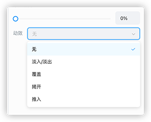

# 自定义页面动效

课件当前已经支持页面动效，并且支持自定义页面动效。

## 介绍

页面动效初衷是为了让课件页面切换时更加流畅、自然，并提供自定义页面切换动画方便用户自行创建页面切换效果。

当前已有页面动效如下图所示：



## 示例代码

让我们先来看一个淡入/淡出动效的代码：

```javascript
import {
    ICEPageTransitionBase,
    IICEEventPageTransitionRegister,
} from '../../base/ICEPageTransitionBase';
import i18n from '../../../../i18n/i18n';
import { iceEvent } from '../../ICEEvent';
import { ICEParamAbstract } from '../../base/ICEEventTypes';
const EventKey = 'ice-page-fade-in';
const { ccclass, property } = cc._decorator;
@ccclass
export default class ICEPageFadeInImpl extends ICEPageTransitionBase {
   
    @property()
    key: string = EventKey;
    @property()
    duration: number = 1;
    @property(cc.Node)
    curPage = null;// 等待切换的页面
    @property(cc.Node)
    prePage = null;// 上一个页面

    initAction(prePage: cc.Node, curPage: cc.Node): Promise<void> {
        return new Promise((rs, rj) => {
            this.prePage = prePage;
            this.curPage = curPage;
            rs && rs();
        });
    }

    runAction(): Promise<void> {
        return new Promise((rs, rj) => {
            rs && rs();
        });
    }

    reset(): void {}
}

export const ICEPageFadeIn: IICEEventPageTransitionRegister = {
    name: i18n.t('iceEvent.pageTransition.name.fadeIn'),
    key: EventKey,
    pageTransition: ICEPageFadeInImpl,
};
iceEvent.registerPageTransition(ICEPageFadeIn);
```

### 关于 ICEPageTransitionBase

每一个页面动效都需要绑定一个脚本，用于编写实现页面切换的具体逻辑，脚本必须继承 `ICEPageTransitionBase`。

参数说明如下：

- `key`：页面动效标识。

- `duration`：页面动效持续时间。

- `curPage`：等待切换的页面。

- `prePage`：切换前页面。

方法说明如下：

- `initAction`：用于动效初始化操作，一般用于初始化 `curPage` 和 `prePage`，入参说明如下：

    - `curPage`：等待切换的页面。

    - `prePage`：切换前页面。

- `runAction`：页面动效执行入口。

- `reset`：重置动效。

### 注册页面动效

使用 `eventLibrary.registerPageTransition` 接口，即可注册一个页面动效，具体的参数说明如下：

- `name`：在 UI 面板上展示的切换动效名字。

- `key`：页面动效标识。

- `pageTransition`：每一个页面动效都需要绑定一个脚本，用于编写实现页面切换的具体逻辑，脚本必须继承 `ICEPageTransitionBase`。

注册成功之后，切换动效会展示在属性面板中的 `动效` 选项中。

## 最后

至此，您已经成功编写了一个自定义页面动效，从代码逻辑中不难看出，在页面动效执行之前，新页面和旧页面同时存在，合理的控制好新页面的进场和旧页面的退场将会使您的动效更加生动。
