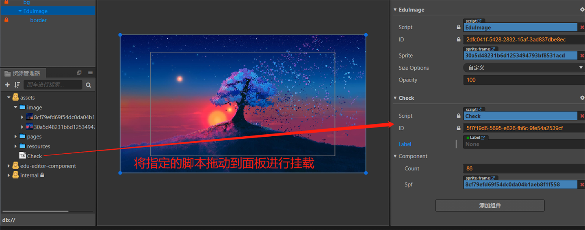

# 自定义面板

## 1、自定义面板的入口声明

自定义面板的接入需要依赖于 Cocos 的脚本组件，在 Cocos 的脚本组件中定义指定的入口,以及对应的属性，并且把对应的脚本挂载到需要显示的组件上

```js
    const {ccclass, property, inspector} = cc._decorator;

    import { eduProperty, i18n } from "education";

    import EduElementAbstract from 'EduElementAbstract'

    @ccclass('CheckUi')
    @inspector('packages://edu-editor/check_ui/index.js')
    class CheckUi {

        @property(cc.Number)
        count: number = 88;

        @property({type:cc.SpriteFrame})
        spf = null;
    }

    @ccclass
    export default class Check  extends EduElementAbstract {

        @property(cc.Label)
        label: cc.Label = null;

        @property({type: CheckUi})
        @eduProperty({dispalyName:i18n('element.com.holdOn')})
        component: comp = new CheckUi();
    }

```



> **注意**：`@inspector` 中的地址即自定义面板的入口文件地址，这个地址与实际的 UI 组件的地址是对应的，这样系统才能正常地读取和显示 UI。

## 2、自定义面板的组件编写

目前自定义面板支持 Vue 组件的写法，因为是外联组件，不加入 Cocos 本身的编译，所以组件需要采用 `common.js` 写法，并且完成好的组件是 ES5 语法才能正确的接入项目。

1. js的入口

    ```js
    const path = require('path');

    const fs = require('fs');

    //引入 template 模板
    const template = fs.readFileSync(path.join(__dirname, './template.html'), 'utf-8');

    //引入样式文件，目前整个自定义面板的 UI 是写在一个 css 文件中
    exports.style = fs.readFileSync(path.join(__dirname, './style.css'), 'utf-8');

    // 引入自定义组年
    const ImageItem = require('./components/ImageItem');

    const NumberItem = require('./components/NumberItem');

    ....

    exports.CheckUi = {
        name: 'CheckUi',
        template,
        components: {NumberItem, ImageItem, ...},
        props: ['target', 'root'], //这里接收两个参数，target 与 root,是从面板回传的组件属性
        methods: {
            getCompType(type) {
                switch (type) {
                    case 'Float': return 'NumberItem';
                    case 'cc.SpriteFrame': return 'ImageItem';
                }
            },
            ...
        },
    };
    ```

    - 因为没有办法参数编辑，所以模块的导出需要暴露两个文件，一个是读取后的 style 文本，在 Cocos 内部会把指定的 style 文本添加到样式中，一个是 Vue 组件。

    > **注意**：这里的 exports 出来的组件名称需要与入口声明的 @inspector 中的类名一致，不然内部无法正确注册 Vue 组件。

    - **在入口处组件接收两个参数，target 与 root 是面板回传的自定义属性，可以根据这些自定义属性定制自己的 ui**。

2. template 文件的编写

    ```html
    <div class="container">
        <div class="listItem" v-for="(val, ind) of (target.value||[])" :key="'comp_' + ind">
            <component  :info="val" :is="getCompType(val.type)" :root="root"/>
        </div>

    ....

    </div>
    ```

    > template 的编写对应 Vue 里的 template 的写法

3. css 样式的编写

    目前样式的写法只支持 css 的写法，并且当前所有的父组件以及子组件的样式都统一归类写在这里。

## 自定义登录界面

如有需要自定义登录界面可在替换 edu-editor 下的 login-frame 文件夹内的所有脚本，但是必须保留 `index.js` 入口文件

### `index.js` 需要自定义一个 customElement，以下是必备写法（其他的都可以参照 html 写法）

```
class LoginFrame extends window.HTMLElement {
   static name = 'edu-login-frame'; // <--- 必须有，name 可以顺意取
   //... 内容写法跟 html 一样
}
// 必须要注册到 customElements 上
if (!window.customElements.get(LoginFrame.name)) {
    window.customElements.define(LoginFrame.name, LoginFrame);
}
// 必须要，否则无法把自定义登录元素显示在窗口内
module.exports = LoginFrame;
```

### 登录 API 为 `Editor.User.login`

```
try {
  await Editor.User.login(username, password);
} catch (error) {
  // 表示为登录失败，具体登录失败的信息，可以查看 error
}
```

### 使用内置的 i18n，可以通过以下方式注册与使用

```
// 注册
Editor.i18n.extend({
  ['login-frame']: require(Editor.url(`unpack://edu-editor/login-frame/i18n/${Editor.lang}`)),
});
// 使用
Editor.T('login-frame.自定义的变量名');
```

## 自定义功能使 undo/redo 生效

```js
// 设置节点数据后，可以使用根据实际情况使用下方几个接口
_Scene.Undo.recordNode(nodeID);
_Scene.Undo.recordCreateNode(nodeID);
_Scene.Undo.recordDeleteNode(nodeID);
_Scene.Undo.recordMoveNode(nodeID);
// 参数一：节点 id，参数二：组件实例，参数三：组件在节点上的下标
_Scene.Undo.recordAddComponent(nodeID, component, index);
// 参数一：节点 id，参数二：组件实例，参数三：组件在节点上的下标
_Scene.Undo.recordRemoveComponent(nodeID, component, index);
// 提交 undo 数据
_Scene.Undo.commit();// commit 必须在设置数据后调用
```
