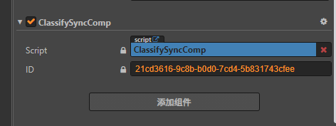

# 第三方平台适配

Cocos ICE 适配第三方平台，便于用户将课件用于不同的第三方教学平台，适配之后可做到用户操作同步、课件数据同步。

## 目前支持的平台

- [拓课云](talk-cloud/index.md)
- [ClassIn](class-in/index.md)

## 适配逻辑

Cocos ICE 内部实现了一套通用消息收发逻辑，您只需要关心与第三方平台的对接适配，在入口脚本中根据不同的平台引入相应的适配脚本即可。

### 初始化平台实例

入口脚本路径：`.\edu-editor\ui-component\stateSync\EduStateSync.ts`，由于所有适配脚本都在 `ui-component` 目录下，不需要编译就能运行。

以下为 入口脚本 `EduStateSync.ts` 代码：

```js
import { IStateSync, StateSyncEvent } from './IStateSync';
import { TalkCloud } from './TalkCloud';
/**
 * 状态同步组件需要接入的接口
 */
export interface IStateSyncComp {
    syncData: any;

    getId(): string;

    onDataUpdate(data);
}

class EduStateSync extends cc.EventTarget {
    syncInstance: IStateSync;
    syncList = {};

    constructor() {
        super();
    }
    /**
     * 初始化平台实例
     */
    init() {
        this._initSyncInstance();
    }

    /**
     *
     * 需要根据平台去判断下使用哪个平台进行对接
     */
    private _initSyncInstance() {
        this.syncInstance = new TalkCloud();
        this._initEvent();
    }

    private _initEvent() {
        this.syncInstance.on(StateSyncEvent.CompStateUpdate, this.onStateUpdate, this);
    }

    onStateUpdate(compId) {
        for (const key in compId) {
            if (Object.prototype.hasOwnProperty.call(compId, key)) {
                this.emit(`data-update-${key}`, compId[key]);
            }
        }
    }

    getAttributes(compId) {
        this.onStateUpdate(compId);
    }

    /**
     * 把当前的数据同步到服务端
     */
    async syncChanges(comp: IStateSyncComp) {
        // 提交数据更新
        let compId = comp.getId();
        if (!compId) {
            return console.warn('component id not found!');
        }
        if (!comp.syncData) {
            return console.warn('syncData not found');
        }
        this.syncList[compId] = comp.syncData;

        let data = {};
        data[compId] = comp.syncData;

        // 更新组件状态数据
        await this.syncInstance.setAttributes(data);
        // 发送组件更新状态消息
        this.syncInstance.compStateUpdate(compId);

        // 本地的，自己去获取下更新
        this.onStateUpdate(compId);
    }

    async removeData(compId) {
        let data = {};
        data[compId] = undefined;
        await this.syncInstance.setAttributes(data);
    }
}

export let eduStateSync = new EduStateSync();
globalThis.eduStateSync = eduStateSync;
```

> 适配脚本引入后，需要在 `_initSyncInstance` 方法中创建平台实例。

### 引入适配脚本

平台实例创建之后，按需创建消息同步脚本并继承 `StateSyncComp`，在组件中引用，如果是事件类则需要通过 `node.addComponent()` 的方式动态添加脚本。



适配脚本主要用于定义需要监听和发送的消息事件，例如：点击事件、游戏开始事件、游戏结束事件等。

#### 示例

以内置组件 **分类题** 为例：

**SyncComp.ts** 代码如下：

```js
const { ccclass, property } = cc._decorator;
import StateSyncComp from 'StateSyncComp';
import { eduStateSync, IStateSyncComp } from 'EduStateSync';

//消息列表
enum CLASSIFY_STEP {
    ready = 'ready',
    classify_item_touch_start = 'classify_item_touch_start',
    classify_item_touch_move = 'classify_item_touch_move',
    classify_item_touch_cancel = 'classify_item_touch_cancel',
    classify_item_touch_end = 'classify_item_touch_end',
    classify_restart = 'classify_restart',
    classfy_close_modal = 'classfy_close_modal',
    send_classify_agora_data = 'send_classify_agora_data',
    get_classify_agora_data = 'get_classify_agora_data',
}

@ccclass
export default class ClassfySyncComp extends StateSyncComp {
    onLoad() {
        super.onLoad();
        // 初始化当前消息为ready
        this.syncData = {
            step: CLASSIFY_STEP.ready,
            target: '',
        };
        this.curStep = CLASSIFY_STEP.ready;
        // 监听消息列表中的所有消息
        eduStateSync.on(CLASSIFY_STEP.classify_item_touch_start, this.onItemTouchStart, this);
        eduStateSync.on(CLASSIFY_STEP.classify_item_touch_move, this.onItemTouchMove, this);
        eduStateSync.on(CLASSIFY_STEP.classify_item_touch_end, this.onItemTouchEnd, this);
        eduStateSync.on(CLASSIFY_STEP.classify_item_touch_cancel, this.onItemTouchCancel, this);
        eduStateSync.on(CLASSIFY_STEP.classify_restart, this.onRestart, this);
        eduStateSync.on(CLASSIFY_STEP.send_classify_agora_data, this.sendClassifyAgoraData, this);
        eduStateSync.on(CLASSIFY_STEP.get_classify_agora_data, this.getClassifyAgoraData, this);
        eduStateSync.on(CLASSIFY_STEP.classfy_close_modal, this.closeModal, this);
    }
    closeModal(){
        this.syncData = {
            step: CLASSIFY_STEP.classfy_close_modal,
        };
        this.dataSync();
    }
    sendClassifyAgoraData(data){
        this.syncData = {
            step: CLASSIFY_STEP.send_classify_agora_data,
            agoraData: data.data,
            uuid: data.uuid,
        };
        this.dataSync();
    }
    getClassifyAgoraData(){
        this.syncData = {
            step: CLASSIFY_STEP.get_classify_agora_data,

        };
        this.dataSync();
    }
    onRestart(){
        this.syncData = {
            step: CLASSIFY_STEP.classify_restart,
            event: '',
            name: '',
        };
        this.dataSync();
    }
    onCloseModal(){
        this.syncData = {
            step: CLASSIFY_STEP.classfy_close_modal,
            event: '',
            name: '',
        };
        this.dataSync();
    }
    onItemTouchStart(event,name){
        this.syncData = {
            step: CLASSIFY_STEP.classify_item_touch_start,
            event: event,
            name: name,
        };
        this.dataSync();
    }
    onItemTouchMove(event,name){
        this.syncData = {
            step: CLASSIFY_STEP.classify_item_touch_move,
            event: event,
            name: name,
        };
        this.dataSync();
    }
    onItemTouchEnd(event,name){
        this.syncData = {
            step: CLASSIFY_STEP.classify_item_touch_end,
            event: event,
            name: name,
        };
        this.dataSync();
    }
    onItemTouchCancel(event,element){
        this.syncData = {
            step: CLASSIFY_STEP.classify_item_touch_cancel,
            event: event,
            name: name,
        };
        this.dataSync();
    }
    start() {
        this.curStep = CLASSIFY_STEP.ready;
        window.stcomp = this;
        this.syncData = {
            step: CLASSIFY_STEP.ready,
            event: null,
            name: '',
        }
    }
    onDataUpdate(data) {
        super.onDataUpdate(data);
        this.stateUpdate();
    }
    onDestroy() {
        super.onDestroy();
        eduStateSync.off(CLASSIFY_STEP.classify_item_touch_start, this.onItemTouchStart, this);
        eduStateSync.off(CLASSIFY_STEP.classify_item_touch_move, this.onItemTouchMove, this);
        eduStateSync.off(CLASSIFY_STEP.classify_item_touch_end, this.onItemTouchEnd, this);
        eduStateSync.off(CLASSIFY_STEP.classify_item_touch_cancel, this.onItemTouchCancel, this);
        eduStateSync.off(CLASSIFY_STEP.classify_restart, this.onRestart, this);
        eduStateSync.off(CLASSIFY_STEP.send_classify_agora_data, this.sendClassifyAgoraData, this);
        eduStateSync.off(CLASSIFY_STEP.get_classify_agora_data, this.getClassifyAgoraData, this);
    }
    // 发送消息
    stateUpdate() {
        this.curStep = this.syncData.step;
        eduStateSync.emit(this.syncData.step + '_ret', this.syncData);
    }
}

```

**分类题组件中调用示例**：

```js
onLoad() {
    eduStateSync.on('classify_item_touch_start_ret', this.itemTouchStart, this);
}

onTouchStart() {
    this.node.on(
        cc.Node.EventType.TOUCH_START,
        function (event) {
            eduStateSync.emit(
                'classify_item_touch_start',
                {
                    x: event.getDeltaX(),
                    y: event.getDeltaY(),
                },
                element.name,
            );
        },
        this,
    );
}

```

#### 原理

- 消息监听：初始化时需要使用 `eduStateSync.on(eventName, function, target)` 监听消息列表中的所有消息:

  - `eventName` ：`Stirng` 自定义事件名称。
  - `callback` ：`Function` 回调函数。
  - `target` ：`Object` 调用回调函数的目标。

- 消息发送：重写 `onDataUpdate` 方法，收到消息时触发 `onDataUpdate` ，将受到的数据赋值给 `syncData` 后使用调用 `stateUpdate` ，使用 `eduStateSync.emit(eventName, data);` 将消息发送出去。

  - `eventName` ：`Stirng` 自定义事件名称。
  - `data` ：`Object` 消息数据。

- 组件消息监听：组件加载时需要使用 `eduStateSync.on(eventName, function, target)` 监听自身消息同步事件。

- 组件消息发送：组件发送消息使用 `eduStateSync.emit(eventName, data);`。

> **注意**：对于 `eduStateSync.emit(eventName, data);` ，为了将组件自身发送的事件与自身消息传递事件区分开来， 收到消息后自身消息传递时 `eventName` 一般使用 `eventName` + `'_ret'` 的形式，组件向外发送消息时直接使用 `eventName`。同理，接收消息时，组件内只接收 `eventName` + `'_ret'` 形式的消息，`XXXSyncComp` 中直接收 `eventName` 形式的消息。
