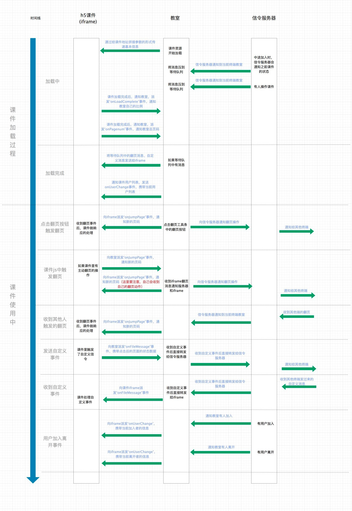

# 拓课云

## 通信方式

iframe 通信

## 限制

1. H5 课件只支持单页面 `SPA`，一个课件中只能有一个 `HTML` 文件；
2. H5 课件只能通过 `zip` 包的形式上传。

## 交互逻辑



## 接口说明

拓课云提供一些公共事件，如果要自定义事件需要和拓课云对接，需要他们的支持。本次适配中，直接使用 `onFileMessage` 接管所有自定义消息。

- 加载完毕事件： `onLoadComplete` (H5 派发给教室);

  - **参数**

  ```js
  {
      method: "onLoadComplete",
      coursewareRatio: 16/9 // 课件比例（比例为宽/高，可选，默认为16/9），类型 Number
  }
  ```

- 页面总页数： `onPageNum` (H5 派发给教室);

  - **参数**

  ```js
  {
      method: "onPagenum", // 动作名称
      totalPages: 9 // 总页数
  }
  ```

- 跳转页面： `onJumpPage` (H5 派发给教室);

  - **参数**

  ```js
  {
      method:"onJumpPage",// 动作名称
      toPage:2 // 跳转的页码
  }
  ```

- 自定义事件：`onFileMessage`。
  - **参数**
  ```js
  {
      method:"onFileMessage",
      handleData:{}
  }
  ```

## 示例

下面试拓课云适配代码，代码路径为： `\edu-editor\ui-component\stateSync\EduStateSync.ts`

```js
import { GameConfig } from 'GameConfig';
import { GameDB } from 'GameDB';
import { eduGame } from 'EduGame';
import { IStateSync, StateSyncEvent } from 'IStateSync';
import { multiply } from 'lodash';
/**
 * 在 iframe 可能发送或者收到的事件
 */
export enum IframeEvents {
    Init = 'Init',
    AttributesUpdate = 'AttributesUpdate',
    SetAttributes = 'SetAttributes',
    RegisterMagixEvent = 'RegisterMagixEvent',
    DispatchMagixEvent = 'DispatchMagixEvent',
    ReciveMagixEvent = 'ReciveMagixEvent',
    NextPage = 'NextPage',
    PrevPage = 'PrevPage',
    GetAttributes = 'GetAttributes',
    InitPage = 'InitPage',
    PageTo = 'onJumpPage',
    // 房间状态变更
    RoomStateChanged = 'room-pubmsg',
    // 加载完成
    onLoadComplete = 'onLoadComplete',
    // 设置页数
    SetPage = 'onPagenum',
    // 自定义事件
    onFileMessage = 'onFileMessage',
    // 用户列表变更事件
    onUserChange = 'onUserChange',
    // 获取当前页面
    RequestCurrentPage = 'RequestCurrentPage',
    // 得到  “获取当前页面”   回调
    ReciveCurrentPage = 'ReciveCurrentPage',
    // 教室状态变化
    onClassStateChange = 'onClassStateChange',
}
/**
 * 白板目前会用到的
 */
enum TalkUserType {
    // 切换页面
    create = 'create',
    join = 'join',
}

/**
 * 同步相关
 * todo：需要判断当前是否是第三方环境，不是就不要和发送相关操作
 */
export class TalkCloud extends cc.EventTarget implements IStateSync {
    _pageLoaded = false;
    _currentUserData = {
        type: '',
        users: '',
    };
    _currentPageIndex = 0;

    constructor() {
        super();
        window.parent !== window && !CC_EDITOR && this.registerEvent();
    }

    init(): void {
        this.postMessage(IframeEvents.onFileMessage, { cmd: IframeEvents.Init });
    }
    // 下一页
    nextPage(): void {
        this.postMessage(IframeEvents.onFileMessage, { cmd: IframeEvents.NextPage });
    }
    // 上一页
    prevPage(): void {
        this.postMessage(IframeEvents.onFileMessage, { cmd: IframeEvents.PrevPage });
    }
    // 跳转页面
    pageTo(page: number): void {
        this.postMessage(IframeEvents.PageTo, { cmd: IframeEvents.PageTo, toPage: page });
    }
    // 设置总页数
    setTotalPages(page: number): void {
        this.postMessage(IframeEvents.SetPage, {
            cmd: IframeEvents.SetPage,
            totalPages: page,
        });
    }
    // 加载完成
    onLoadComplete(): void {
        this.postMessage(IframeEvents.onLoadComplete, { coursewareRatio: 16 / 9 });
    }

    async setAttributes(obj: any) {
        return new Promise((resolve, reject) => {
            this.once(StateSyncEvent.AttributesUpdate, (data) => {
                resolve(data);
            });
            obj.event = StateSyncEvent.AttributesUpdate;
            obj.cmd = IframeEvents.SetAttributes;
            this.postMessage(IframeEvents.onFileMessage, obj);
        });
    }

    async getAttributes() {
        let obj = {
            cmd: IframeEvents.GetAttributes,
            event: StateSyncEvent.GetAttributes,
        };
        return new Promise((resolve, reject) => {
            this.once(StateSyncEvent.GetAttributes, (data) => {
                resolve(data);
            });
            this.postMessage(IframeEvents.onFileMessage, obj);
        });
    }

    compStateUpdate(compId: string) {
        this.postMessage(IframeEvents.onFileMessage, {
            cmd: IframeEvents.DispatchMagixEvent,
            event: StateSyncEvent.CompStateUpdate,
            payload: compId,
        });
    }

    setCurPage(page) {
        this.setAttributes({ curPage: page });
    }

    postMessage(name: string, obj?: any): void {
        parent.postMessage(
            JSON.stringify({
                method: name,
                coursewareRatio: 16 / 9,
                payload: obj,
                totalPages: obj.totalPages,
                toPage: obj.toPage,
            }),
            '*',
        );
    }

    private registerEvent() {
        // 监听iframe过来的事件
        window.addEventListener('message', this.onMessage.bind(this));
        // parent.addEventListener('message', this.onMessage.bind(this));
        // 注册 自定义 事件 ，组件状态更新
        this.postMessage(IframeEvents.onFileMessage, {
            cmd: IframeEvents.DispatchMagixEvent,
            event: StateSyncEvent.CompStateUpdate,
        });
        // 监听 eduGame 初始化事件
        eduGame && eduGame.addEventListener(eduGame.Event.OnInitialize, this.onInit.bind(this));
        // 监听 eduGame 的页面切换事件
        eduGame && eduGame.addEventListener(eduGame.Event.OnPageSwitch, this.onPageChanged.bind(this));
        this.onLoadComplete();
    }

    onPageChanged(info) {
        if (!this._pageLoaded) {
            this._pageLoaded = true;
            return;
        }
        let [cur, total] = GameConfig.getPagePositionInfo(info.page.id);
        this.setCurPage(info.page.id);
        this.pageTo(cur);
    }

    onInit() {
        this._initPage();
        this.on(StateSyncEvent.PageChange, this.handlePageChanged, this);
    }

    private _initPage(info?) {
        let pageId = info ? info.curPage : null;
        if (!pageId) {
            let pageInfo = GameConfig.getBeginPage();
            pageId = pageInfo.id;
            this.setCurPage(pageId);
        }
        let [cur, total] = GameConfig.getPagePositionInfo(pageId);
        this.setTotalPages(total);
        eduGame.goPageByID(pageId);
    }

    handlePageChanged(info) {
        this._currentPageIndex = info;
        let page = GameDB.curPageInfo;
        if (page.lesson) {
            let jumpPage = page.lesson.pages[info - 1];
            if (jumpPage && GameDB.curPageInfo.id !== jumpPage.id) {
                eduGame.goPageByID(jumpPage.id);
            }
        }
    }

    handleUserChanged(data) {
        if (data.data.type === TalkUserType.join) {
            let obj = {
                cmd: IframeEvents.ReciveCurrentPage,
                event: IframeEvents.ReciveCurrentPage,
                currentPage: this._currentPageIndex,
            };
            this.postMessage(IframeEvents.onFileMessage, obj);
        }
    }

    onReciveCurrentPage(payload) {
        if (this._currentPageIndex !== payload.currentPage) {
            setTimeout(() => {
                this.pageTo(payload.currentPage);
            }, 2000);
        }
    }

    private onMessage(event) {
        let data = event.data;
        if (typeof data === 'string') {
            data = JSON.parse(data);
        }
        let payload = data.payload;
        // 自定义事件
        if (data.method === IframeEvents.onFileMessage) {

            switch (data.payload && data.payload.event) {
                case IframeEvents.Init:
                    break;
                case IframeEvents.RoomStateChanged:
                    break;
                case IframeEvents.AttributesUpdate:
                    this.emit(StateSyncEvent.CompStateUpdate, payload, payload);
                    break;
                case IframeEvents.DispatchMagixEvent:
                    this.emit(StateSyncEvent.CompStateUpdate, payload, payload);
                    break;
                case IframeEvents.GetAttributes:
                    this.emit(StateSyncEvent.GetAttributes, payload);
                    break;
                case IframeEvents.ReciveCurrentPage:
                    this.onReciveCurrentPage(payload);
                    break;
                default:
                    break;
            }
        } else {
            // 公共事件
            switch (data.method) {
                case IframeEvents.PageTo:
                    this.handlePageChanged(data.toPage);
                    break;
                case IframeEvents.onUserChange:
                    this.handleUserChanged(data);
                default:
                    break;
            }
        }
    }
}

```

### 函数说明
- `registerEvent`：初始化事件函数；
    - 监听 window 的 `message` 消息；
    - 监听 `EduGame` 发出的消息，例如页面切换；
    - 向教室主动派发 `onLoadComplete` 事件，通知教室课件加载完成（这一步至关重要）。
- `postMessage`：消息发送函数；
    - 参数必须为字符串
- `onMessage`：消息接收函数，因为本次适配使用 `onFileMessage` 接管所有自定义事件，所以将自定义事件与公共事件分开处理。

## 参考链接

更多注意事项请查看 [**拓课云官方开发文档**](https://showdoc.talk-cloud.com/web/#/21?page_id=129)。
