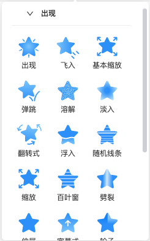
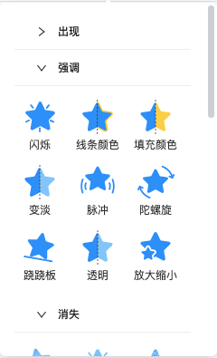
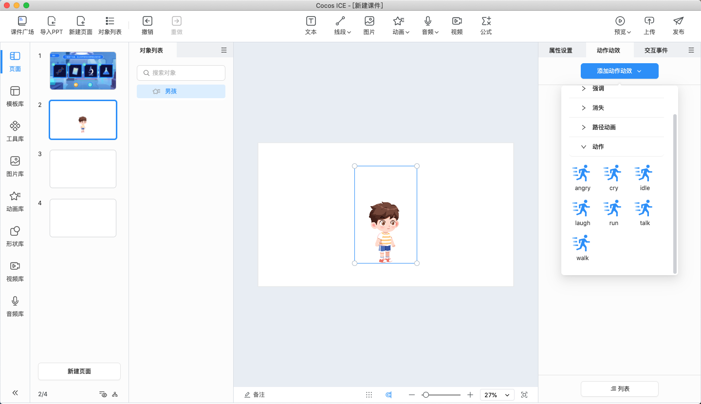

# 动作动效

该面板用于展示和编辑当前选中对象的动作动效。

## 基础操作

**添加动作动效**：在编辑器内选中对象后，可在动作动效面板点击 **添加动作动效**，为对象添加上丰富的动作动效。

- **出现动效**：目前支持弹跳、淡入、翻转、浮入、飞入以及缩放动效。用于设置对象的在编辑器的出现效果。

    

- **消失动效**：目前支持淡出、浮出以及飞出动效。用于设置对象在编辑器内的消失效果。

    

- **强调动效**：目前支持脉冲、陀螺旋、跷跷板以及放大缩小动效。用于设置对象在编辑器内的强调效果。

    

- **路径动效**：目前支持自由曲线路径和直线路径。用于设置对象在编辑器内从初始位置移动到目标位置的效果。

    

还支持选中 **Spine** 或者 **DragonBones** 对象时，可以为当前选中的对象添加上动作，便可在课件中实现丰富的动作效果。

> **注意**：下拉框里显示的 **动作** 是根据选中的 **Spine** 或者 **DragonBones** 对象决定的，下拉框内只会显示当前选中的 **Spine** 或者 **DragonBones** 对象带有的动作。

**编辑动作动效**：为对象添加了合适的动作动效后，便会在 **动作动效面板** 和 **列表面板** 中展示出来，用户可以自由地编辑和设置动作动效。

- **设置基本属性**：用户可以设置基本的动作动效属性，包括 **延时**、**持续**、**重复**。

- **延时**：表示该动作动效会在设置的延时时间后触发。

- **持续**：表示该动作动效从开始到结束的时间段。

- **重复**：表示该动作动效执行的次数，例如设置为 **2**，该动作动效便会执行 2 次。

- **设置触发器**：用户可以设置触发器，通过点击、双击、滑动等操作触发指定的动作动效。

- **更改和删除动作动效**：用户可以点击  或者  按钮，对当前的动作动效进行 **更改** 或 **删除** 操作。

## 列表

用户可以在 **列表** 内进行动作动效触发时机的排序，详情请见 [列表](list/index.md) 部分。
