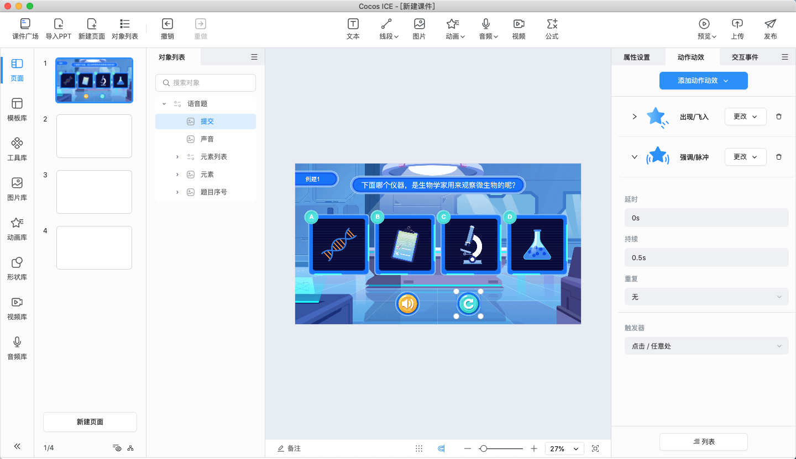
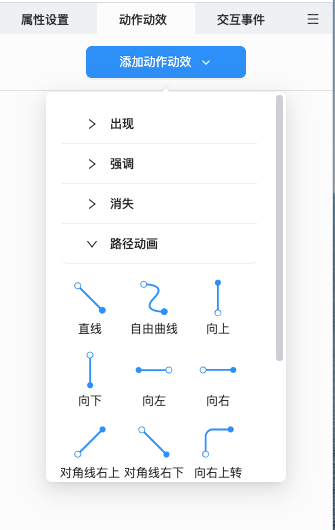
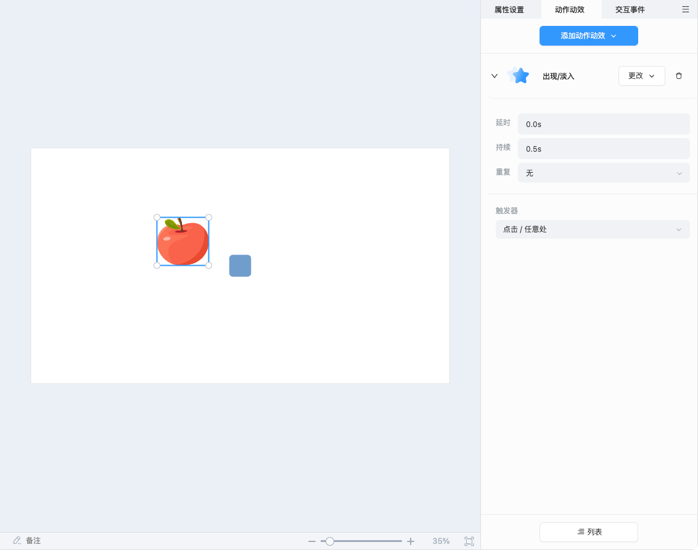

# 动作动效

该面板用于展示和编辑当前选中对象的动作动效。

## 基础操作

1. **添加动作动效**：在编辑器内选中对象后，可在动作动效面板点击 **添加动作动效**，为对象选择合适的动作动效，便可在课件中实现趣味的动效效果。

    

2. **编辑动作动效**：为对象添加了合适的动作动效后，便会在 **动作动效面板** 和 **列表面板** 中展示出来，用户可以自由地编辑和设置动作动效。

    

    - **设置基本属性**：用户可以设置基本的动作动效属性，包括 **延时**、**持续**、**重复**。

        

        - **延时**：表示该动作动效会在设置的延时时间后触发。

        - **持续**：表示该动作动效从开始到结束的时间段。

        - **重复**：表示该动作动效执行的次数，例如设置为 **2**，该动作动效便会执行 2 次。

    - **设置触发器**：用户可以设置触发器，通过点击、双击、滑动等操作触发指定的动作动效。

        

    - **更改和删除动作动效**：用户可以点击  或者  按钮，对当前的动作动效进行 **更改** 或 **删除** 操作。

## 列表

用户可以在 **列表** 内进行动作动效触发时机的排序，详情请见 [列表](list/index.md) 部分。
