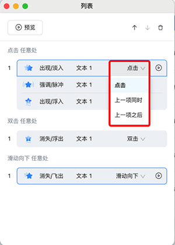
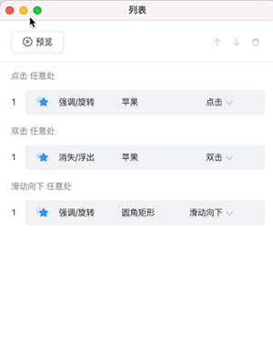

# 列表

点击 **动作动效面板** 或者 **交互事件面板** 的 **列表** 按钮，便可开启或者收回 **列表**。用户可以在此面板灵活地调整各个对象的 **动作动效顺序**、**交互事件顺序** 和 **触发器** 等设置，实现丰富有趣的课件和视频的互动效果。

## 面板介绍

该面板可以展示当前页面里所有对象的动作动效和交互事件，并且能直观的看出动效的触发时机。如下图所示，表示第一次点击任意处，触发对象 **苹果** 的旋转动效，第二次点击任意处，触发对象 **苹果** 的消失动效，第三次点击任意处，触发对象 **圆角矩形** 的脉冲动效，并且点击对象 **圆角矩形**，能触发对象 **圆角矩形** 的旋转动效。

## 基础操作

1. **预览动作动效**：支持在对象编辑器内，对对象的 **动作动效** 进行预览。

    - **整体预览**：点击 **预览** 按钮，可以对 **触发器** 为页面加载时和点击任意处的动效按列表顺序进行预览。例如下图所示，点击 **预览** 后，会预览对象 **苹果** 旋转的动效，再预览对象 **圆角矩形** 飞出的动效，最后预览对象 **苹果** 脉冲的动效。

        

    - **单独预览**：各个 **动作动效** 也支持单独预览。鼠标悬停在动作动效处，便会出现 **预览** 的按钮，点击按钮便可在对象编辑器内预览该 **动作动效**。

        

2. **调整动作动效和交互事件顺序**：用户可以通过点击列表内的  、改变触发的时机和拖拽操作，进行列表内 **动作动效** 和 **交互事件** 顺序的调整。

    - **改变触发时机**：用户可以通过调整触发时机，来进行 **动作动效** 和 **互动事件** 的排序，触发时机分为 **点击**、**双击**、**滑动**、**上一项同时** 和 **上一项之后** 五种类型。

        

        - **点击、双击、滑动**：表示该 **动作动效** 或者 **互动事件** 需要通过点击、双击、滑动相应对象才会触发。如下图所示，点击任意处后，会触发对象 **苹果** 的旋转动效，双击任意处后，会触发对象 **苹果** 的消失动效，滑动向下任意处后，会触发对象 **圆角矩形** 的飞出动效。

            

        - **上一项同时**：表示该 **动作动效** 或者 **互动事件** 和上一项同时触发。如下图所示，点击任意处后，对象 **苹果** 的旋转动效会和对象 **圆角矩形** 的飞出动效同时触发。

            

        - **上一项之后**：表示该 **动作动效** 或者 **互动事件** 会在上一项触发完成后自动触发。如下图所示，点击面板任意处触发对象 **苹果** 的旋转动效后，对象 **圆角矩形** 的飞出动效便会自动触发。

            

            > **注意**：当动效或者事件的 **触发器** 为点击/双击/滑动任意处，并且为这些触发器的第一项时，将触发时机调整为 **上一项同时** 或者 **上一项之后**，这些动效或者事件的触发器将会调整为 **页面加载时**，表示在页面加载的时候自动触发。如下图，将点击任意处的第一个动效的触发时机调整为上一项同时，则会在进入页面后，自动触发对象 **苹果** 的旋转动效。

            

    - **拖拽操作**：用户可以通过在列表面板内，拖拽选中的 **动作动效** 和 **互动事件**，进行排序。

        

3. **删除动作动效和交互事件**：用户可以通过点击列表内的  按钮，对选中的 **动作动效** 或者 **交互事件** 进行删除。
