# 事件

该面板展示和编辑当前选中对象的事件。

## 基础操作

1. **添加互动事件**：选中对象后，可前往事件面板中添加互动事件，为课件添加趣味动效和设置交互事件。

    

2. **选择触发器**：触发器表示触发该事件用户需要进行的操作，可以选择点击、滑动等操作。

    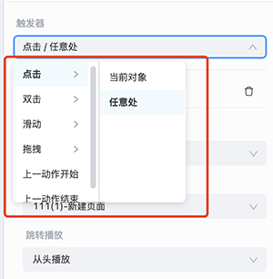

3. **设置触发事件**：用户选择完触发器后，会默认为事件添加 1 个动作，需要对动作的 **触发事件** 进行设置。支持基本的 **播放动效**、**页面调整**，企业也可以 [**自定义事件**](../developer/develop-event/index.md)。

    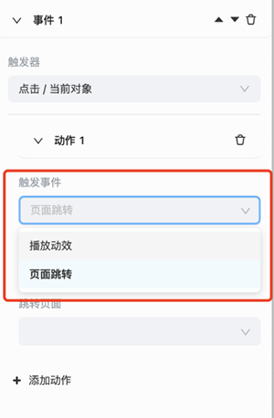

    - **页面跳转**：用户可以自由配置需要跳转的页面。

        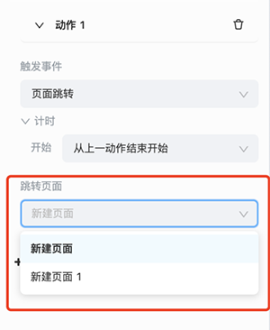

    - **播放动效**：用户可以选择动效和操作的对象。

        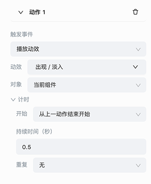

        用户设置完动效的对象后，可以对动效的持续时间和重复次数进行设置。

        - **持续时间**：表示该动效的开始到结束的时间段。

        - **重复次数**：表示该动效执行的次数，例如设置为 **2**，该动效便会执行 2 次。

4. **添加多个动作**：设置完动作 1 后，还可以为该事件添加动作 2。为动作 2 设置 **开始** 属性。

    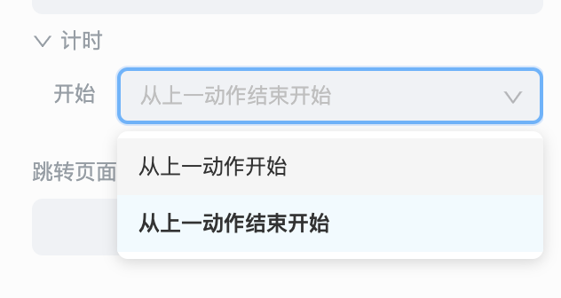

    - **从上一动作开始**：表示动作 2 和动作 1 同时进行；
    - **从上一动作结束开始**：表示动作 2 会在动作 1 结束后自动进行。

        如下图表示：用户执行了一次的 **点击页面任意处** 的操作后，会对当前组件先执行 **0.5 秒的出现时淡入动效** 后，再对当前组件执行 **0.5 秒的消失时淡出动效**。

        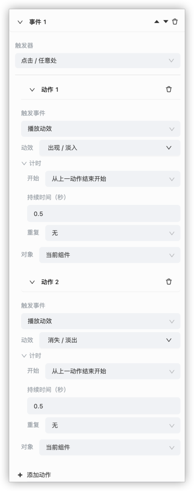

5. **添加多个事件**：如果用户需要执行点击两次任意处事件，分别执行不同的操作，需要创建 3 个事件，并设置为：

    - 事件 1：设置触发器为 **点击/任意处**；
    - 事件 2：设置触发器为 **上一动作开始或者上一个动作结束**；
    - 事件 3：设置触发器为 **点击/任意处**。

        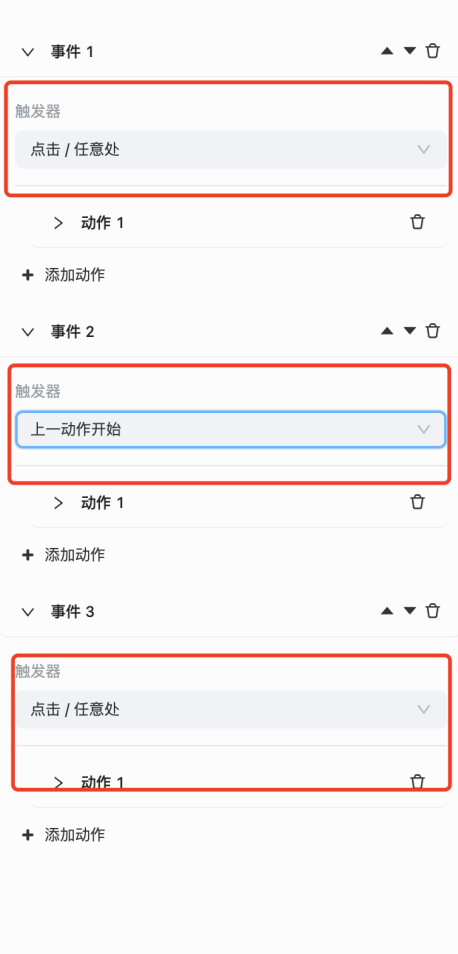

        > **注意**：事件 2 触发器设置为 **上一动作开始或上** 后，仅需配置触发事件为 **播放动效**，无需添加动效动作，才可以实现第一次点击进行事件 1 的动作，第二次点击进行事件 3 的动作；如果对事件 2 添加动效动作后，则会第一次点击执行事件 1 和事件 2 的动作，第二次点击执行事件 3 的动作。

        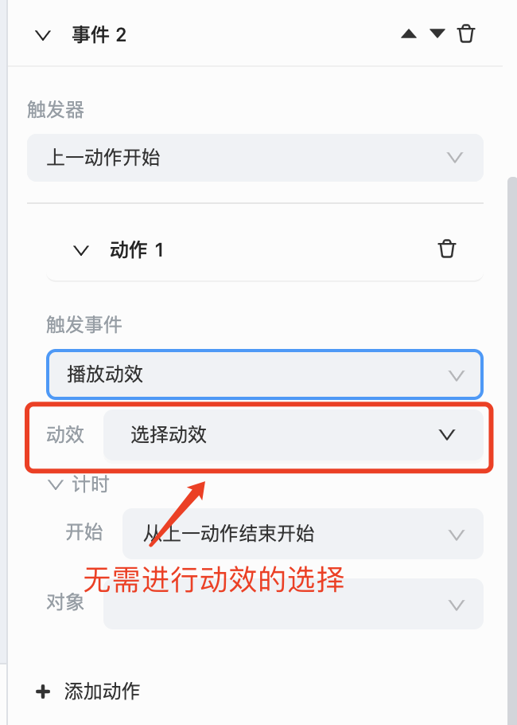

    - 举例说明：对 **风景图** 组件，添加以下互动事件后，第 1 次点击任意处，会让 **苹果** 消失；第 2 次点击任意处，会让 **风景图** 消失。

        - 事件 1：设置触发器 **点击任意处**，让 **苹果** 消失/淡出。

            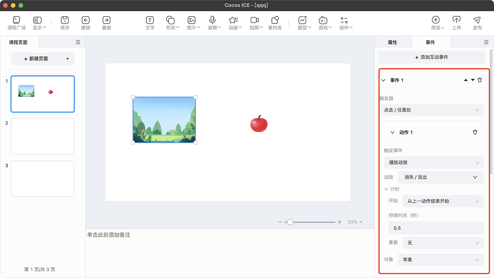

        - 事件 2：设置触发器 **上一个动作开始**，不选择动效。

            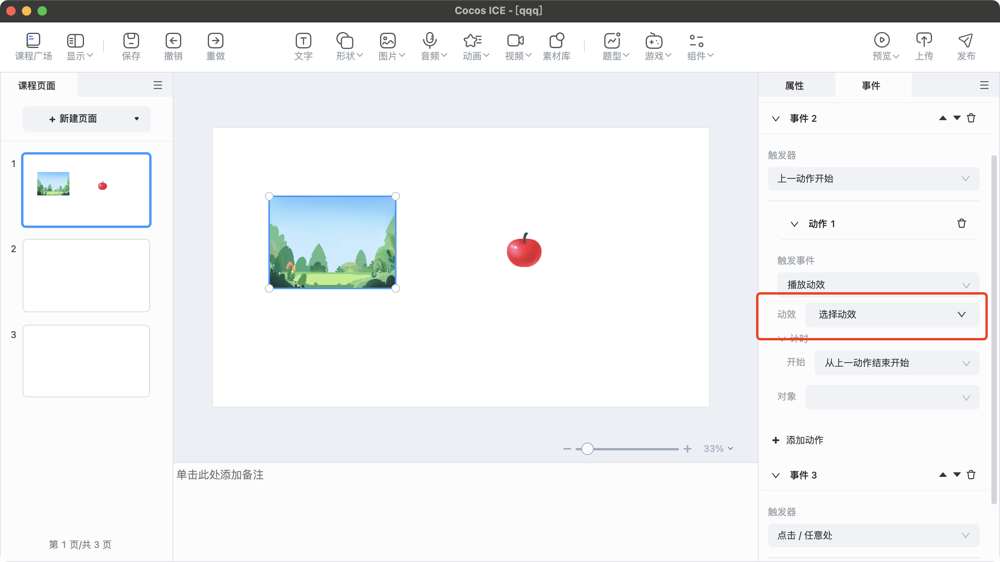

        - 事件 3：设置触发器 **点击任意处**，让当前组件也消失/淡出。

            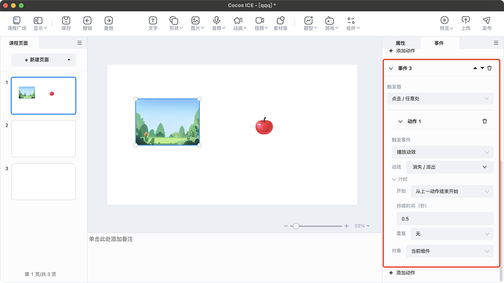

6. **事件顺序移动**：用户可以点击按钮对事件的顺序进行上移和下移的操作。

    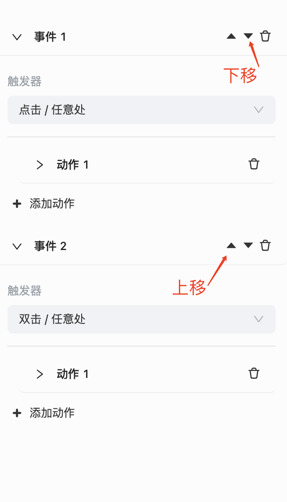