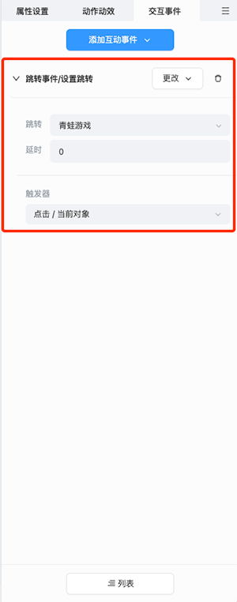

# 交互事件

该面板可以展示和编辑当前选中对象的交互事件。

## 基础操作

1. **添加交互事件**：在编辑器内选中对象后，可在交互事件面板点击 **添加互动事件**，为对象选择合适的事件，便可在课件中实现丰富的交互效果。

    

2. **编辑交互事件**：为对象添加了合适的交互事件后，便会在 **交互事件面板** 和 **列表面板** 中展示出来，用户可以自由的设置交互事件参数。

    

    - **更改和删除交互事件**：用户可以点击  和  按钮，对当前的交互事件进行更改和删除操作。

## 互动事件介绍

1. **设置跳转**：用户可以自由配置需要跳转的页面，在 **互动视频** 页面，还可以跳转到页面的时间点。

    

    > **注意**：目前 **交互事件** 暂时只有设置跳转，后续会进行持续的扩充。企业也可以 [**自定义事件**](../developer/develop-event/index.md)。

## 列表

用户可以在 **列表** 内进行交互事件触发时机的排序，详情请见 [列表](../effect/list/index.md) 部分。
