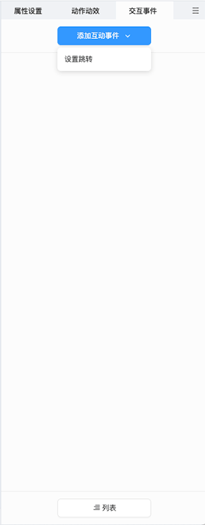

# 交互事件

交互事件面板可以展示和编辑当前选中对象的交互事件。

## 添加交互事件

在编辑器内选中对象后，可在交互事件面板点击 **添加交互事件**，根据需要选择 **设置跳转**/**播放音频**，即可添加 **设置跳转**/**播放音频** 事件：

为对象添加了合适的交互事件后，便会在 **交互事件面板** 和 **列表面板** 中展示出来，用户可以自由的设置交互事件参数。

## 设置交互事件

- **设置跳转**：用户可以自由配置需要跳转的页面，在 **互动视频** 页面，还可以跳转到页面的时间点。

    

- **播放音频**：用户可以为对象设置播放音频的事件，配置播放音频事件后，可以达到点击某个对象，便可播放指定音频的效果。

    

用户还可以点击事件右上方的  或  按钮，可以更改或删除当前交互事件。

> **注意**：目前 **交互事件** 暂时只有设置跳转和播放音频，后续会进行持续的扩充。企业也可以 [**自定义事件**](../developer/develop-event/index.md)。

## 列表

用户可以在 **列表** 内进行交互事件触发时机的排序，详情请见 [列表](../effect/list/index.md) 部分。
