# 新手使用教程

Cocos ICE 互动课件编辑器（全称“Cocos Interactive Courseware Editor”）是面向在线教育机构推出的一款互动课件制作工具，可开发出互动性强、自由度高、高性能、轻量级的教学内容。本产品支持接入机构现有团队的工作流程及第三方资源/素材管理库，缩短工作流，提高课件质量及工作效率。

## 1.新手上路

第一步，下载安装。访问XXX（支持点击跳转的地址），下载Cocos ICE（下面简称ICE）安装包，运行安装包，完成ICE安装；

第二步，注册账号。运行ICE，在登录页点击[账号注册]，跳转浏览器完成注册；

第三步，加入公司。返回ICE登录页，输入账号密码，点击登入后，出现[点击加入]提示，按提示提交加入申请；

最后，登入，开始使用。审核通过后，返回ICE登录页，完成登录。
To管理员：Cocos ICE的使用前提是获取 [License](../License/index-1.md)，若存疑请咨询商务（商务的联系方式）

## 2.软件问题

### 软件安装

您可以通过访问 Cocos产品首页 上的下载链接获得 Cocos ICE的安装包。

下载完成后双击安装包。

### Windows 安装说明

Windows 版的安装程序是一个 .exe 可执行文件，通常命名会是 Cocos ICE_vX.X.X_20XXXXXX_setup.exe，其中 vX.X.X 是 Cocos ICE 的版本号，如 v1.2.2，后面的一串数字是版本日期编号。

### Mac 安装说明

Mac 版 Cocos ICE 的安装程序是 dmg 镜像文件，双击 dmg 文件，然后将 Cocos ICE.app 拖拽到您的 应用程序 文件夹快捷方式，或任意其他位置。然后双击拖拽出来的 Cocos ICE.app 就可以开始使用了。

### 操作系统要求

Cocos ICE 所支持的系统环境是：
• Mac OS X 所支持的最低版本是 OS X 10.9。
• Windows 所支持的最低版本是 Windows 7 64 位。

## 3.软件概览

目前，Cocos ICE提供三种制课模式：课程制作模式、互动视频制作模式、研发模式。

• 课程制作模式，面向非研发用户，提供了简单易上手的操作界面，体验上接近 PPT。

• 互动视频制作模式，不仅具有课程制作模式的基础功能，还提供制作互动视频的功能。

• 研发模式，面向研发，在此模式下 Cocos ICE 会暴露原始的 Cocos Creator 界面及工程，研发可在此模式下封装逻辑组件，或者对最终课件进行二次开发。

### 切换模式

打开课程，点击“主菜单——模式”，点选想要切换的模式并确认操作后，模式切换完成。

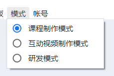

### 场景模块

课程制作模式和互动视频制作模式都是面向非研发用户的制课工具，按照使用场景可将其拆分为三大模块：课程广场、课程制作、互动视频。

### 课程广场

功能描述：

在课程广场您可以对课程进行统一管理，我们提供目录管理功能，方便结构化存管课程。课程支持下载与上传至云端，方便内部协作。

基础操作：

1、	点击【+】，开始创建一级目录，点击左侧目录下的“…”可继续添加一级目录，在一级目录下添加二级目录，支持按需添加子目录。

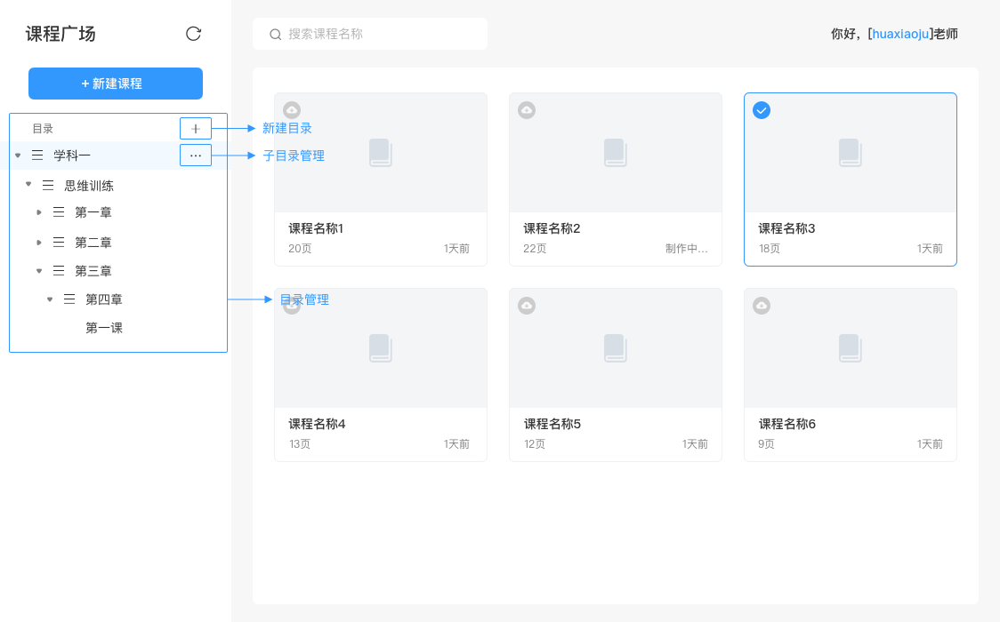

2、	点击【新建课程】将在选中的目录下生成一个新课程，支持对课程进行命名、上传、删除、编辑、预览、移动操作。
  
3、	搜索与同步。支持在当前目录下进行模糊搜索，点击【  】，可刷新当前课程广场。

### 课程制作模式

功能描述：

在该模式下，教研团队可以很方便地制作教学课程，支持在课程页面上添加组件和素材，同时还可以通过属性面板设置对象属性值，以及配置事件动作。

基础介绍：

1、	点击【+新建页面】，可添加新页面，在课程页面面板中可右键删除页面。场景编辑器为当前选中页面的放大展示，素材、组件是可以添加入舞台的对象内容。新建页面支持通过模版新建，模版可由企业自由配置；

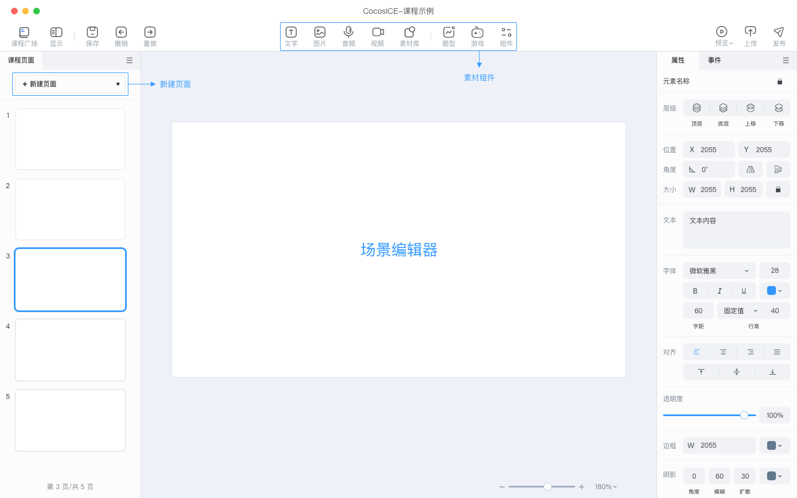

2、	舞台中的所有对象，都会在【对象列表】中出现。选中对象后，可在对应的【属性面板】中修改显示样式、位置，对象不同，对应的属性面板中的参数也会存在差异（下图示例的是文字的属性面板）。

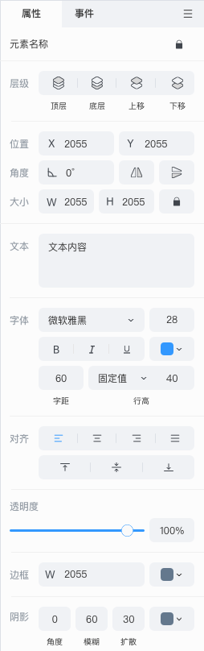

3、	选中对象，可通过【事件面板】配置触发条件、动作，为课件添加趣味动效；

4、	面板支持拖动，可以放到用户想放的位置，搭建自己方便的工作面板，可在顶部条中的【面板】唤出已关闭的面板。

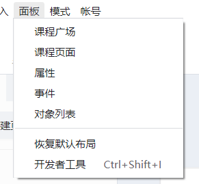

### 互动视频模式

功能描述：

该模式的核心功能就是互动视频的制作，可在视频任意节点中插入互动组件，组件可以由企业自定义开发，可以是选项、游戏或其他互动，支持同时编辑多条互动视频。

基础操作：

1、	插入视频。在【素材库】选中想要插入的视频，点击【插入】，即可将视频置入互动视频的制作面板中。

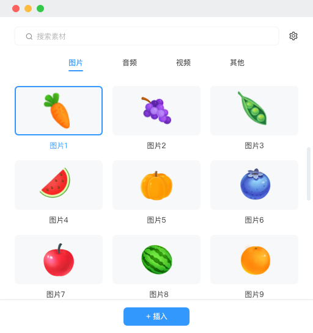

2、	点击【互动视频】面板中的视频，将出现滑块，长按滑块可左右拖拽，滑块实时显示当前时间锚点，点击【插入互动】可添加分支选项。长按缩放条，可放大、缩小面板中的视频长度。

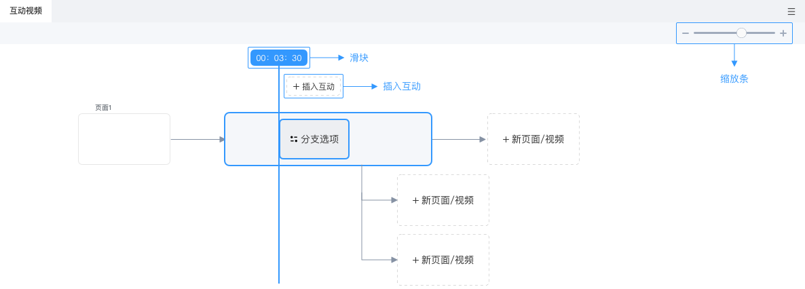

3、	面板中的分支选项和主线都可以添加新页面/视频，选中页面/视频后，同样将出现在场景编辑器。其他操作同“课程制作模式”。

### 研发模式

研发模式调用的是Cocos Creator，点我查看详细操作说明。

## 主窗口介绍

如图是【课程制作模式】的主窗口，由于课程制作模式和互动视频制作模式差异不大，因此，下面将基于【课程制作】的主窗口的默认布局来展开介绍（从上向下，从左向右）：

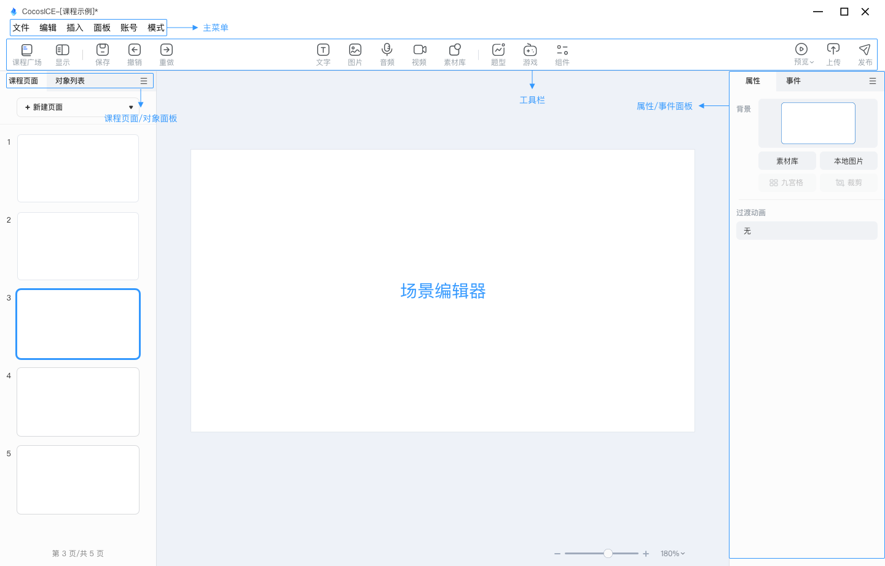

• 主菜单：当前共存在6个主菜单，分别为：文件（支持保存课程、关闭主窗口）、编辑（对编辑动作和内容的操作）、插入（支持向场景编辑器插入对象素材）、面板（可唤出所有面板、开发者模式，以及恢复默认布局）、账号（支持退出当前账号）、模式（切换制作模式）；

• 工具栏：提供常用功能的快捷入口（保存、撤销、重做、预览、上传、发布）、基本对象插入（文字、图片、音频、视频）、组件库（题型、游戏、基础组件）、课程广场入口，工具栏后续将支持自定义。；

• 课程页面：展示当前的课程结构，可以在这里切换课程，管理课程中的页面。

• 场景编辑器：展示和编辑可视内容的工作区域。所见即所得的搭建工作都依靠场景编辑器中的显示来完成。

• 属性面板：展示和编辑当前在场景中选中的对象的属性，对象不同，对应的属性也不同；

• 事件面板：展示和编辑当前选中对象的事件树；

• 对象面板：展示当前场景编辑器中所引用的所有对象、组件（由对象组成），支持选中编辑（选中后，可通过属性面板、事件面板进行配置）和删除操作；

## 4.通用工具

下面，将开始介绍通用工具，本次讲解将围绕 基础对象、素材库、系统工具、操作快捷键 这5个模块展开。涉及的截图都源于“课程制作模式”。

### 基础对象

基础对象为 文字、图片、音频、视频。

#### 选取对象

鼠标悬浮到场景中的对象上时，hover对象。此时单击鼠标，就会选中该对象。选择对象后可通过属性面板进行修改。

#### 移动对象

选中的对象后，可直接拖动对象来进行移动，也可拖动约束框来对对象进行缩放。

#### 编辑对象

除了直接对对象进行拖拽移动和大小缩放外，还可通过属性、事件面板设置对象样式和动作条件；

### 素材库

点击工具栏中的素材库，可快速唤出【素材库】弹窗，支持预览素材。通过Tap可切换素材类型，选中素材后点击插入，素材将置入场景编辑器中。

#### 素材来源

cocos将提供部分CC0素材，企业也可接入自己内部的素材库，支持限制内网使用，上传功能支持企业定制是否开放。

#### 搜索素材

支持在当前类目下对素材进行模糊搜索。

### 系统工具

系统工具包括：显示、保存、撤销/重做、预览、上传。

#### 显示

点击【显示对象列表】将显示对象面板，点击【显示网格】将展示网格点，辅助用户进行对齐和内容的分布。

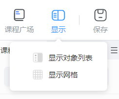

#### 保存、撤销、重做

保存的对象为当前正在编辑的课件；撤销：退回到编辑器中的上一步操作；重做：还原已经撤销的操作；

#### 预览

点击工具栏中的预览按钮，将弹出预览窗口，支持实时体验课件效果。

#### 上传

点击上传按钮，即可将当前课程上传到资源库，并反馈上传结果。离线状态下，不允许上传课程。

### 快捷操作键

提供快捷操键提高用户的制课效率。

#### Mac

/待完善

#### Windows

/待完善

## 5.互动组件

互动组件包括：互动视频制作、游戏组件、题型组件、基础组件，除互动视频外，其他组件都支持机构自行开发。

### 互动视频制作

查看详情

### 游戏组件

鼠标移入【游戏】，出现抽屉弹窗，选中游戏组件后，该组件将立即置入场景编辑器中。

### 编辑游戏组件

可通过属性面板设置游戏关卡数量、选项素材等。

下图为示例：

### 题型组件

题目组件包括：基础题型、3D题型。

#### 编辑题目组件

可通过属性面板设置题目选项的数量、内容、答案，以及答题反馈等。

下图为示例：

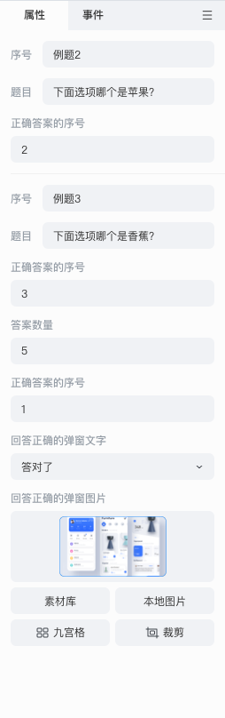

#### 组件库

组件库包括：基础组件、互动组件。

#### 编辑组件

不同组件其对应的属性面板中的属性参数也是不同的

## 6.基础面板

Cocos ICE共存在4中面板，分别为：课程页面、对象面板、属性面板、事件面板。面板可以关闭、弹出、自由移动、组合，以适应不同项目和用户的需要。

### 课程页面

#### 基础操作

支持新建页面，点击【新建页面】可在面板中添加新页面。

选中页面，右键可唤出更多操作（见下图）。

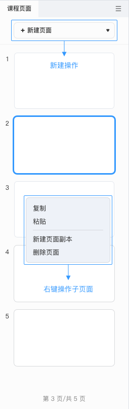

### 对象面板

展示当前场景编辑器中所引用的所有对象、组件（由对象组成），支持选中编辑（选中后，可通过属性面板、事件面板进行配置）和删除操作；

#### 基础操作

在场景编辑器中添加的内容，都会出现在对象列表中，对象若是集合，则将以树状结构进行展示。右键对象将唤出更多操作（见下图）。

### 属性面板

展示和编辑当前在场景中选中的对象的属性，对象不同，对应的属性也不同。

### 事件面板

展示和编辑当前选中对象的事件。

#### 基础操作

选中事件对象后，可前往事件面板中配置事件条件以及动作结果。

