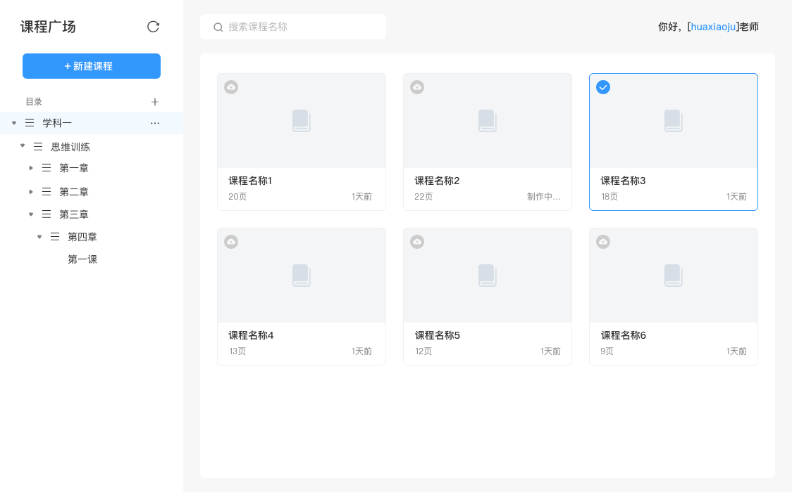
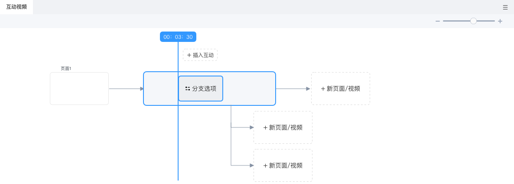
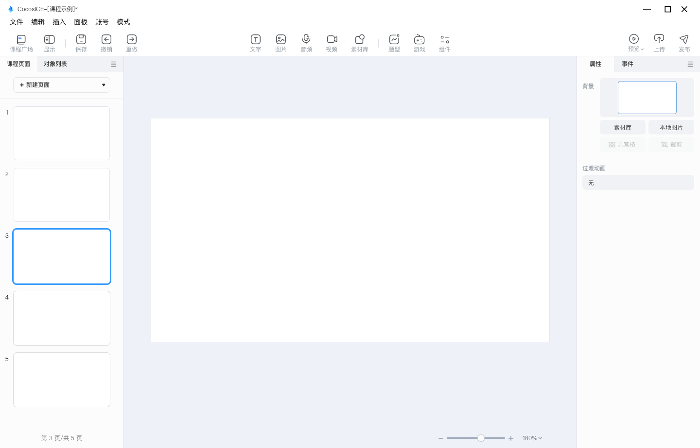

# 新手使用教程

Cocos ICE 互动课件编辑器（全称 **Cocos Interactive Courseware Editor**）是面向在线教育机构推出的一款互动课件制作工具，可开发出互动性强、自由度高、高性能、轻量级的教学内容。本产品支持接入机构现有团队的工作流程及第三方资源/素材管理库，缩短工作流，提高课件质量及工作效率。

## 1. 新手上路

- 下载安装。访问 [Cocos 产品首页](链接地址)，下载 Cocos ICE（下面简称 ICE）安装包，具体的安装步骤请查看下文 **安装与启动** 部分的内容。

- 注册账号。运行ICE，在登录页点击 **账号注册**，跳转浏览器完成注册。

- 加入公司。返回ICE登录页，输入账号密码，点击登入后，出现[点击加入]提示，按提示提交加入申请。

- 最后，登入，开始使用。审核通过后，返回ICE登录页，完成登录。

> **注意**：Cocos ICE 的使用前提是获取 [License](../License/index-1.md)，若存疑请咨询商务，联系方式如下：

## 2. 安装与启动

用户可以通过访问 Cocos 产品首页，下载 Cocos ICE 的安装包。

下载完成后双击安装包，运行软件。

### Windows 安装说明

Windows 版的安装程序是一个 .exe 可执行文件，通常命名会是 `Cocos ICE_vX.X.X_20XXXXXX_setup.exe`，其中 `vX.X.X` 是 Cocos ICE 的版本号，如 v1.2.2，后面的一串数字是版本日期编号。

### Mac 安装说明

Mac 版 Cocos ICE 的安装程序是 dmg 镜像文件，双击 dmg 文件，然后将 `Cocos ICE.app` 拖拽到用户的应用程序文件夹快捷方式，或任意其他位置。然后双击拖拽出来的 `Cocos ICE.app` 就可以开始使用了。

> **注意** ：Mac 平台如果从 zip 解压安装，解压后请移动到任意一个文件夹。这是 Mac 的限制，解压后若不移动文件位置，系统会识别它仍然在临时文件夹，导致运行失败。

### 操作系统要求

Cocos ICE 所支持的系统环境是：
- macOS 所支持的最低版本是 OS X 10.9。
- Windows 所支持的最低版本是 Windows 7 64 位。

## 3. 软件概览

目前，Cocos ICE 提供三种制课模式：**课程制作模式**、**互动视频制作模式**、**研发模式**。

- 课程制作模式：面向非研发用户，提供了简单易上手的操作界面，体验上接近 PPT。

- 互动视频制作模式：不仅具有课程制作模式的基础功能，还提供制作互动视频的功能。

- 研发模式：面向研发，在此模式下 Cocos ICE 会暴露原始的 Cocos Creator 界面及工程，研发可在此模式下封装逻辑组件，或者对最终课件进行二次开发。

### 切换模式

打开课程，点击 **主菜单 -> 模式**，点选想要切换的模式并确认操作后，模式切换完成。
![Mode switch]

### 场景模块

**课程制作模式** 和 **互动视频制作模式** 都是面向非研发用户的制课工具，按照使用场景可将其分为三大模块：**课程广场** 、**课程制作** 、**互动视频** 。

#### 课程广场

在课程广场用户可以对课程进行统一管理，我们提供目录管理功能，方便结构化存管课程。课程支持下载与上传至云端，方便内部协作。

**基础操作**：

1. 点击左侧 **目录** 旁的 **+** 按钮，即可创建一级目录。**+** 按钮下方的 **...** 按钮可用于继续添加一级目录、在一级目录下添加二级目录、按需添加子目录。

    

2. 点击 **新建课程** 将在选中的目录下生成一个新课程，支持对课程进行 **命名** 、**上传** 、**删除** 、**编辑** 、**预览** 、**移动** 操作。

3. **搜索** 与 **同步**。支持在当前目录下进行模糊搜索，点击  按钮即可 **刷新** 当前课程广场。

#### 课程制作模式

在该模式下，教研团队可以很方便地制作教学课程，支持在课程页面上添加组件和素材，同时还可以通过属性面板设置对象属性值，以及配置事件动作。

**基础介绍**：

1. 点击 **新建页面**，可添加新页面，在课程页面面板中可右键删除页面。场景编辑器为当前选中页面的放大展示，素材、组件是可以添加入场景编辑器的对象内容。新建页面支持通过模版新建，模版可由企业自由配置。

    

2. 场景编辑器中的所有对象，都会在 **对象列表** 中出现。选中对象后，可在对应的 **属性面板** 中修改显示样式、位置。

    对象不同，对应的属性面板中的参数也会存在差异（下图示例的是文字的属性面板）。

    

3. 选中对象，可通过 **事件面板** 配置触发条件、动作，为课件添加趣味动效。

    

4. 面板支持拖动，可以放到用户想放的位置，搭建自己方便的工作面板，可在顶部条中的 **面板** 唤出已关闭的面板。

    

#### 互动视频模式

该模式的核心功能就是 **制作互动视频**，可在视频任意节点中插入互动组件，组件可以由企业自定义开发，可以是选项、游戏或其他互动，支持同时编辑多条互动视频。

**基础操作**：

1. 插入视频。在 **素材库** 选中想要插入的视频，点击 **插入**，即可将视频置入互动视频的制作面板中。

    

2. 点击 **互动视频** 面板中的视频，将出现滑块，长按滑块可左右拖拽，滑块实时显示当前时间锚点，点击 **插入互动** 可添加分支选项。

    长按页面右上方的缩放条，即可放大、缩小面板中的视频长度。

    

3. 面板中的分支选项和主线都可以添加新页面/视频，选中页面/视频后，同样将出现在场景编辑器。其他操作同 **课程制作模式**。

### 研发模式

研发模式调用的是 `Cocos Creator`， 可通过 [**用户手册**](https://docs.cocos.com/creator/manual/zh/) 进行学习。

## 主窗口介绍

下图展示的是 **课程制作模式** 的主窗口，由于课程制作模式和互动视频制作模式差异不大，因此，下面将基于【课程制作】的主窗口的默认布局来展开介绍（从上向下，从左向右）：

- 主菜单：目前包括以下 6 个功能项：

    - 文件：支持保存课程、关闭主窗口
    - 编辑：对编辑动作和内容的操作
    - 插入：支持向场景编辑器插入对象素材
    - 面板：可唤出所有面板、开发者模式，以及恢复默认布局
    - 账号：支持退出当前账号
    - 模式：切换制作模式

- 工具栏：提供常用功能的快捷入口（保存、撤销、重做、预览、上传、发布）、基本对象插入（文字、图片、音频、视频）、组件库（题型、游戏、基础组件）、课程广场入口，工具栏后续将支持自定义。；

• 课程页面：展示当前的课程结构，可以在这里切换课程，管理课程中的页面。详情可参考文末 **课程页面** 部分的内容。

• 场景编辑器：展示和编辑可视内容的工作区域。所见即所得的搭建工作都依靠场景编辑器中的显示来完成。详情可参考文末 **课程页面** 部分的内容

• 属性面板：展示和编辑当前在场景中选中的对象的属性，对象不同，对应的属性也不同。详情可参考文末 **课程页面** 部分的内容

• 事件面板：展示和编辑当前选中对象的事件树。详情可参考文末 **课程页面** 部分的内容

• 对象面板：展示当前场景编辑器中所引用的所有对象、组件（由对象组成），支持选中编辑（选中后，可通过属性面板、事件面板进行配置）和删除操作。详情可参考文末 **课程页面** 部分的内容

## 4. 通用工具

接下来，我们来看一下通用工具，主要围绕 **基础对象**、**素材库**、**系统工具**、**操作快捷键** 这 4 个模块展开。

以下截图皆源于 **课程制作模式**。

### 基础对象

基础对象为 **文字**、**图片**、**音频**、**视频**。

#### 选取对象

将鼠标移动到对象上方并单击，即可选中对象。选中对象后可通过 **属性** 面板进行修改。。

#### 移动对象

选中对象后长按即可拖拽移动对象，支持拖动约束框对对象进行缩放。

#### 编辑对象

除了直接对对象进行拖拽移动和大小缩放外，还可通过 **属性**、**事件** 面板设置对象样式和动作条件。

### 素材库

点击工具栏中的素材库，可快速唤出 **素材库** 面板，面板中包括 **图片**、**音频**、**视频**、**其他** 4 种类型，可根据需要选择素材类型，支持预览素材。选中素材后点击下方的 **+ 插入** 按钮，即可将其添加到 **场景编辑器** 中。

#### 素材来源

Cocos ICE 会提供部分 **CC0** 素材，打开编辑器就能直接使用。企业也可接入自己内部的素材库，支持限制内网使用，上传功能支持企业定制是否开放。

#### 搜索素材

支持在当前类目下对素材进行模糊搜索。

### 系统工具

系统工具包括：**显示**、**保存**、**撤销**、**重做**、**预览**、**上传**。

#### 显示

点击 **显示对象列表** 将显示对象面板，点击 **显示网格** 将展示网格点，辅助用户进行对齐和内容的分布。

#### 保存、撤销、重做

- **保存**：保存的对象为当前正在编辑的课件
- **撤销**：退回到编辑器中的上一步操作
- **重做**：还原已经撤销的操作

#### 预览

点击 **工具栏** 中的 **预览** 按钮，将弹出预览窗口，支持实时体验课件效果。

#### 上传

点击 **上传** 按钮，即可将当前课程上传到 **资源库**，并反馈上传结果。

> **注意**：离线状态下，不允许上传课程。

### 快捷操作键

提供快捷操键提高用户的制课效率。

#### Mac

/待完善

#### Windows

/待完善

## 5. 互动组件

目前互动组件包括：**互动视频制作**、**游戏组件**、**题型组件**、**基础组件**。

> **注意**：除互动视频外，其他组件都支持机构自行开发。

### 互动视频制作

详情请查看上文 [互动视频制作](#%E4%BA%92%E5%8A%A8%E8%A7%86%E9%A2%91%E6%A8%A1%E5%BC%8F) 部分的内容。

### 游戏组件

鼠标移入 **游戏**，出现抽屉弹窗，选中游戏组件后，该组件将立即置入场景编辑器中。

### 编辑游戏组件

可通过 **属性** 面板设置游戏关卡数量、选项素材等。

下图为示例：

### 题型组件

目前题型组件包括 **基础题型** 和 **3D 题型** 两种。

#### 编辑题目组件

可通过属性面板设置题目选项的数量、内容、答案，以及答题反馈等。

下图为示例：

#### 组件库

目前组件库包括 **基础组件** 和 **互动组件** 两种。

#### 编辑组件

不同组件其对应的属性面板中的属性参数也是不同的。

## 6. 基础面板

Cocos ICE 目前包括 4 种面板，分别为：**课程页面**、**对象面板**、**属性面板**、**事件面板**。

面板支持关闭、弹出、自由移动、组合，以适应不同项目和用户的需要。

### 课程页面

展示当前的课程结构，可以在这里切换课程，管理课程中的页面

#### 基础操作

支持新建页面，点击 **新建页面** 可在面板中添加新页面。

选中页面后，点击 **右键** 即可对其进行更多操作（见下图）。

### 对象面板

展示当前 **场景编辑器** 中所引用的所有对象、组件（由对象组成）。可对选中对象进行 **编辑**（选中后，可通过属性面板、事件面板进行配置）和 **删除** 操作；

#### 基础操作

在 **场景编辑器** 中添加的内容，都会出现在对象列表中，对象若是集合，则将以树状结构进行展示。**右键** 点击对象即可对其进行更多操作（见下图）。

### 属性面板

展示和编辑当前在场景中选中的对象的属性，对象不同，对应的属性也不同。

### 事件面板

展示和编辑当前选中对象的事件。

#### 基础操作

选中事件对象后，可前往事件面板中配置事件条件以及动作结果。

