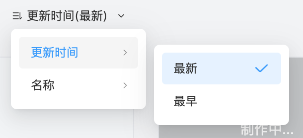

# 使用课件广场

启动 Cocos ICE 并使用 Cocos 开发者帐号登录后，就会打开 **课件广场** 界面，在这里你可以新建课件、打开已有课件；也可以上传课件至云端、下载他人制作课件，方便内部协作；还可以对课件进行统一的目录管理，方便结构化存管课件。

## 基础操作

1. **目录**：目录分为 **快捷目录** 和 **企业共享目录**。
    - **快捷目录**：包含 **最近打开** 和 **我的课件**，可以便捷的查看您最近打开过的课件和您创建的课件。
    - **企业共享目录**：企业内的所有用户可以共享该目录下的所有目录和课件，您可以在此对课件进行分类管理，点击 **企业共享目录** 旁的  按钮，即可创建一级目录。目录右侧的 **...** 按钮可用于继续添加一级目录、在一级目录下添加二级目录、按需添加子目录。

2. **刷新**：点击  按钮可以 **刷新** 课件广场，从服务端获取最新的数据。

3. **新建课件**：选中一个目录，点击 **新建互动课件** 或 **新建互动视频**，将在该目录下生成一个新互动课件或互动视频。点击 **导入 PPT 文件** 可以选择 `.pptx` 文件导入并自动新建一个互动课件，支持导入文字、图片、音视频等基础对象，也支持导入部分基础动效、直线路径动效和页面跳转超链接，还支持导入公式和表格，但导入公式和表格后不可编辑。

4. **编辑课件**：将鼠标滑动到想编辑的课件上，点击 **打开**，即可编辑课件。如果课件未下载，可以先点击 **下载** 再打开课件进行编辑。

5. **课件管理**：将鼠标滑动到想编辑的课件上，点击课件名称右侧的 **...** 按钮，支持对课件进行 **上传**、**转化为互动视频**、**重命名**、**创建副本** 和 **删除**，按住课件拖动可以将课件 **移动** 到其他目录。

6. **课件状态**：

    - ：表示课件已同步，即本地课件与服务端课件相同。
    - ：表示课件未下载，即服务端课件比本地课件新。
    - ：表示课件待上传，即本地课件比服务端课件新。

7. **搜索**：支持在当前目录下进行模糊搜索课件。

8. **帮助**：点击  按钮可以打开课件广场的新手引导，查看基础的操作和说明。

9. **排序**：支持选择课件的排序方式，可以按课件的更新时间从新到旧或从旧到新排序，也可以按课件名称首字母顺序排序。

    
