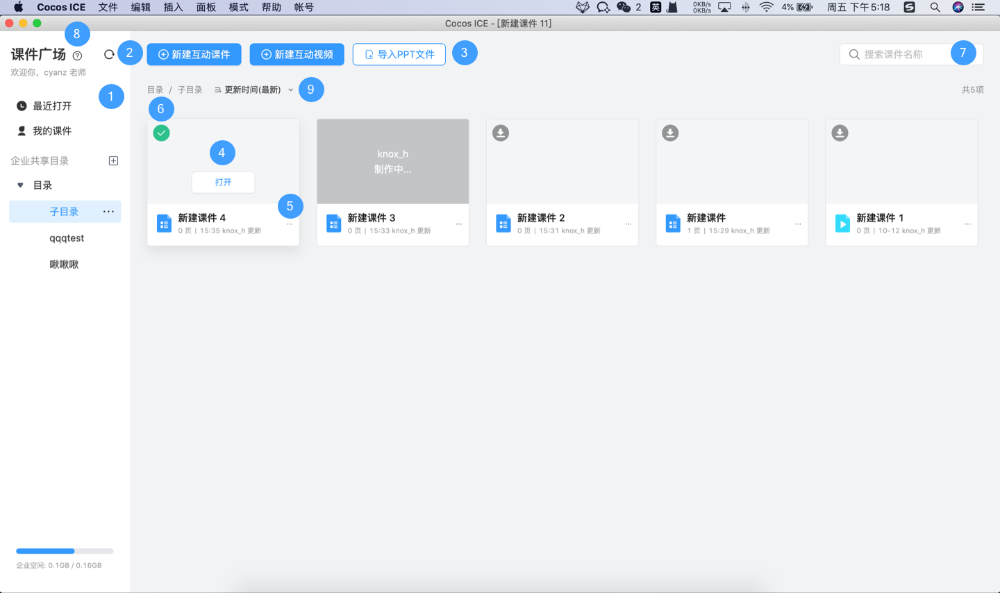

# 使用课程广场

启动 Cocos ICE 并使用 Cocos 开发者帐号登录后，就会打开 **课程广场** 界面，在这里你可以新建课程、打开已有课程；也可以上传课程至云端、下载他人制作课程，方便内部协作；还可以对课程进行统一的目录管理，方便结构化存管课程。

## 基础操作

1. **目录**：目录可以对您的课程进行分类，点击左侧 **目录** 旁的 **+** 按钮，即可创建一级目录。**+** 按钮下方的 **...** 按钮可用于继续添加一级目录、在一级目录下添加二级目录、按需添加子目录。

2. **新建课程**：选中一个目录，点击 **新建课程**，将在该目录下生成一个新课程。

3. **编辑课程**：将鼠标滑动到想编辑的课程上，点击 **打开**，即可编辑课程。如果课程未下载，可以先点击 **下载** 再打开课程进行编辑。

4. **课程管理**：将鼠标滑动到想编辑的课程上，点击 ，支持对课程进行 **上传**、**重命名**、**创建副本**、**删除**，按住课程拖动可以将课程 **移动** 到其他目录。

5. **课程状态**：

    - ：表示课程已同步，即本地课程与服务端课程相同。
    - ：表示课程未下载，即服务端课程比本地课程新。
    - ：表示课程待上传，即本地课程比服务端课程新。

6. **搜索**：支持在当前目录下进行模糊搜索课程。

7. **刷新**：点击  按钮可以 **刷新** 当前课程广场，从服务端获取最新的数据。

8. **帮助**：点击右上角的  按钮可以打开课程广场的新手引导，查看基础的操作和说明。
