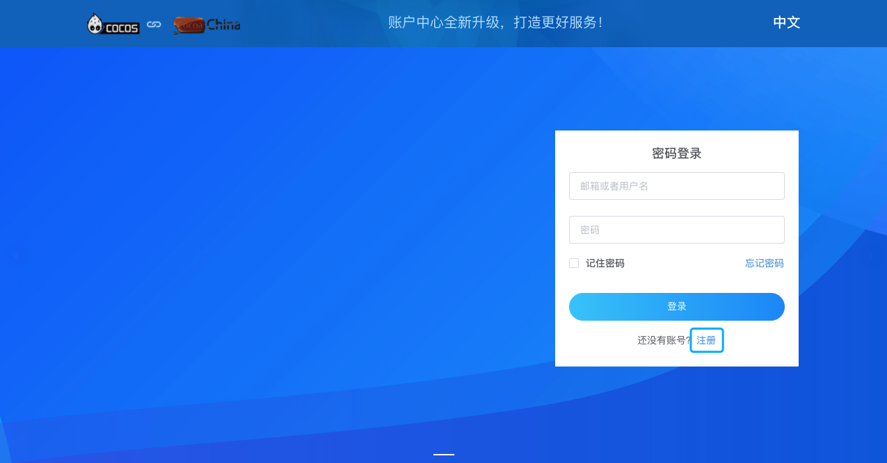
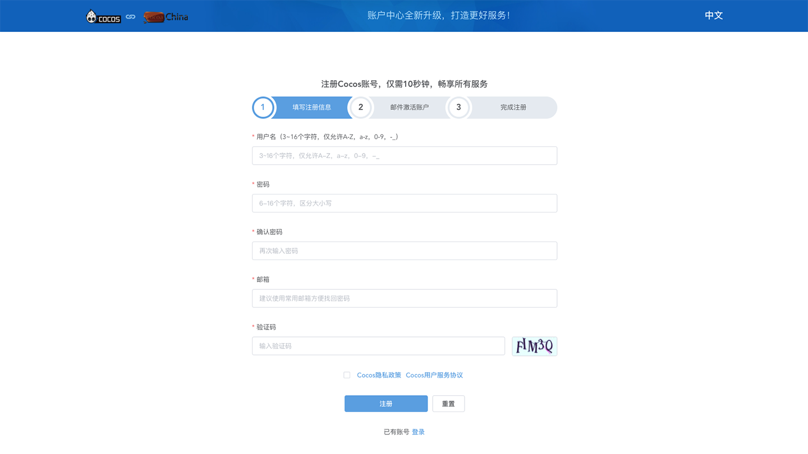
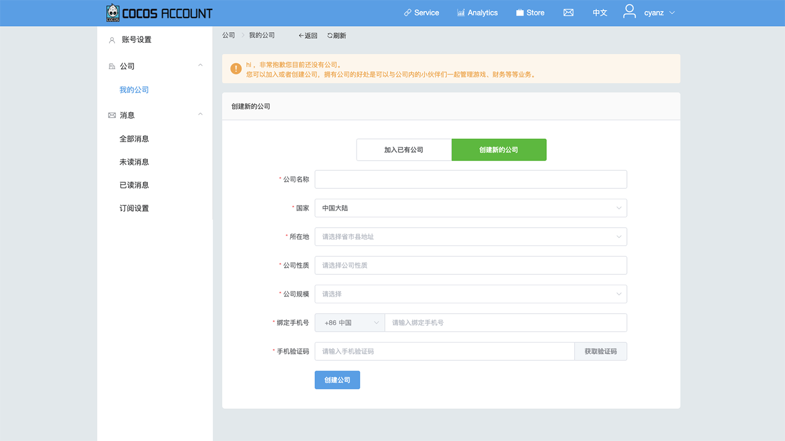
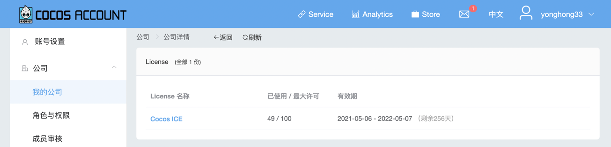
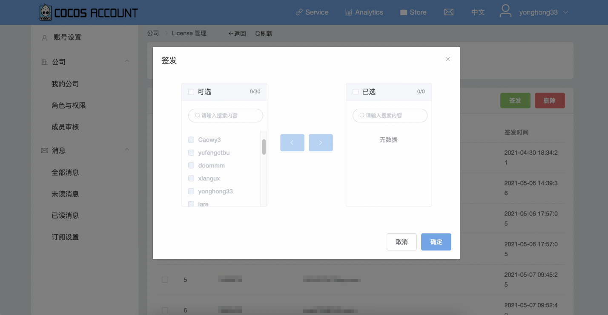

# 注册和授权

## 1. 账号注册

- 访问 [**Cocos 账号登录页**](https://auth.cocos.com/#/) ，点击 **注册**。

    

- 填写注册信息，注册 Cocos 账号。

    

## 2. 账号授权

ICE 账号根据公司授权，公司管理员可统一管理，因此需要您的 Cocos 账号注册、加入公司，与公司绑定。

### 公司授权

#### 注册公司

- 使用拟作为管理员的账号登录 [**开发者后台**](https://account.cocos.com/#/) 。

- 点击 **创建新的公司**，填写相关信息，进行创建公司。

    

#### 申请官方授权

将已注册的公司名称及管理员的注册邮箱 **发给官方人员**（联系方式见下图）申请授权，授权完成后即可使用。

### 账号授权

#### 加入公司

- 普通账号可以登录 [**开发者后台**](https://account.cocos.com/#/) 提交加入公司申请。

- 管理员账号可以在 **开发者后台** 邀请成员、审核成员加入公司。

    

#### 账号授权

- 需要 **管理员** 账号在 [**开发者后台**](https://account.cocos.com/#/) 点击 **Cocos ICE**。

    

- 然后点击 **签发**，选择已加入公司的账号进行授权，授权完成后即可使用。

    

    
