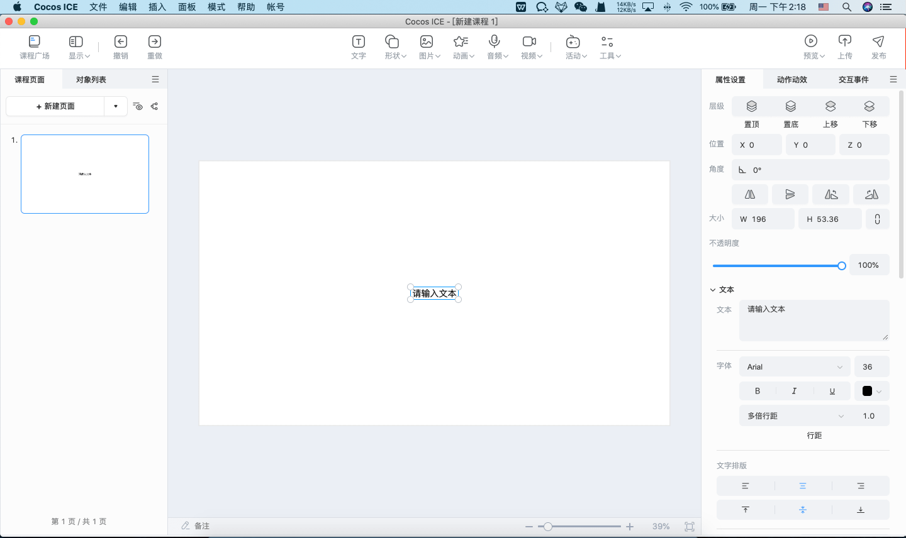
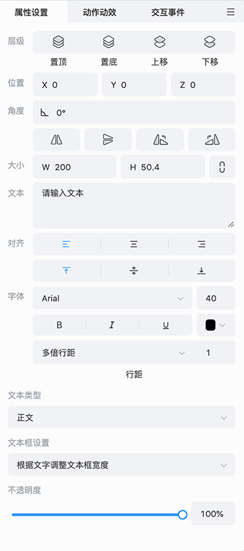
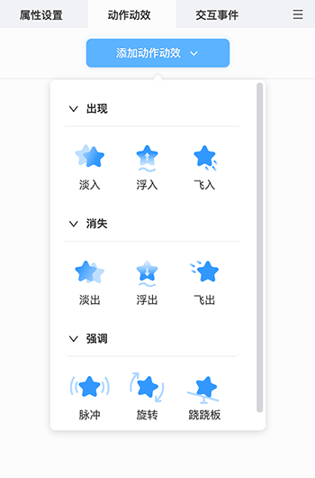

# 制作课件

教研团队可以很方便地制作教学课程，支持在课程页面上添加文字、图片、音视频、组件等对象，同时还可以通过属性设置面板设置对象属性值，以及配置动作动效和交互事件。

## 基础操作

1. 点击 **新建页面**，可添加新页面，在课程页面面板中可右键删除页面。新建页面支持通过模版新建，模版可由公司自由配置。

    

2. 在 **工具栏** 选择插入文字、图片、音频、视频、动画、活动、工具等 **对象** 到场景中。编辑器在每个步骤都支持自动保存。

3. 场景的所有对象都会显示在 **对象列表** 中。选中对象后，可在对应的 **属性** 面板中修改显示样式、位置。对象不同，对应的属性面板中的参数也会存在差异（下图示例的是文字的属性面板）。

    

4. 选中对象，通过 **动作动效** 和 **交互事件** 面板配置动作动效和交互事件，可以让课件更生动有趣，加强交互性。

    

5. 课件制作中或完成后，点击 **工具栏** 右侧中的 **预览** 按钮，选择直接 **预览** 或 **从当前预览**，将弹出预览窗口，支持在多种设备仿真、实时预览制作的课件效果，还支持移动端扫码预览，详见 [**预览**](../preview/index.md) 文档。

    
