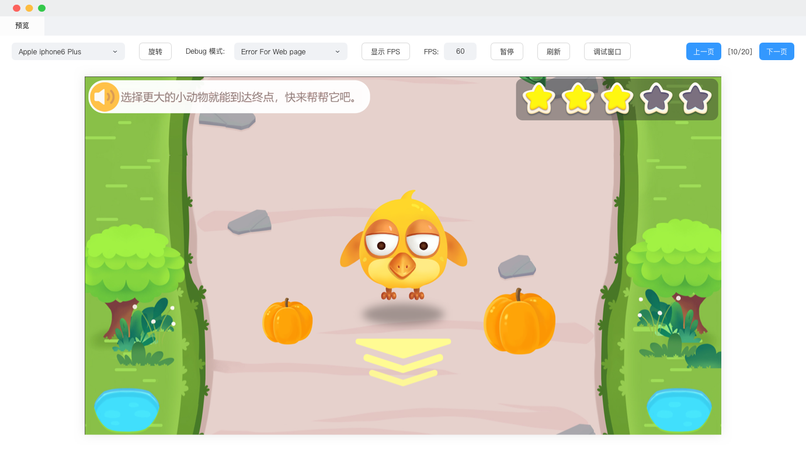

# 制作课件

教研团队可以很方便地制作教学课程，支持在课程页面上添加组件和素材，同时还可以通过属性面板设置对象属性值，以及配置事件动作。

## 基础操作

1. 点击 **新建页面**，可添加新页面，在课程页面面板中可右键删除页面。新建页面支持通过模版新建，模版可由公司自由配置。

    

2. 场景编辑器为当前选中页面的放大展示，素材、组件是可以添加入场景编辑器的对象内容。

3. 场景编辑器中的所有对象，都会在 **对象列表** 中出现。选中对象后，可在对应的 **属性面板** 中修改显示样式、位置。对象不同，对应的属性面板中的参数也会存在差异（下图示例的是文字的属性面板）。

    

4. 选中对象，可通过 **事件面板** 配置触发条件、动作，为课件添加趣味动效。

    

5. 课件制作中或完成后，点击 **工具栏** 中的 **预览** 按钮，将弹出预览窗口，支持支持在多种设备仿真、实时预览制作的课件效果。

    
