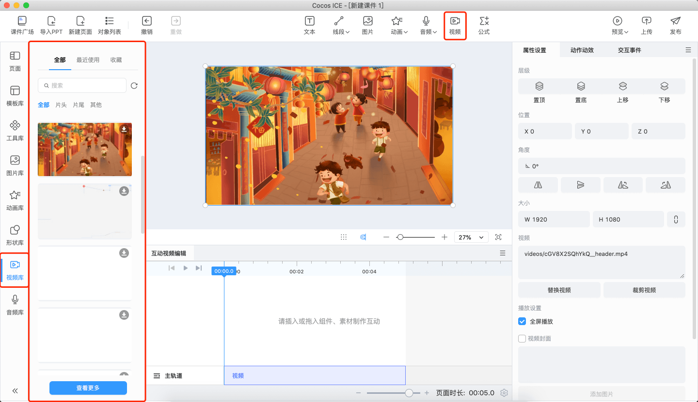
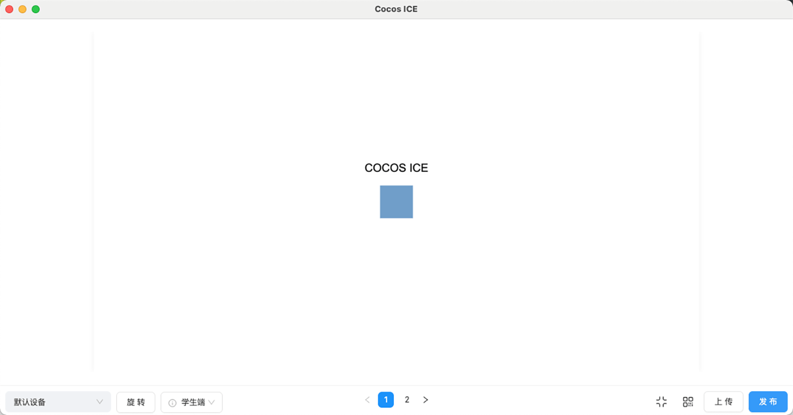

# 互动视频制作

Cocos ICE 的互动视频支持在视频任意时间点中插入互动组件，制作互动视频。组件可以由公司自定义开发，可以是选项、游戏或其他互动，支持同时编辑多条互动视频。

## 基础操作

1. **插入视频**：在 **视频库** 中选中想要插入的视频，点击或拖拽视频到互动视频编辑面板，或在工具栏点击 **视频** 按钮选择本地视频，即可将视频置入其中的主轨道上。

    

2. **设置视频流程**：**页面** 面板会以流程图的形式显示，可以先规划好互动视频的主流程，将视频分别插入相应的页面中。

    

3. **插入互动**：选中一个有视频的页面，互动视频编辑面板将出现时间线，点击或拖拽时间线确定时间点，从素材库或本地选择对象插入，**工具库** 中的 **互动视频组件** 分类下为互动视频常用的组件，用户可以从中选择需要的互动插入。

    

    > **注意**：插入文字、形状、图片、动画、音频、视频和其他工具等对象时，默认为播放状态，从选中的时间点开始与视频同时播放 5 秒，插入活动、视频互动时将暂停选中的时间点，用户也可以自己修改。

4. **编辑对象**：在互动视频编辑面板或场景中选择对象，可以在右侧的 **属性设置面板** 编辑对象的内容、设置在视频暂停或播放时出现、组件出现和结束的时间等。在互动视频面板拖拽组件也可以设置组件的出现和结束时间。在动作动效面板和交互时间面板也可以给属性添加动效和事件。

    

5. **设置分支**：分支支持跳转当前页面的指定时间，也支持跳转到其他页面，悬停在互动视频编辑面板的选项时，会出现按钮，可以点击按钮新建页面，也可以拖拽按钮到时间或页面上即可指定跳转，或点击时间修改精确的时间点。也可以通过交互事件面板设置。

    

6. **其他设置**：调节互动视频面板页面右下方的缩放条可以放大、缩小面板中的视频显示的宽度。点击旁边的页面时长和设置按钮可以对设置页面相关的属性。

7. **预览**：互动视频制作中或完成后，点击 **工具栏** 右侧的 **预览** 按钮，选择直接 **预览** 或 **从当前预览**，将弹出预览窗口，支持在多种设备仿真、实时预览制作的课件效果。

    
