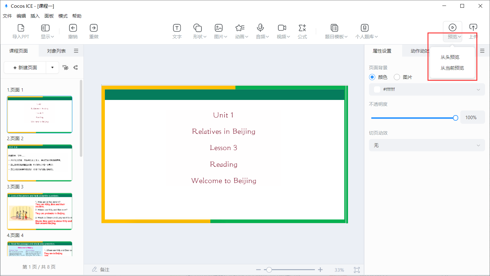
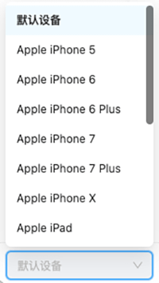
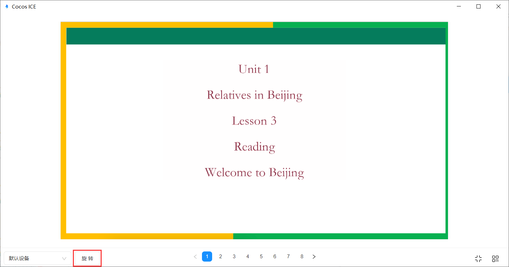
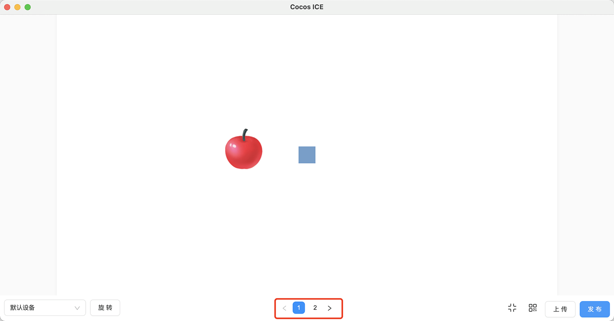
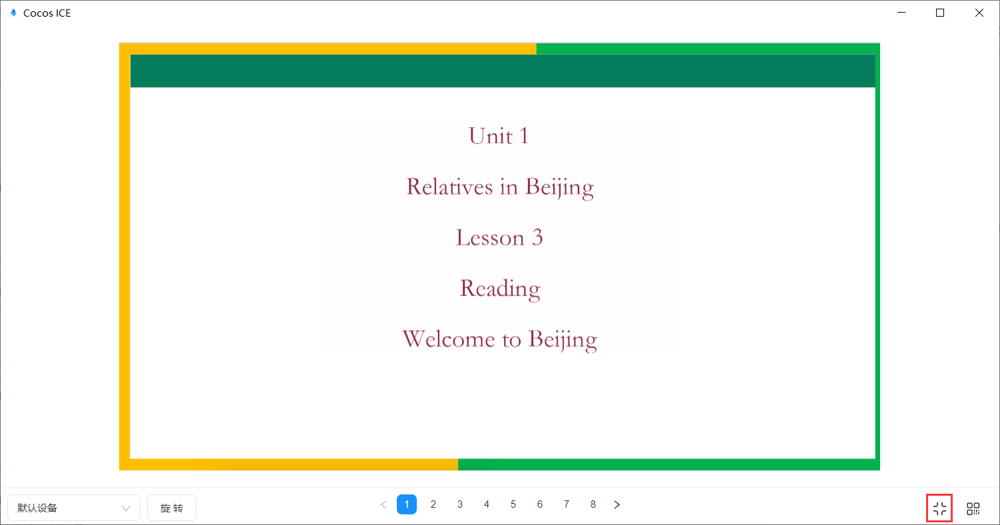
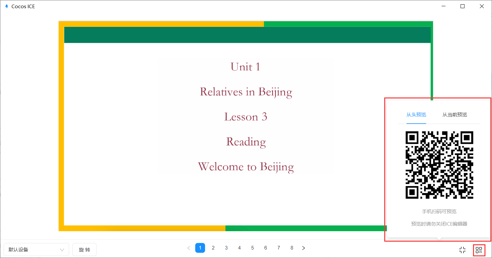
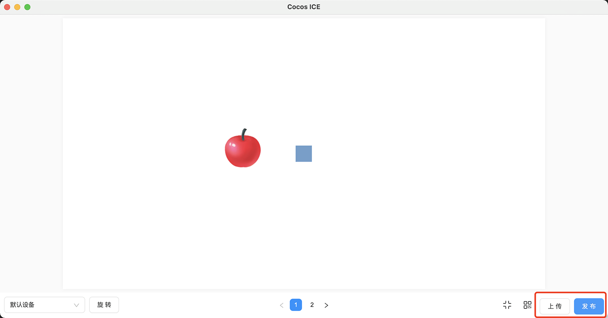

# 预览

点击编辑器主界面 **工具栏** 右侧的 **预览** 按钮，可以对当前课程进行预览。点击 **预览** 按钮下方 ，便可选择从头预览或者是从当前页面预览。

## 预览界面介绍

点击 **预览** 后，会进入预览页面，如下图所示。

1. **分辨率选择**:点击界面左下角的选择框，便可选择不同设备的分辨率，查看不同分辨率下该课程的预览情况。

    

2. **旋转**：点击 **旋转** 按钮，便可让预览画面进行横竖屏的切换。

    

3. **快捷翻页**：在这里可以点击对应页数或者翻页按钮，进行快捷翻页的操作。

    

4. **全屏和原始尺寸预览**：当画面在全屏预览状态下，则按钮会变成 **原始尺寸** 状态；当画面在原始尺寸预览状态下，则按钮会变成 **全屏** 状态。点击按钮，便可以让预览画面进行原始尺寸或者全屏的预览。

    

5. **二维码预览**：点击 **二维码预览** 按钮，便会出现预览二维码，用户可以通过扫描二维码，在手机上进行课程的预览。

    

6. **上传和发布**：点击 **上传** 和 **发布** 按钮，便可进行课程上传和发布的操作。

    
