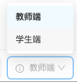
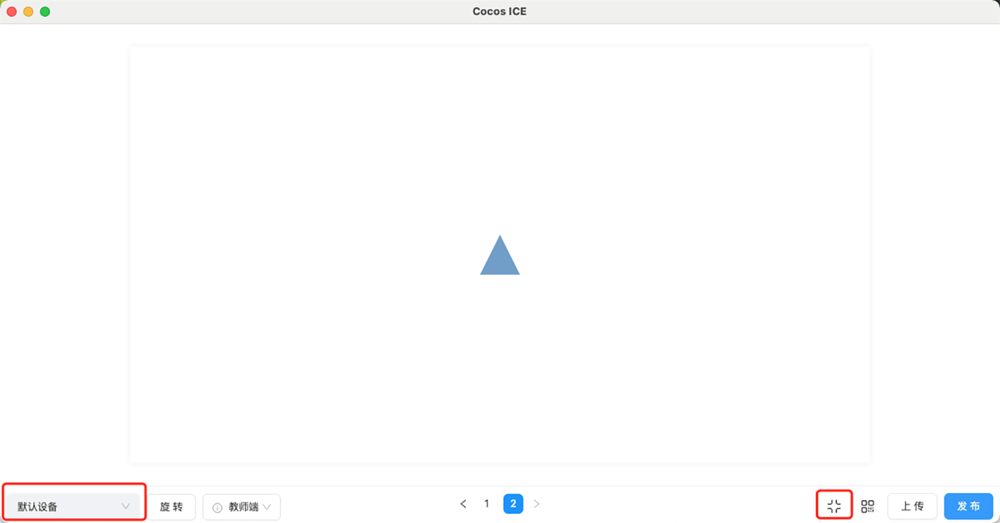

# 预览

点击编辑器主界面 **工具栏** 右侧的 **预览** 按钮，可以对当前课程进行预览。点击 **预览** 按钮下方 ，便可选择从头预览或者是从当前页面预览。

## 预览界面介绍

点击 **预览** 后，会进入预览页面，如下图所示。

1. **预览仿真设备选择**:点击界面左下角的选择框，可以选择不同仿真设备，查看不同设备分辨率下该课程的预览情况，默认为课件原始分辨率，如果用户选择过预览仿真设备，下次预览默认为该设备分辨率。

    

2. **旋转**：点击 **旋转**  按钮，便可让预览画面进行横竖屏的切换。

3. **教师端/学生端切换**：在这里可以对预览的画面进行教师端和学生端的切换。选择学生端，则预览的是学生端的画面；选择教师端，则预览的是教师端的画面。该功能主要用于多端教学场景，详见 [多端控制配置](../../developer/configure/multi-terminal/index.md)。

    

4. **快捷翻页**：在这里可以点击对应页数或者翻页按钮，进行快捷翻页的操作。

    

5. **全屏和原始尺寸预览**：在默认情况下，预览画面是以当前设置的课件原始分辨率进行全屏的展示，如下图所示。

    

    > **注意**：企业可自定义设定编辑器的原始分辨率，详见 [分辨率配置](../../developer/configure/resolution/index.md) 文档。

    - 当画面在全屏预览状态下，则按钮会变成 **原始尺寸**  状态；当画面在原始分辨率预览状态下，则按钮会变成 **全屏**  状态。点击按钮，便可以让预览画面进行原始分辨率或者全屏的预览。

6. **二维码预览**：点击 **二维码预览** 按钮，便会出现预览二维码，用户可以通过扫描二维码，在手机上进行课程的预览。

    

7. **上传和发布**：点击 **上传** 和 **发布** 按钮，便可进行课程上传和发布的操作。

    
