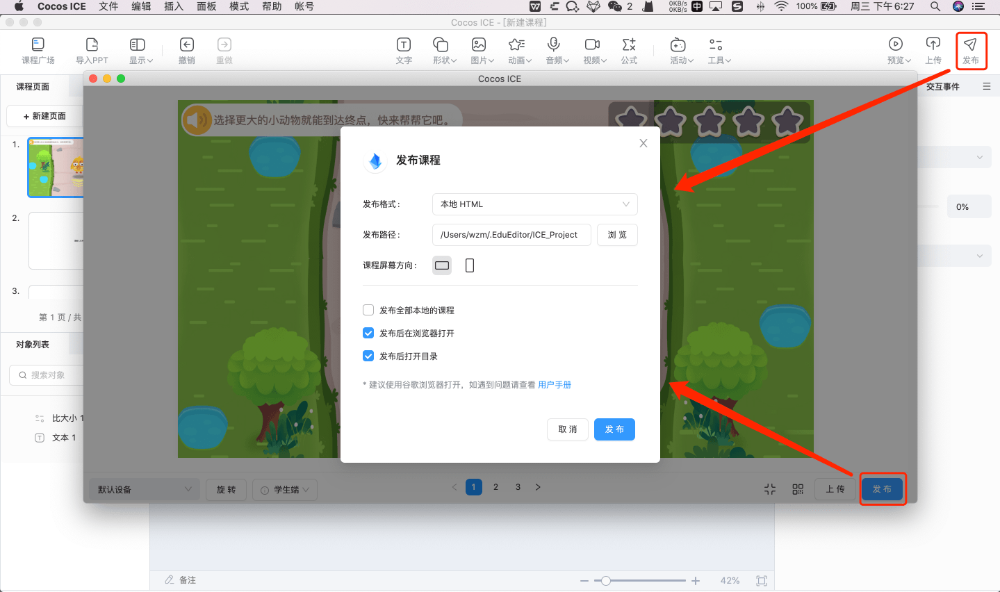

# 上传和发布

## 上传课程

- 点击编辑器主界面 **工具栏** 右侧的 **上传** 按钮，即可将当前课程上传到 **课程广场**，并反馈上传结果。

- 将光标移到 **课程广场** 要上传的课程上，点击 ，点击 **上传**，即可上传课程，并反馈上传结果。

> **注意**：离线状态下，不允许上传课程。

## 发布课程

### 非研发模式发布

非研发模式支持发布课程为 HTML 到本地。

> **注意**：Cocos ICE 1.1.1 及之前的版本，不支持 **只打包当前课程**，发布的文件夹内会包含所有课程用到的资源，所以包体较大。如果您需要优化包体大小，建议使用 v1.1.2 以上版本，或使用研发模式发布。

#### 操作方法

点击 **工具栏** 右侧的 **发布** 按钮，在弹出的窗口中选择发布目录，选择课程屏幕方向，然后点击 **发布** 即可发布课程。

> **注意**：由于系统限制，发布后的 HTML 可能无法直接在谷歌浏览器打开，建议发布时不要取消勾选 **发布后在浏览器打开**，或者直接在浏览器中打开 <http://localhost:7456/build/> 预览（该网址仅支持预览最新发布的课程）。

### 研发模式发布

研发模式下，支持将课程发布到所有 Cocos Creator 支持的平台，但操作相对复杂，建议由研发同学来执行：

1. 点击 **菜单栏 -> 模式** 切换到 **研发模式**，即可切换使用 Cocos Creator 2.4.6。

2. 点击 **菜单栏 -> 教育编辑器 -> 课程广场**，下载老师制作好的课程，选择需要发布的课程，执行构建发布。具体操作可参考 [**Cocos Creator 用户手册 — 跨平台发布**](https://docs.cocos.com/creator/manual/zh/publish/)。
