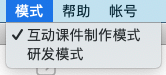
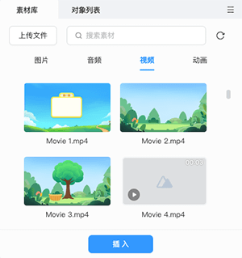

# 互动视频制作

Cocos ICE 支持在视频任意时间点中插入互动组件，制作互动视频。组件可以由公司自定义开发，可以是选项、游戏或其他互动，支持同时编辑多条互动视频。

## 切换到互动视频制作模式

打开课程，点击 **主菜单 -> 模式**，点击切换到互动视频制作模式。

## 基础操作

1. 插入视频。在 **素材库** 选中想要插入的视频，点击下方的 **+ 插入** 按钮，即可将视频置入互动视频的制作面板中。

    

2. 点击 **互动视频** 面板中的视频，将出现滑块，按住滑块可左右拖拽，滑块实时显示当前时间点，点击 **插入互动** 可在当前时间点添加分支选项或其他互动组件。

    您可以通过页面右上方的缩放条放大、缩小面板中的视频显示的宽度，调节到您认为舒适方便的尺寸。

    

3. 面板中的分支选项和主线都可以添加新页面/视频，或链接到已由页面，选中页面/视频后，同样将出现在场景编辑器。其他操作同 **课程制作模式**。

4. 拖动页面/视频可以改变顺序，右键箭头或页面/视频也可以在相应位置插入新页面。

5. 选中视频或组件，可以在右侧的 **属性面板** 可以编辑视频、组件的内容、设置等，详细说明见 [**视频属性**](../tools/object/video/index.md)。

    

6. 课件制作中或完成后，点击 **工具栏** 右侧的 **预览** 按钮，选择直接 **预览** 或 **从当前预览**，将弹出预览窗口，支持在多种设备仿真、实时预览制作的课件效果。

    
