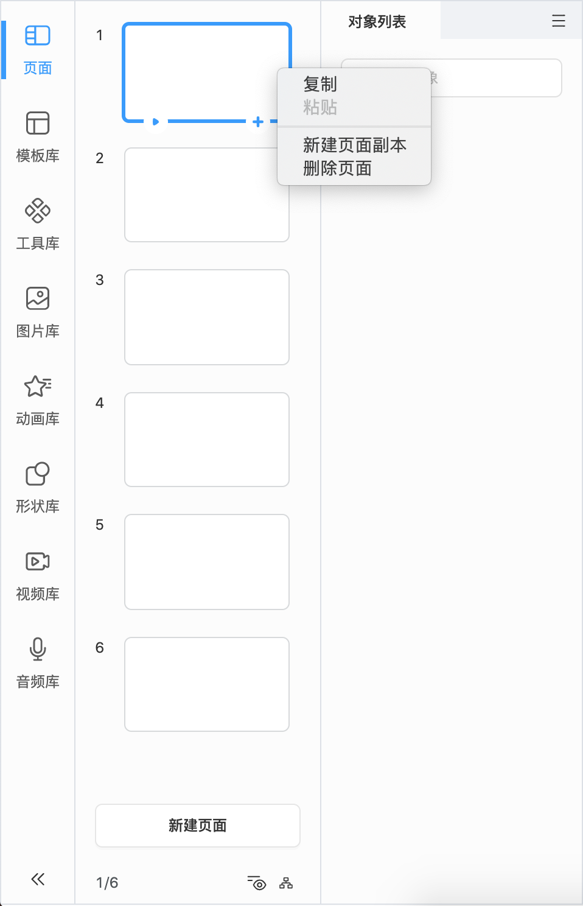
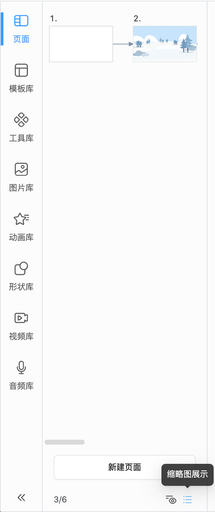

# 课程页面

展示当前的课程结构和各课程页面的缩略图，可以在这里切换课程，管理课程中的页面，预览页面。

>**注意**：当前课程页面的缩略图在页面保存后才会刷新，如果希望实时刷新可以由研发统一配置 [**强制刷新页面缩略图**](../developer/refresh-page/index.md)

## 基础操作

- 点击 **新建页面** 可在面板中添加新页面到最后。点击旁边的下拉按钮可以选择页面模板进行页面新建。点击  可以快速在选中页面下方新建页面。新建课程后是否自动生成空白的第一页、页面模板研发可以统一配置，适用于各公司自己的使用场景。

- 点击  按钮可以控制页面名称的显示和隐藏，显示名称时，双击名称可以重命名页面；

- 点击  按钮可以控制页面为流程图展示或列表展示。

    

- 选中页面后，拖动页面可以调整页面顺序，点击 **右键** 可以复制页面、新建页面副本、删除页面。

- 在页面上悬停时，点击  可以从当前页面预览。

- 选中页面时，可以在右侧属性设置面板编辑页面属性，设置背景颜色、图片和切页动效。

    

    - 目前切页动效支持 **淡入/淡出**、**覆盖**、**揭开** 和 **推入**，还支持企业 [**自定义切页动效**](../developer/develop-page_effect/index.md)。

        
