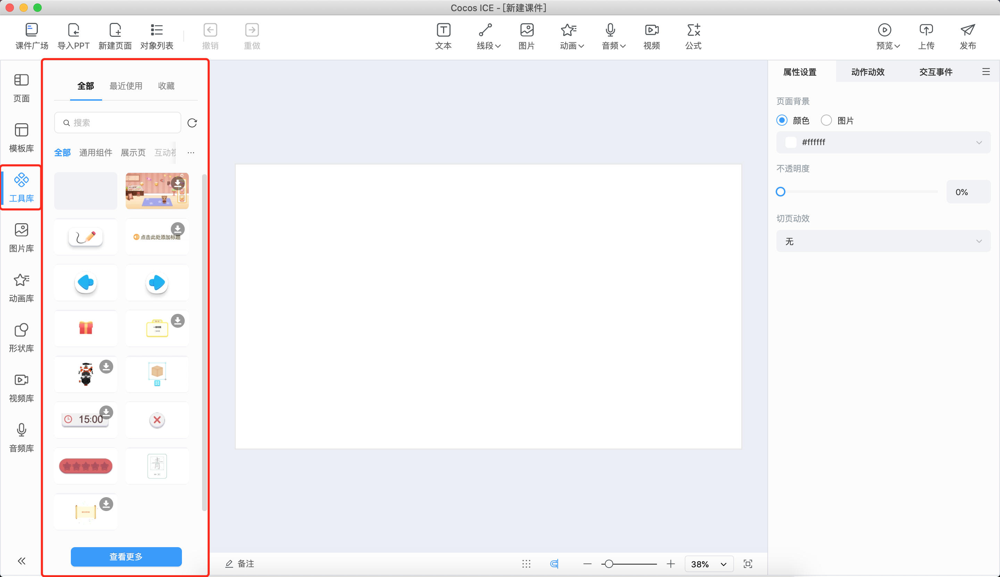
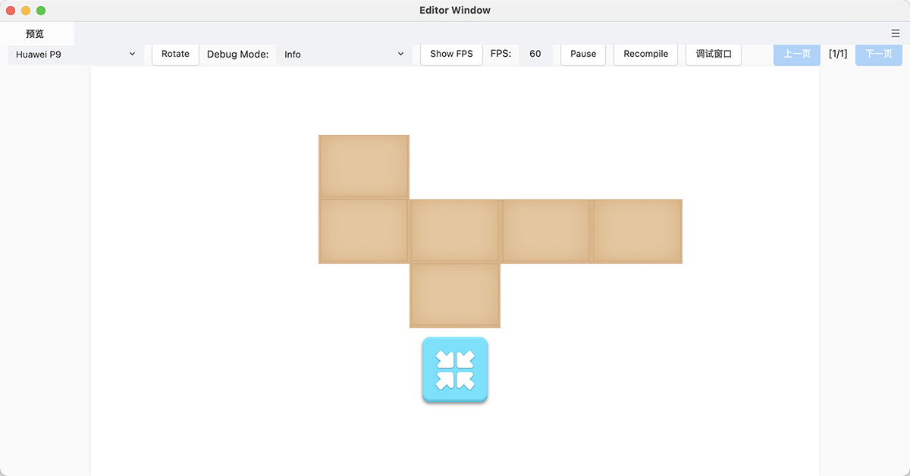
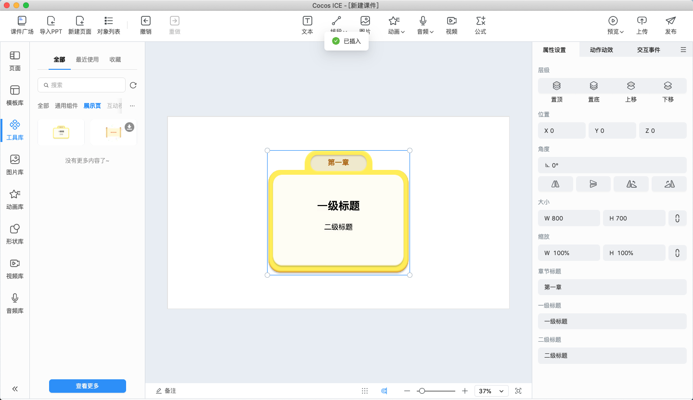
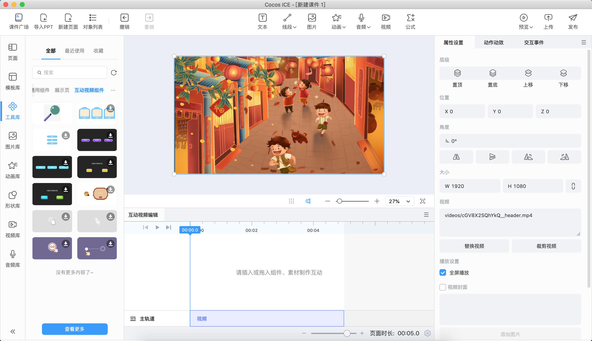
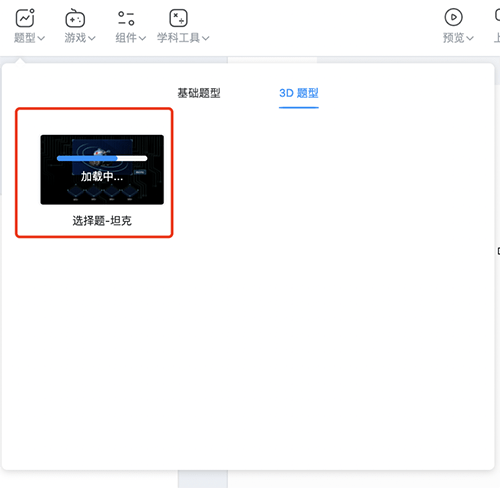

# 工具库

目前工具库包括 **通用组件**、**展示页**、**互动视频组件**，在工具库中进行筛选和选择，下载后再次点击可插入工具到当前页面。工具支持各公司自由开发和分类。

## 通用组件

以 **立方体** 组件为例，添加后支持旋转，也支持展开成平面体，用于了解立方体的结构。

### 编辑通用组件

在场景中选中添加的工具组件，即可在 **属性设置** 面板编辑，不同组件其对应的属性面板中的属性参数不同。

## 展示页

展示页分类下包含一些标题、提示等展示面板，用户可以用于组合课件。

### 编辑展示页

在场景中选中添加的展示页，即可在 **属性设置** 面板编辑，不同组件其对应的属性面板中的属性参数不同。

## 互动视频组件

互动视频组件在制作互动视频时常用，需要切换到 [互动视频制作模式](../../getting-started/make-interactive-video/index.md) 使用。

### 编辑视频互动组件

在场景或互动视频编辑面板选中添加的视频互动组件，即可在 **属性设置** 面板和 **交互事件** 面板设置参数。

## 自定义组件开发

详细自定义组件开发说明见 [**自定义组件**](../../developer/develop-component/index.md)。

## 互动组件服务端管理

为方便管理互动组件，节约资源空间，目前的互动组件统一放在服务端进行管理，用户若第一次插入某个互动组件，会自动从服务端下载该组件，加载进度条完成后，会将组件自动插入场景编辑器中进行使用。

下图为示例：

