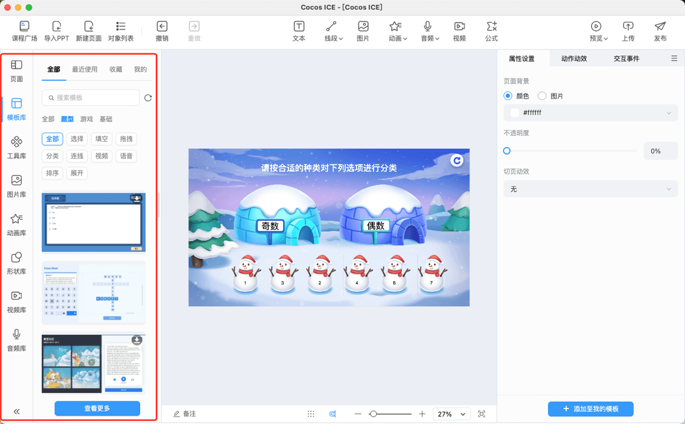
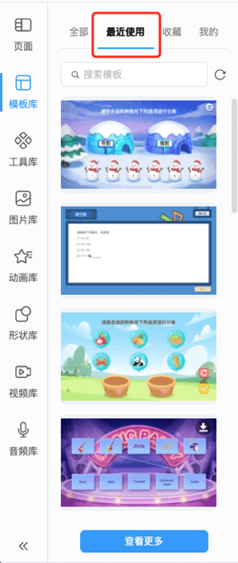
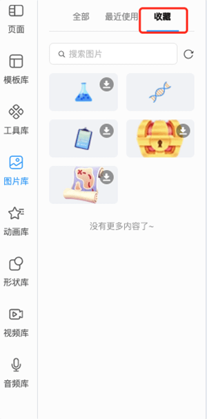
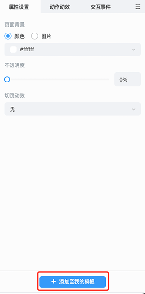
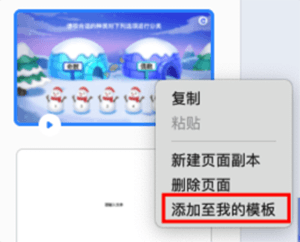
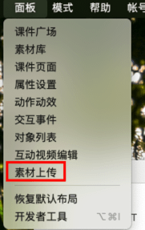
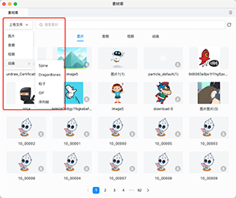
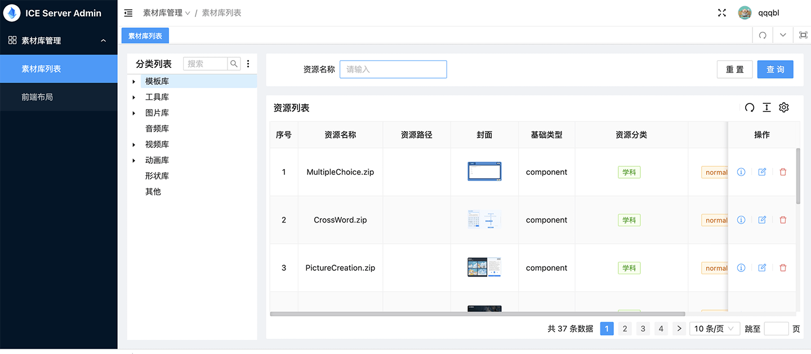

# 资源库

用于存放 ICE 内置的部分基础对象资源，以及各公司接入的 **模板库**、**工具库**、**图片库**、**动画库**、**形状库**、**视频库** 和 **音频库** 资源，并支持资源分类的显示。

> **注意**：资源的分类可以根据企业的需求进行定制化。

- 最近使用：选择相应的资源类型，会根据用户插入该类型资源的时间顺序，从新到旧依次显示用户最近使用的资源。

    

- 收藏：鼠标移入资源时，会出现收藏的按钮 ，用户可以点击收藏的按钮，对该资源进行收藏。已收藏的资源会先显示在收藏的列表下。

    

- 我的：当页面内存在对象时，用户可以选中页面属性或者右击页面，再点击 **添加至我的模板** 按钮，将该页面另存为模板，保存到 **模板库** 下的 **我的** 列表里。

    
    

    > **注意**：只有模板库会出现 **我的** 列表，其他资源下不会有 **我的** 列表。

- 资源库面板：点击 **查看更多** 按钮，可快速唤出 **资源库** 面板，面板中包括 **模板库**、**工具库**、**动画库**、**视频库** 和 **音频库**，可根据需要快速选择资源类型，并在页面里插入对应资源。

    

- 资源库支持 **搜索资源**，能在当前类目下对资源进行模糊搜索。

- 选中资源后，点击 **确定**，便可将资源插入到场景中。

## 资源来源

- **内置资源**：Cocos ICE 会提供部分 **CC0** 资源，打开编辑器就能直接使用。

- **上传资源**：Cocos ICE 提供上传资源的入口，可由研发给有权限的用户配置，详见 [**资源上传**](../developer/configure/upload/index.md) 进行配置，配置入口后用户可通过点击 **面板** 处的 **素材上传**，打开素材上传面板，将本地文件上传至资源库内，进行使用。

    

    

- **接入资源库**：公司能通过 [**配置服务端**](../developer/configure/server/index.md) 接入自己内部的素材库，支持限制内网使用。

- **管理资源**：可由研发给有权限的企业配置素材管理后台，在素材管理后台可以进行资源的类别编辑和资源的删除。

    

> **注意**：上传课件时，不会上传课件中使用的本地图片到资源库。
