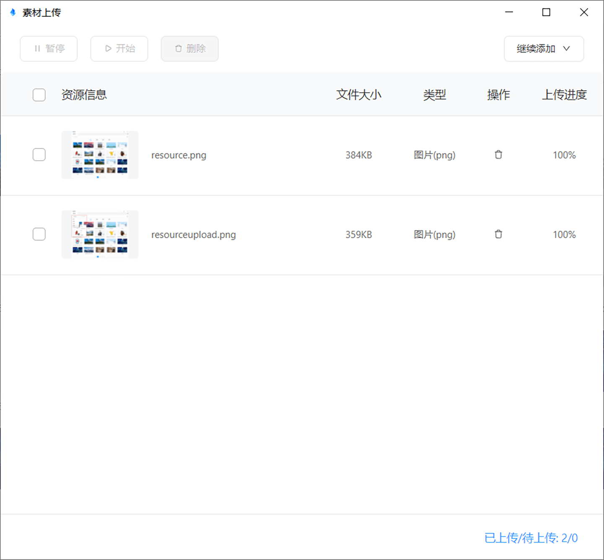

# 素材库

点击工具栏中的素材库，可快速唤出 **素材库** 面板，面板中包括 **图片**、**音频**、**视频**、**动画** 4 种类型，可根据需要选择素材类型，支持预览素材。选中素材后，点击下方的 **+ 插入** 按钮或直接拖拽素材到 **场景** ，即可将其添加到 **场景** 中。

素材库支持 **搜索素材**，能在当前类目下对素材进行模糊搜索。

## 素材来源

- **内置素材**：Cocos ICE 会提供部分 **CC0** 素材，打开编辑器就能直接使用。

- **上传素材**：Cocos ICE 也提供上传素材的入口，用户可通过点击 **上传文件**，将本地文件上传至素材库内，进行使用。目前支持上传 **图片**、 **音频**、 **视频**、 **动画** 文件。

- **接入素材库**：公司能通过 [**配置服务端**](../developer/configure/server/index.md) 接入自己内部的素材库，支持限制内网使用。

> **注意**：当前版本在上传课程时会上传课程中使用的本地图片到素材库，后续版本会进行优化，支持定制限制上传权限。
