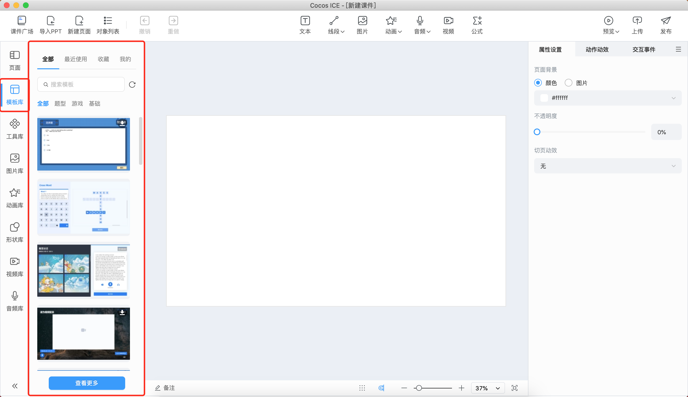
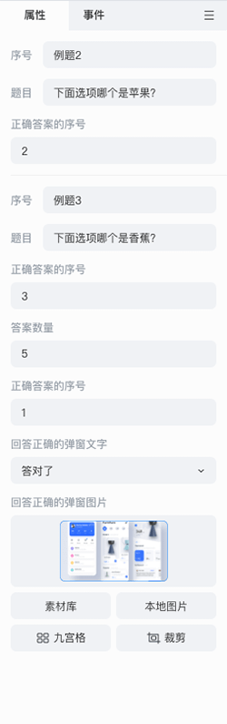
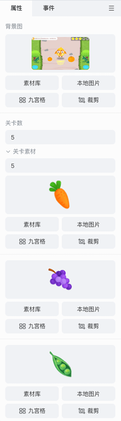

# 模板库

目前模板库包括 **题型模板**、**游戏模板**、**基础模板**，在模板库中进行筛选和选择，下载模板后再次点击可将模板作为一个新页面添加到当前选中页面的下一页。模板支持各公司自由开发和分类。

## 编辑题型模板

题型模板内主要包含常见互动题型，如选择题、填空题等。在场景中选中对象，即可在 **属性设置** 面板设置题目选项的数量、内容、答案，以及答题反馈等。

下图为示例：

## 编辑游戏模板

游戏模板内主要包含各种用于教育的互动小游戏，在场景中选中对象，即可在 **属性** 面板设置游戏关卡数量、选项素材等。

下图为示例：

## 编辑基础模板

基础模板主要包含页面展示模板，在场景中选中对象，即可在 **属性** 面板设置相应内容。

