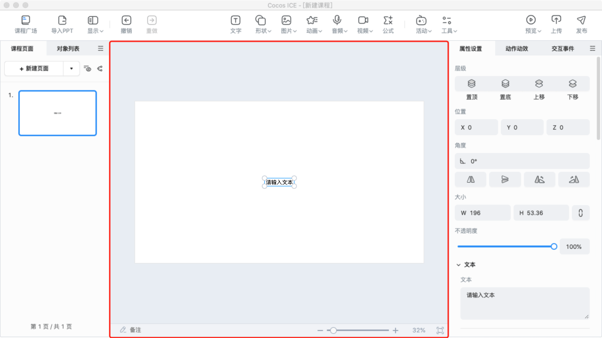

# 场景

展示和编辑可视内容的工作区域。所见即所得的课程制作工作都依靠场景来完成。（下图大蓝框内为场景）

- 在场景内可以 **选中** 对象，选中后可以拖动对象摆放位置、除了文字外的对象可以点击选中框的四个角缩放对象，更多内容可以在右侧 **属性** 面板进行编辑设置。

- 场景内对象移动时，在对象移动到 **中线** 和 **边线** **附近** 时，与其他对象 **中线** 和 **边线** **对齐的附近** 时，以及对象与其他对象之间 **间距接近相同** 时会 **自动吸附对齐**，并进行 **参考线** 提示。你还可以点击 **工具栏** 的 **显示**，点击 **显示网格**，对象接近网格时也会 **自动吸附对齐**，辅助进行对齐和内容的分布。

- 点击场景内没有放置对象的 **空白处**，可以设置页面的背景图片和切换到该页面时的过渡动画。

- 操作场景右下角的 **缩放条** 可以调整场景预览的大小，也可以使用快捷键缩放。

    - **Windows 快捷键**：按住 `Ctrl` 滑动鼠标滚轮缩放场景，按住鼠标滚轮移动场景。

    - **Mac 快捷键**：按住 `Command` 滑动滑动鼠标滚轮缩放场景，按住鼠标滚轮移动场景。或通过触控板双指捏合缩放场景，双指按住拖动移动场景。