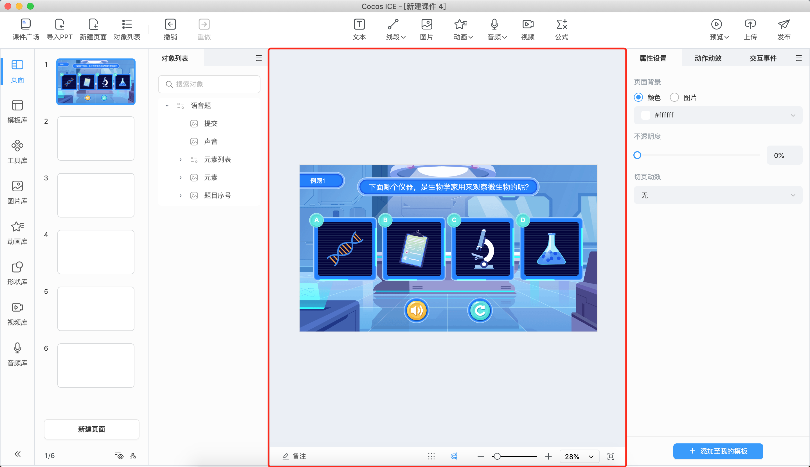
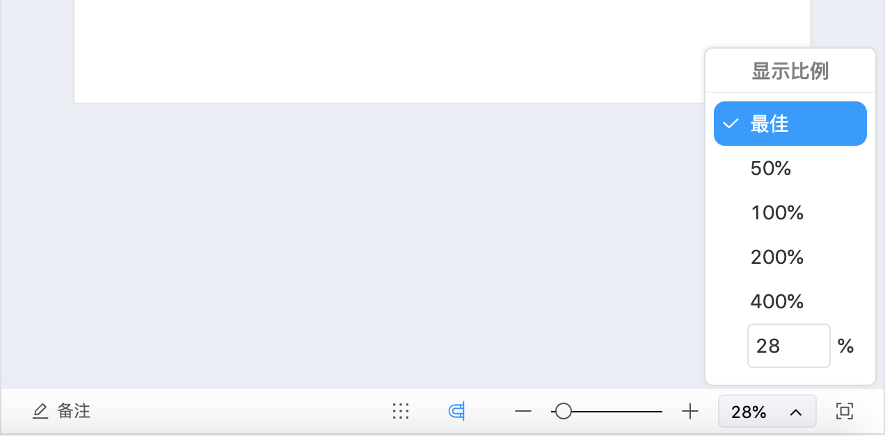
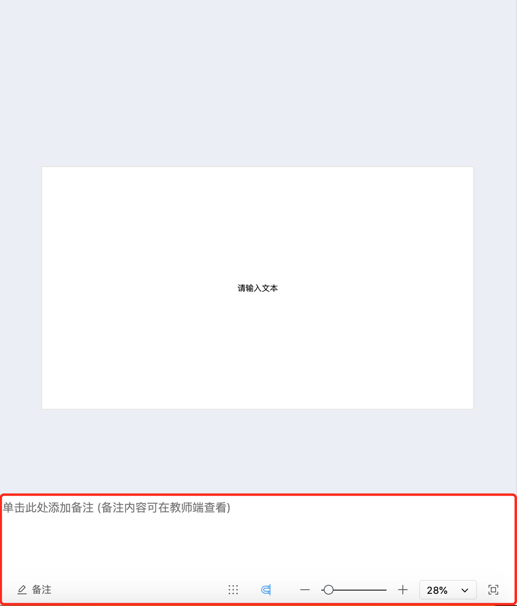
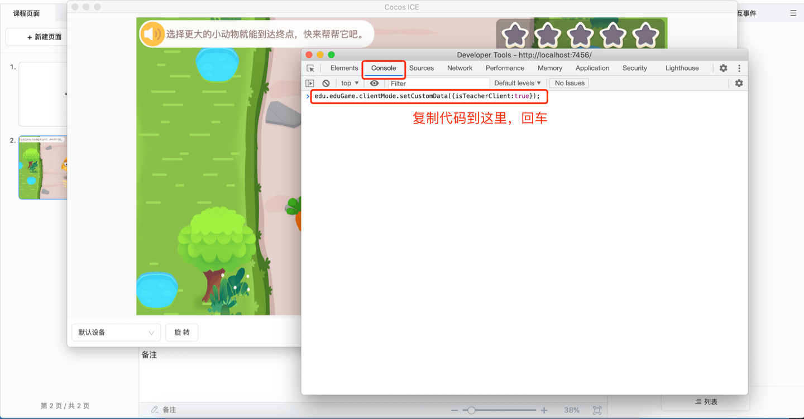
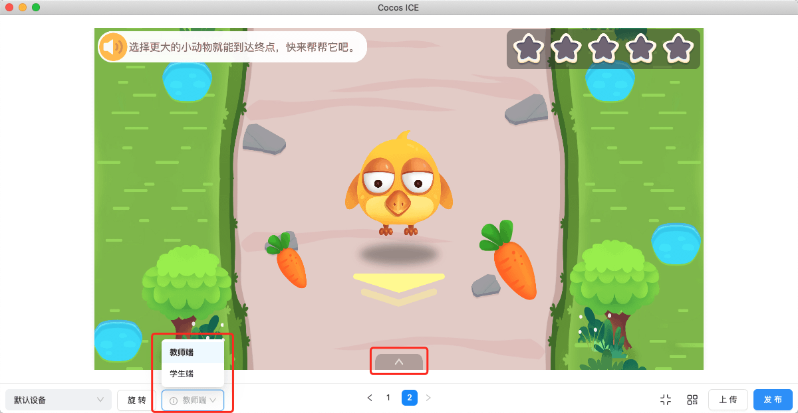

# 场景

展示和编辑可视内容的工作区域。所见即所得的课程制作工作都依靠场景来完成。（下图红框内为场景）



- 在场景内可以 **选中** 对象，选中后可以拖动对象摆放位置、除了文字外的对象可以点击选中框的四个角缩放对象，更多内容可以在右侧 **属性** 面板进行编辑设置。

- 场景内对象移动时，在以下 4 种情况时可以 **自动对齐**，并进行 **参考线** 提示，辅助进行对齐和内容的分布。
    - 对象移动到 **中线** 和 **边线** **附近** 时。
    - 与其他对象 **中线** 和 **边线** **对齐的附近** 时。
    - 对象与其他对象之间 **间距接近相同** 时。
    - 点击 **工具栏** 的 **显示**，点击 **显示网格**，对象接近网格时。

        

- 点击场景内没有放置对象的 **空白处**，可以设置页面的 **背景** 颜色或图片和该页面切换到下一页时的 **过渡动画**。

- 点击场景右下角的  按钮可以让场景预览缩放到最佳比例，也可以通过按钮左侧的数字比例调整场景预览的大小。

    

    还可以操作 **缩放条** 或使用快捷键缩放。

    - **Windows 快捷键**：按住 <kbd>Ctrl</kbd> 滑动鼠标滚轮缩放场景，按住鼠标滚轮移动场景。

    - **Mac 快捷键**：按住 <kbd>Command</kbd> 滑动滑动鼠标滚轮缩放场景，按住鼠标滚轮移动场景。或通过触控板双指捏合缩放场景，双指按住拖动移动场景。

- 点击底部左下角的 **备注** 按钮，可以给当前页面增加 **备注**。

    

    该功能主要适用于为多端教学场景，仅在老师端显示备注内容。在编辑器内查看备注效果需在预览时点击打开 **调试窗口**，输入以下内容后回车：

    ```
    edu.eduGame.clientMode.setCustomData({isTeacherClient:true});
    ```

    

    > **注意**：进行上述操作后需要在预览界面切换到其他页面 1 次才能看到效果。

    然后点击页面下方的箭头即可看到备注。

    
