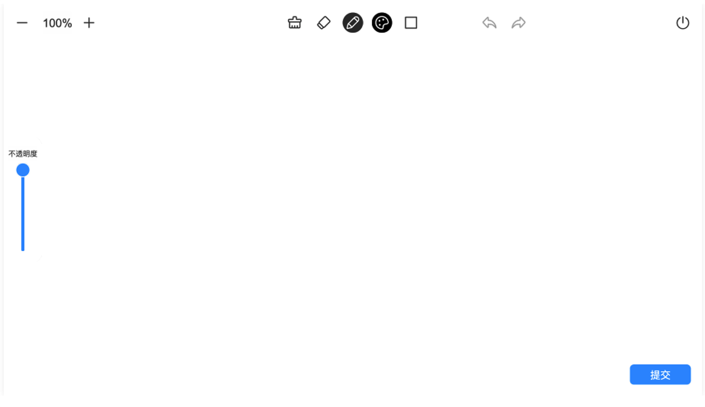
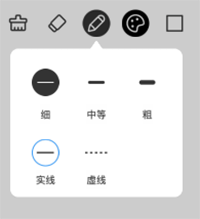
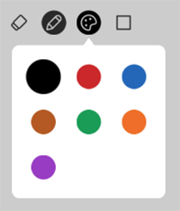
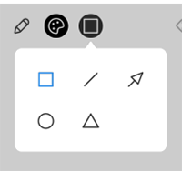
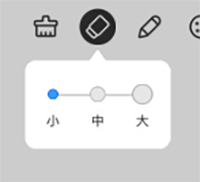
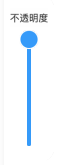

# 白板

部分模板需要用到白板，来进行对题目的作答。

## 白板功能

学生答题时，可以在白板内书写下答题的步骤等，白板的功能如下：

- 画笔粗细和类型：粗细分为细、中等和粗；类型分为实现和虚线。

    

- 画笔颜色：颜色分为黑、红、蓝、棕、绿、橙和紫。

    

- 形状：支持在白板内插入形状，形状包括矩形、直线、箭头、圆形和三角形。

    

- 橡皮擦：支持使用橡皮擦对白板内容进行擦除。橡皮擦分为小、中和大三个类型。

    

- 调节不透明度：支持对白板的不透明度进行调节。

    

- 撤销和恢复：支持点击 ，对白板进行撤销和恢复的操作。

- 清空：支持点击 ，对白板的内容进行清空。

- 关闭：支持点击 ，对当前的白板进行关闭。

- 提交：支持点击 ，对当前白板内书写的内容进行提交。
