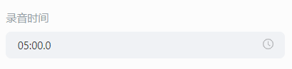

# 创作模板

工具栏点击 **创作模板**，下载完创作模板后，便可选择创作模板，将模板插入到编辑器内。

## 创作模板属性配置

选中创作模板，便可在编辑右侧的属性面板内，进行模板的属性配置。

属性侧显示的配置内容包括：

- 题目的标签：题目的知识点标签。
- 难度系数：题目的难易系数，老师可根据题目的难易程度自由设置，难易系数设置范围为 0-1。
- 题目倒计时：题目的答题倒计时，在设置的倒计时范围内，学生可以进行作文的答题，第一次作答时倒计时结束将自动提交学生答案，二次作答时倒计时结束将向学生确认是否提交答案。
- 标题：题目的标题。在场景中选中也可以编辑。
- 背景图片：题目的背景图片，建议尺寸 1920*1080（最佳）。
- 录音时间：老师可设置学生作答的录音最长录音时长，时间到了会弹框提示学生是否提交，默认为 5 分钟，老师可在 0-10 分钟内选择。

    

- 题目内容：可以根据需要自由添加素材库或本地的文字、图片、音频、视频或删除。在场景中选中也可以编辑。默认展示一句文字。

    

- 滑动区域图片：老师需要展示较多图片时可以勾选该选项，最多支持配置 20 张图片，上课和学生答题时图片可以滑动展示。默认展示 4 张图片，图片少于 4 张时建议老师使用 **题目内容** 配置图片。

    

- 参考答案：用于配置展示在答题结果页面的范文，并作为 AI 评测学生创作的参考依据。

    

- 好的表达：用于配置 AI 评测学生创作的参考依据，如学生的创作里有使用到好的表达的内容，评分将更高。不同的词汇或词组使用英文逗号 **,** 分隔。

    

