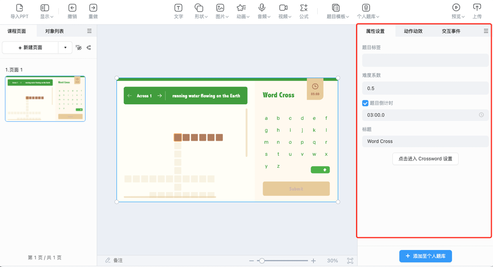
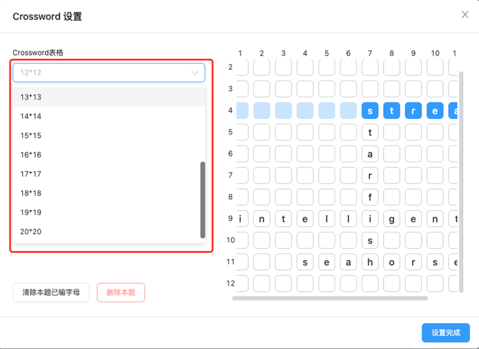
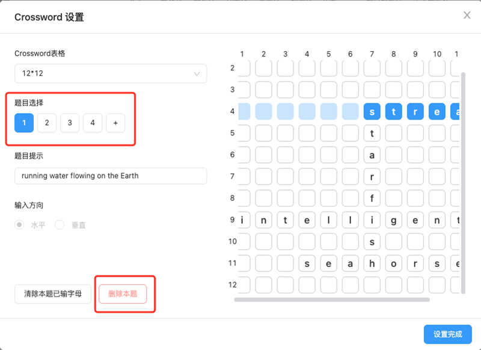
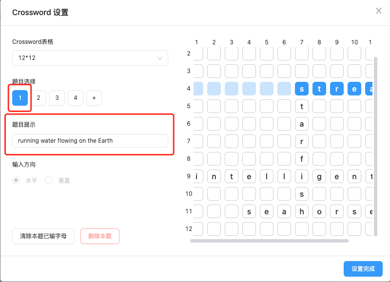
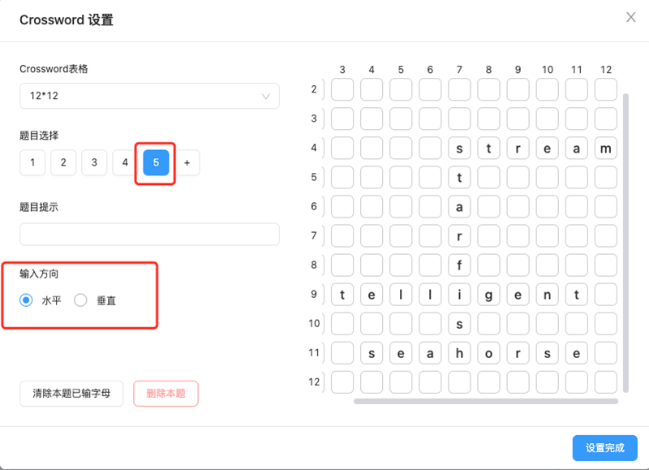
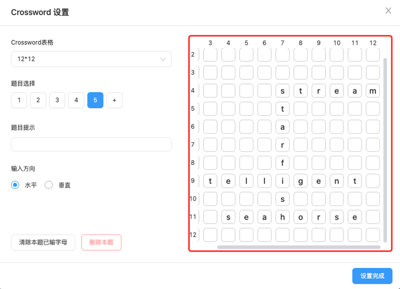

# CrossWord模板

工具栏点击 **题目模板**，下载完 **CrossWord模板** 后，便可选择 CrossWord 模板，将模板插入到编辑器内。

## CrossWord 模板属性配置

选中 CrossWord 模板，便可在编辑右侧的属性面板内，进行模板的属性配置。

属性侧配置内容包括：

- 题目标签：模板的知识点标签。

- 难度系数：模板的难易系数，老师可根据题目的难易程度自由设置，难易系数设置范围为 0-1。

- 题目倒计时：模板的答题倒计时，在设置的倒计时范围内，学生可以进行 CrossWord 的答题。

- 标题：模板的标题。

- 详细配置：点击 <kbd>点击进入 Crossword 设置</kbd> 按钮，进行 CrossWord 模板的详细配置，配置内容包括：

    - CrossWord 表格：可以配置题目需要的表格数，最大支持 20*20 的表格数量。

        

    - 题目数量：可以自由选择相应的题目，也可以添加、删除和设置题目的数量。

        

    - 题目提示：可以对每个题目分别设置题目的提示。

        

    - 输入方向：可以对每个题目分别设置输入方向，老师输入题目内容时，会根据设置的方向进行水平或者垂直的输入。

        

    - 输入区域：右侧为题目内容的输入区域，老师可以在这里进行题目题干的输入。

        

    - 保存配置：点击<kbd>设置完成</kbd>按钮，便完成并保存了对CrossWord模板的详细配置。
