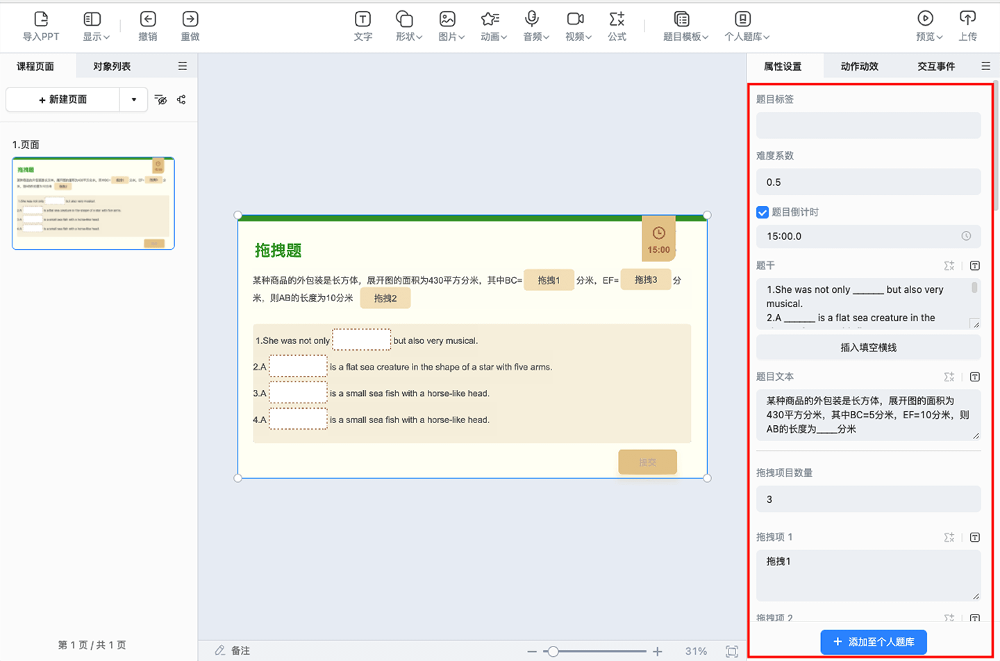
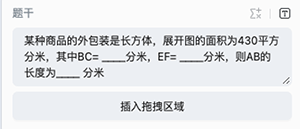
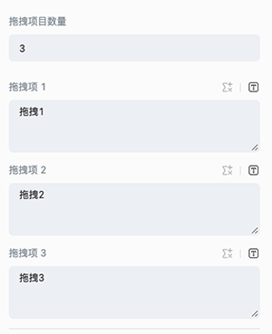
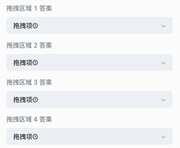
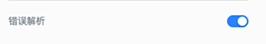
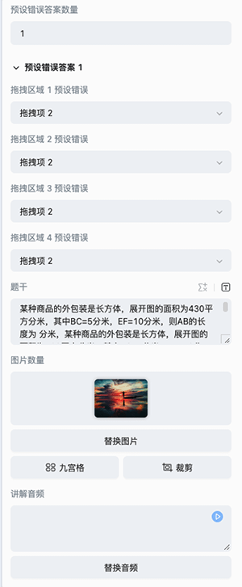
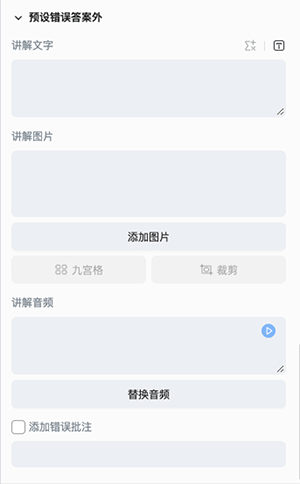

# 拖拽题模板

工具栏点击**题目模板**，下载完**拖拽题(通用)模板**后，便可选择选择题模板，将模板插入到编辑器内。

## 拖拽题模板属性配置

选中拖拽题(通用)模板，便可在编辑右侧的属性面板内，进行模板的属性配置。

属性侧配置内容包括：

- 题目标签：模板的知识点标签。

- 难度系数：模板的难易系数，老师可根据题目的难易程度自由设置，难易系数设置范围为 0-1。

- 题目倒计时：模板的答题倒计时，在设置的倒计时范围内，学生可以进行选择题的答题。

- 背景图片：模板的背景图片。

    

- 题干：模板的题干内容，可以根据需要选择文本题干或者公式题干，并可以自由在题干内插入拖拽区域。

    

- 题目文本：模板的题目文本，可以根据需要选择文本或者公式。

    

- 拖拽项配置：模板内拖拽项的数量和各个拖拽项的内容。

    

- 拖拽区域答案配置：题干里各个拖拽区域对应的拖拽项答案。

    

- 开启白板答题：开启此配置，学生答题时可以进行白板答题，白板的具体功能见[白板](../board/index.md)。

    

- 二次作答：开启此配置，学生答题时可以对第一次提交后错误的拖拽项进行再次答题。

    

- 跳转下一页：开启此配置，学生答题结束有按钮点击进入下一页。

    

- 开启错题解析：开启此配置，可以开启对预设错误答案的配置。

    

    - 预设错误答案配置：配置预设错误答案的数量、各个预设答案的讲解内容和错误批注。

        

    - 预设错误外答案配置：配置预设错误答案外的讲解内容和错误批注。

        
