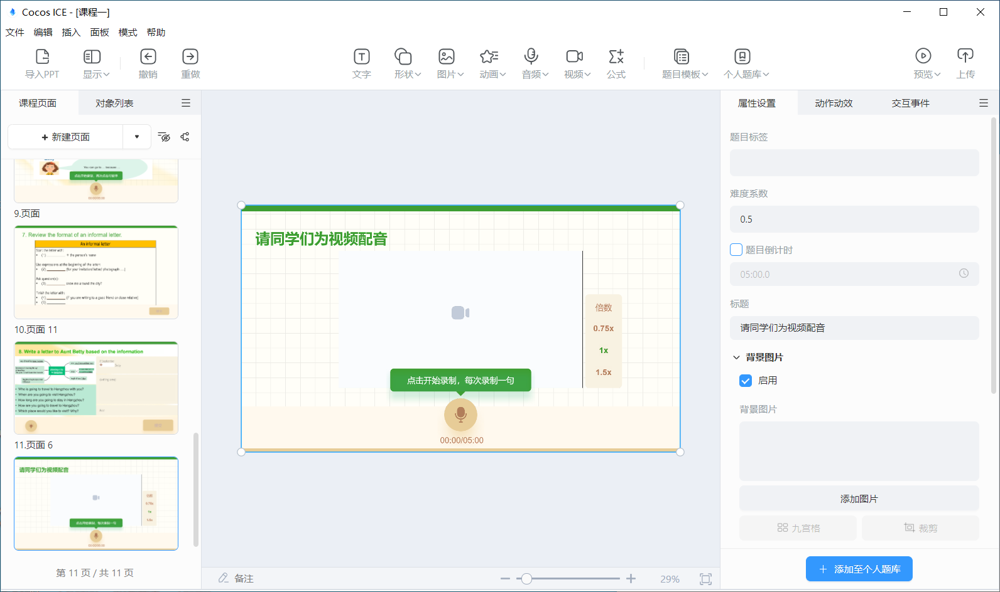
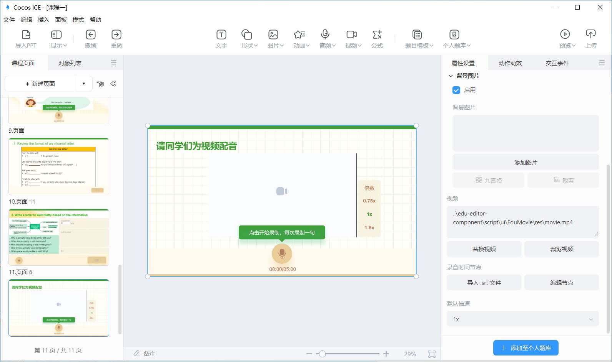
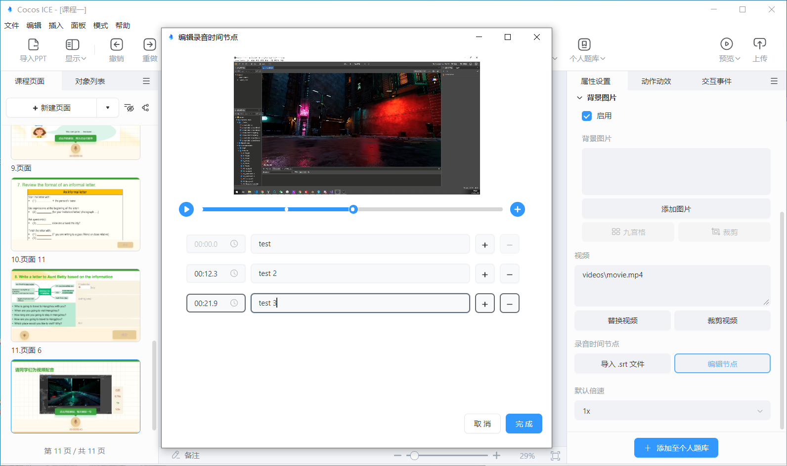

# 配音模板

工具栏点击 **配音模板**，下载完配音模板后，便可选择配音模板，将模板插入到编辑器内。

## 配音模板属性配置

选中配音模板，便可在编辑右侧的属性面板内，进行模板的属性配置。

属性侧显示的配置内容包括：

- 题目的标签：题目的知识点标签。
- 难度系数：题目的难易系数，老师可根据题目的难易程度自由设置，难易系数设置范围为 0-1。
- 题目倒计时：题目的答题倒计时，在设置的倒计时范围内，学生可以进行作文的答题，第一次作答时倒计时结束将自动提交学生答案，二次作答时倒计时结束将向学生确认是否提交答案。
- 标题：题目的标题。在场景中选中也可以编辑。
- 背景图片：题目的背景图片，建议尺寸 1920*1080（最佳）。

- 视频：题目中用于配音的视频，视频在作答时将自动静音。建议视频尺寸为 1280*720，支持的格式见 [视频对象说明](tools/object/video/index.md)
- 录音时间节点：配音题为分句配音，需要导入 **.srt** 文件或手动编辑分句的时间节点。
    - 导入 **.srt** 文件：点击 **导入.srt文件** 按钮，从本地选择含时间信息的字幕文件，即可根据字幕信息设置好配音时间节点。
    - 手动编辑录音时间节点：点击 **编辑节点** 按钮，或在导入 **.srt** 文件后，将打开 **编辑节点** 界面，支持如下操作：

        

        - 播放视频：点击左侧蓝色播放按钮，即可播放视频，也可通过进度条控制视频。
        - 添加时间节点：点击右侧蓝色添加按钮，或点击每行时间节点信息的加号，即可添加时间节点，进度条显示的白点即代表各个时间节点。
        - 编辑时间节点：每行时间节点可以在左侧设置开始时间，中间设置学生配音的文字内容，作为 AI 评测的依据。
        - 删除时间节点：点击每行时间节点右侧的减号按钮可以删除该行时间节点，第一行不允许删除。
        
- 默认倍速：题目中用于配音的视频的播放速度，默认为 1x。