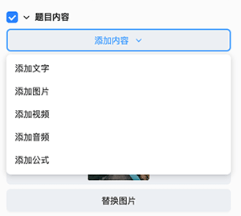

# 填空题模板

工具栏点击 **题目模板**，下载完填空题模板后，便可选择填空题模板，将模板插入到编辑器内。

## 填空题模板属性配置

选中填空题模板，便可在编辑右侧的属性面板内，进行模板的属性配置。

属性侧显示的配置内容包括：

- 题目的标签：题目的知识点标签。
- 难度系数：题目的难易系数，老师可根据题目的难易程度自由设置，难易系数设置范围为 0-1。
- 题目倒计时：题目的答题倒计时，在设置的倒计时范围内，学生可以进行作文的答题，第一次作答时倒计时结束将自动提交学生答案，二次作答时倒计时结束将向学生确认是否提交答案。
- 标题：题目的标题。在场景中选中也可以编辑。
- 背景图片：题目的背景图片，建议尺寸 1920*1080（最佳）。
- 题目内容：可以根据需要自由添加素材库或本地的文字、图片、音频、视频、公式或删除。在场景中选中也可以编辑。默认展示一张图片。

    

- 填空：配置题目的题干和答案

    

    - 默认展示 1 个填空区域，可以点击 **添加填空** 按钮增加，也可以通过属性或在场景中选中该区域删除。
    - 题干可以为公式或文本，答案的格式会与题干相对应。
    - 输入下划线 **_** 增加填空，连续的下划线不会成为多个填空区域，而是增加填空区域的长度。
    - 每个填空区域可以设置 1 个以上的正确答案，如果题干为文本，则答案也可以配置所属于的词汇类型，如果都配置了，则学生填写答案和词汇类型内的文本都算对，如果学生填写的答案与设置的答案不同，将在答题结果页提示学生错误。

- 开启白板答题：开启此配置，学生答题时可以进行白板答题，白板的具体功能见[白板](../board/index.md)。
- 跳转下一页：开启此配置，学生答题结束有按钮点击进入下一页。
- 开启错题解析：开启此配置，可以开启对预设错误答案的配置。

    

    - 预设错误答案配置：配置预设错误答案的数量、各个预设答案的讲解内容和错误批注。

        

    - 预设错误外答案配置：配置预设错误答案外的讲解内容和错误批注。

        