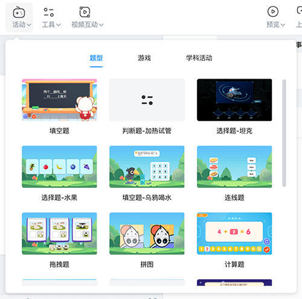
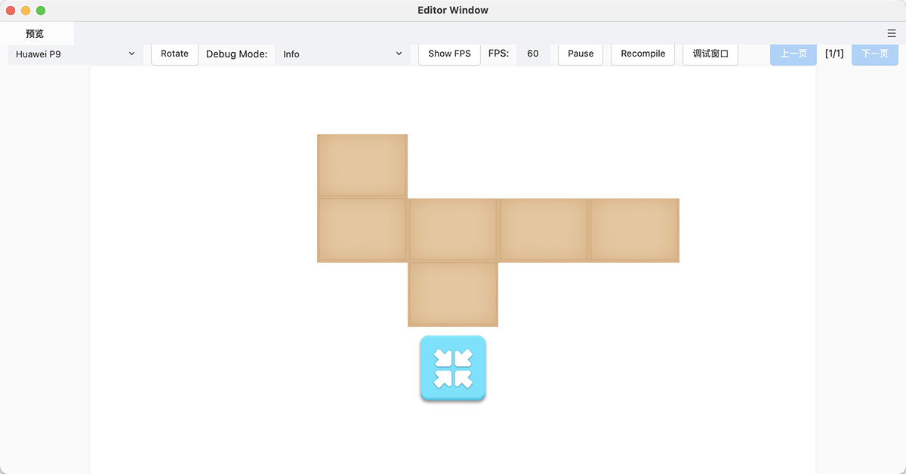
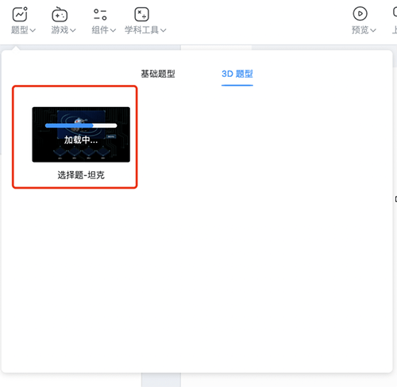

# 互动组件

目前互动组件包括 **活动组件**、**工具组件**、**视频互动组件**，点击上方工具栏中的相应按钮，即可根据需要选择添加。各类型组件都支持各公司自由开发和分类。

## 活动组件

活动组件包括 **题型**、**游戏** 和 **学科活动**，点击工具栏中的 **活动组件**，出现抽屉弹窗，选中活动组件后，该组件将立即置入场景编辑器中。

### 编辑游戏组件

在场景中选中添加的游戏组件，即可在 **属性** 面板设置游戏关卡数量、选项素材等。

下图为示例：

### 编辑题型组件

在场景中选中添加的题型组件，即可在 **属性设置** 面板设置题目选项的数量、内容、答案，以及答题反馈等。

下图为示例：

### 编辑学科活动组件

以 **立方体** 组件为例，添加后支持旋转，也支持展开成平面体，用于了解立方体的结构。

## 工具组件

工具组件包括 **通用组件** 和 **展示页**，点击工具栏中的 **工具** 并选择组件即可添加到场景面板中。

### 编辑工具组件

在场景中选中添加的工具组件，即可在 **属性设置** 面板编辑，不同组件其对应的属性面板中的属性参数不同。

## 视频互动组件

视频互动中为互动视频常用的组件，需要切换到 [互动视频制作模式](../../getting-started/make-interactive-video/index.md)，在互动视频编辑面板选中一个时间点，从顶部工具栏中的 **视频互动** 选择对象插入。

### 编辑视频互动组件

在场景或互动视频编辑面板选中添加的视频互动组件，即可在 **属性设置** 面板和 **交互事件** 面板设置参数。

## 自定义组件开发

详细自定义组件开发说明见 [**自定义组件**](../../developer/develop-component/index.md)。

## 互动组件服务端管理

为方便管理互动组件，节约资源空间，目前的互动组件统一放在服务端进行管理，用户若第一次插入某个互动组件，会自动从服务端下载该组件，加载进度条完成后，会将组件自动插入场景编辑器中进行使用。

下图为示例：

