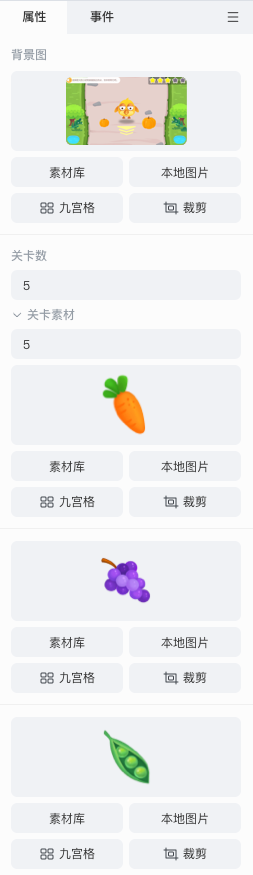
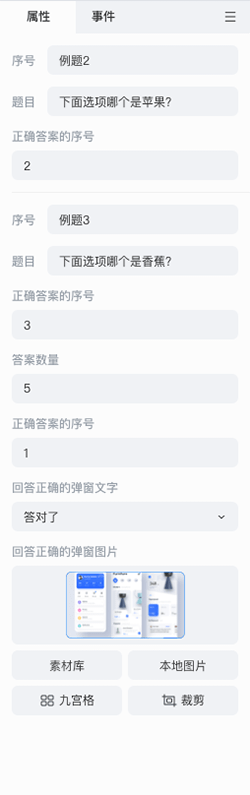

# 互动组件

目前互动组件包括：**游戏组件** 、**题型组件** 、**基础组件** 、**互动视频组件** 。组件都支持各公司自由开发和分类。

## 游戏组件

鼠标移入 **游戏** ，出现抽屉弹窗，选中游戏组件后，该组件将立即置入场景编辑器中。

### 编辑游戏组件

可通过 **属性** 面板设置游戏关卡数量、选项素材等。

下图为示例：

## 题型组件

鼠标移入 **题型** ，出现抽屉弹窗，目前题型组件包括 **基础题型** 和 **3D 题型** 两种，选中题型组件后，该组件将立即置入场景编辑器中。

### 编辑题目组件

可通过 **属性** 面板设置题目选项的数量、内容、答案，以及答题反馈等。

下图为示例：

## 基础组件

鼠标移入 **组件** ，出现抽屉弹窗，选中基础组件后，该组件将立即置入场景编辑器中。

### 编辑基础组件

不同组件其对应的属性面板中的属性参数也是不同的。

## 互动视频组件

使用互动视频组件需要切换到 **互动视频制作模式** ，点击 **互动视频** 面板中的视频，选中一个时间点，点击 **插入互动** 可在当前时间点添加分支选项或其他互动组件。

### 编辑互动视频组件

可通过 **属性** 面板和 **事件** 面板设置参数。

## 自定义组件开发

详细自定义组件开发说明见 [**自定义组件**](../../developer/develop-component/index.md) 。
