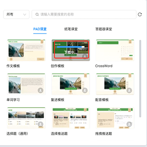

# 题目模板

题目模板用于存放所有定制的模板，点击上方工具栏中的 **题目模板**，会展开题目模板页面，用户可根据需要进行 **模板类别**、**学科筛选** 和 **关键词筛选**，选择合适的题目模板。

- **模板类别**：题目模板有为三个类别，分别为 **PAD课堂**、**纸笔课堂** 和 **答题器课堂**，用户可通过选择类别快速的找到各个类别下对应的模板。

    

    - **PAD课堂**：所有定制模板。

    - **纸笔课堂**：作文模板、选择题模板、填空题模板。

    - **答题器课堂**：单词学习模板、选择题模板。

- **学科筛选器**：筛选器默认选择全部，并支持筛选数学和英语学科的模板。

    

    - **全部**：所有定制模板。

    - **数学**：选择推送题模板、填空推送题模板、拖拽推送题模板、选择题（通用）模板、填空题（通用）模板和拖拽题（通用）模板。

    - **英语**：CrossWord模板、单词学习模板、作文模板、创作模板、复述模板、配音模板、选择题（通用）模板、填空题（通用）模板和拖拽题（通用）模板。

- **关键词筛选**：支持通过输入关键词，实现对题目模板的筛选。

## 编辑题目模板

添加了题目模板后，即可在 **属性面板** 进行题目模板的编辑。下图是以 **作文模板** 为例，选择了 **作文模板** 后，可以在属性侧进行对作文模板的编辑操作。

在模板的属性面板，点击下方的 <kbd>+添加至个人题库</kbd>，或者在对象列表选中模板节点，鼠标右键，点击 **添加至个人题库**。

为题目设置题目名称和标签后，便可将编辑好了的题目模板添加至 [**个人题库**](../personalcomponent/index.md)。

## 模板服务端管理

为方便管理模板，节约资源空间，目前的模板统一放在服务端进行管理，用户若需要使用模板，需点击下载按钮 ，从服务端下载该模板，下载完成后，便可将模板插入到场景编辑器中进行使用。

## 模板使用手册

各个模板的使用手册如下：

- [作文模板](writting/index.md)
- [创作模板](creating/index.md)
- [复述模板](retell/index.md)
- [配音模板](dub/index.md)
- [CrossWord模板](crossword/index.md)
- [单词学习模板](wordstudy/index.md)
- [选择题模板](choice_general/index.md)
- [填空题模板](fill/index.md)
- [拖拽题模板](drag_general/index.md)
- [选择推送题模板](pushtemplate_choice/index.md)
- [填空推送题模板](pushtemplate_fill/index.md)
- [拖拽推送题模板](pushtemplate_drag/index.md)