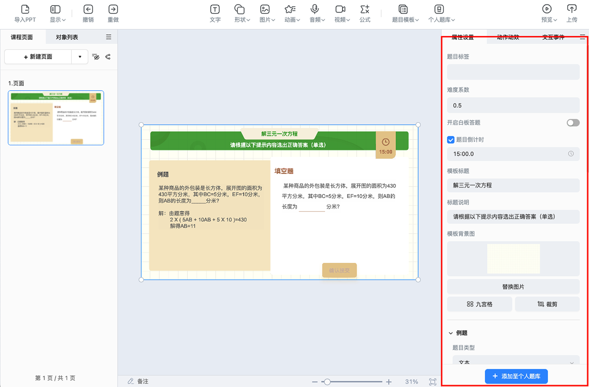

# 填空推送题模板

工具栏点击**题目模板**，下载完**填空推送题模板**后，便可选择模板，将模板插入到编辑器内。

## 填空推送题模板属性配置

选中填空推送题模板，便可在编辑右侧的属性面板内，进行模板的属性配置。

属性侧配置内容包括：

- 题目标签：模板的知识点标签。

- 难度系数：模板的难易系数，老师可根据题目的难易程度自由设置，难易系数设置范围为 0-1。

- 开启白板答题：开启白板答题：开启此配置，学生答题时可以进行白板答题，白板的具体功能见[白板](../board/index.md)。

- 题目倒计时：模板的答题倒计时，在设置的倒计时范围内，学生可以进行选择题的答题。

- 模板标题：模板的标题。

- 模板标题说明：模板标题的说明。

- 背景图片：模板的背景图片。

- 例题配置：配置例题区域的显示内容。

    

- 主观题配置：选择主观题，属性和编辑器便会展示主观题的配置内容。

    

    - 主观题题目配置：配置主观题题目的显示内容。

        

    - 主观题填空项答案配置：配置主观题的各个填空项对应的答案，可以对一个填空项设置多个答案。

        

        > **注意**：主观题需要配置的填空项，是根据题干里插入的填空横线数量决定的。

    - 预设错误答案配置：配置题目的预设错误答案数量、各个预设配置答案的内容和错误批注。如下图所示，填空项 1，填写了“9”或者“九”，会进入一级推送题 1。

        

        > **注意**：预设错误答案 1 会对应一级推送题 1，预设错误答案 2 会对应一级推送题 2，以此类推......

- 一级推送题配置：选择一级推送题，属性和编辑器便会展示一级推送题的配置内容。

    

    - 一级推送题讲解配置：配置一级推送题的讲解内容。

        
    
    - 一级推送题题目内容配置：配置一级推送题题目的显示内容。

        

    - 一级推送题题目选项配置：配置一级推送题的选项数量和各个选项的内容。

        

        > **注意**：若要配置多个一级推送题，可以在下图处选择切换到其他一级推送题，进行配置。

        

- 二级推送题配置：选择二级推送题，属性和编辑器便会展示二级推送题的配置内容。

    

    - 二级推送题讲解配置：配置二级推送题的讲解内容。

        

    - 二级推送题题目内容配置：配置二级推送题题目的显示内容。

        

    - 二级推送题填空项答案配置：配置二级推送题的各个填空项对应的答案，一个填空项可以配置多个答案。

        

        > **注意**：二级推送题需要配置的填空项，是根据题干里插入的填空横线数量决定的。
