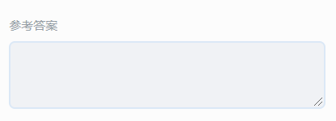
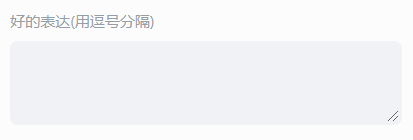

# 复述模板

工具栏点击 **复述模板**，下载完复述模板后，便可选择复述模板，将模板插入到编辑器内。

## 复述模板属性配置

选中复述模板，便可在编辑右侧的属性面板内，进行模板的属性配置。

属性侧显示的配置内容包括：

- 题目的标签：题目的知识点标签。
- 难度系数：题目的难易系数，老师可根据题目的难易程度自由设置，难易系数设置范围为 0-1。
- 题目倒计时：题目的答题倒计时，在设置的倒计时范围内，学生可以进行作文的答题，第一次作答时倒计时结束将自动提交学生答案，二次作答时倒计时结束将向学生确认是否提交答案。
- 标题：题目的标题。在场景中选中也可以编辑。
- 背景图片：题目的背景图片，建议尺寸 1920*1080（最佳）。
- 复述内容：支持配置视频或图片。

    - 配置视频：选中视频选项，点击 **替换视频** 按钮，可以从素材库或本地选择视频，支持配置视频默认倍速，视频在作答时将自动静音。配置后将自动修改录音时间。建议视频尺寸为 1280*720，支持的格式见 [视频对象说明](../../object/video/index.md)

        

    - 配置图片：选中图片选项，可以设置图片数量，每张图片可以点击 **替换图片** 按钮，可以从素材库或本地选择图片。超过 1 张图片时在答题时支持学生手动翻页。建议图片尺寸为 1080*600（最佳）。

        

- 录音时间：老师可设置学生作答的录音最长录音时长，时间到了会弹框提示学生是否提交，默认为 5 分钟。如果设置了视频和倍速，默认调整为视频时长*倍速，老师也可手动在 0-10 分钟内选择。

    

- 参考答案：用于配置复述的原文，作为 AI 评测学生复述内容的参考依据。

    

- 好的表达：用于配置 AI 评测学生复述内容的参考依据，如学生的复述内容里有使用到好的表达的内容，评分将更高。不同的词汇或词组使用英文逗号 **,** 分隔。

    