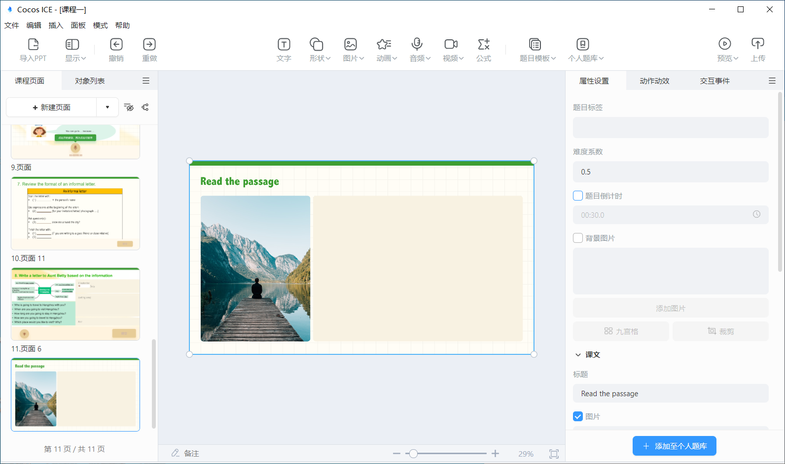
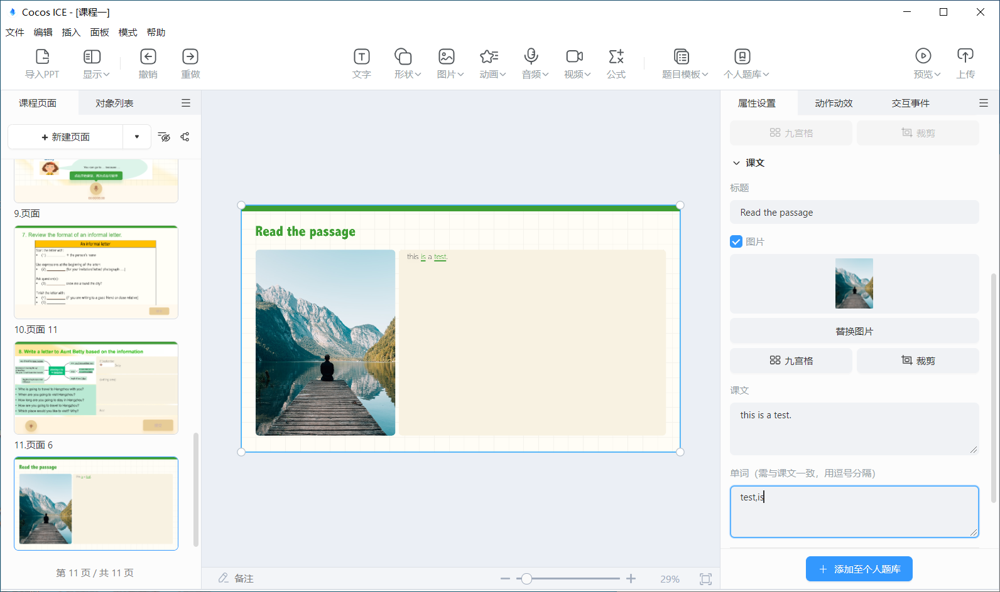
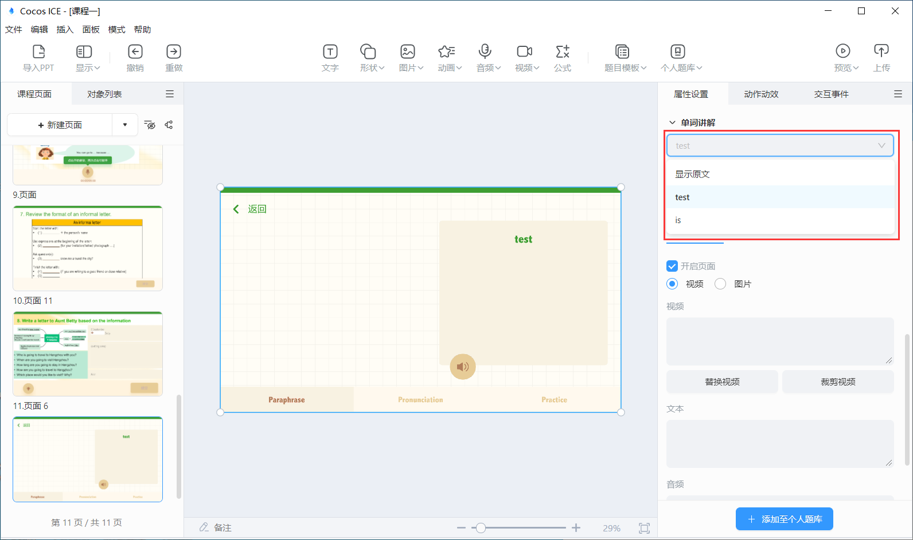
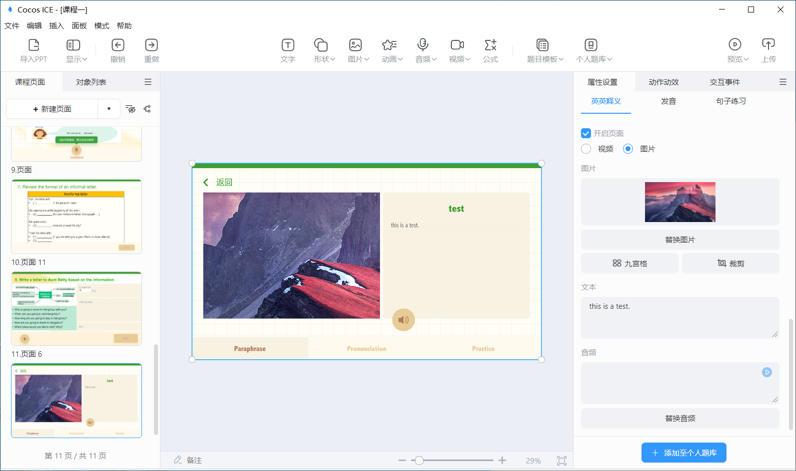
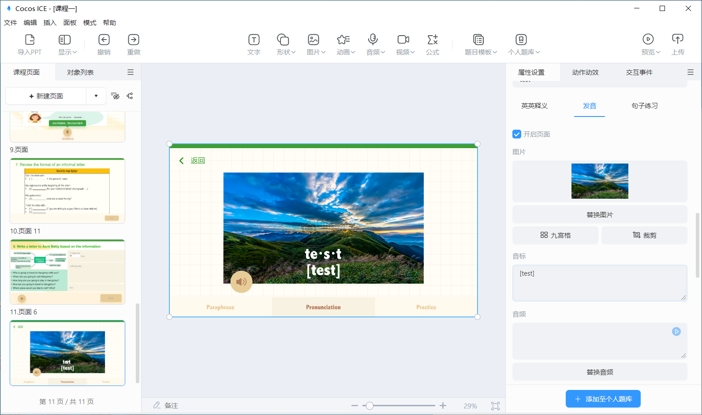
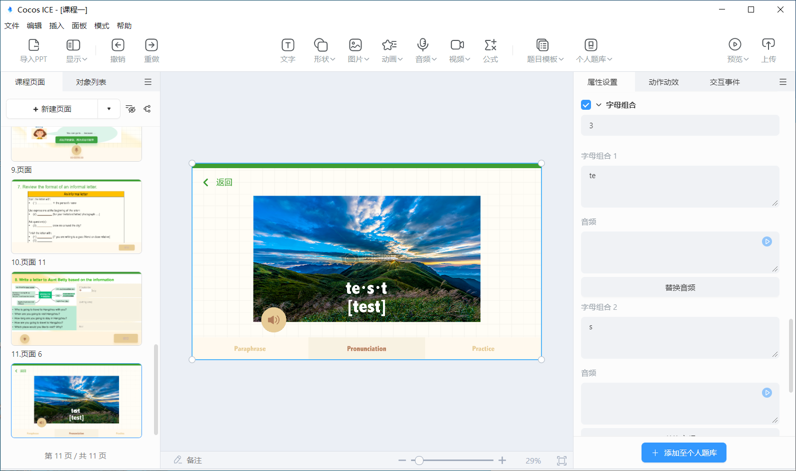
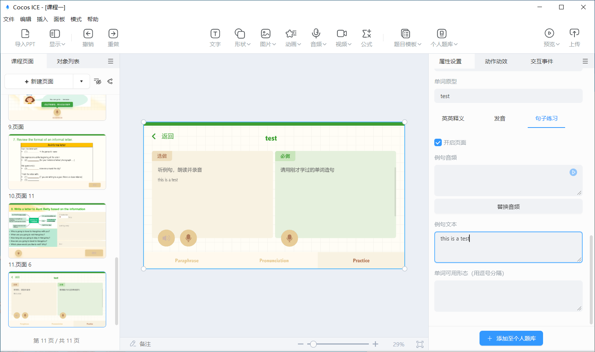

# 单词学习模板

工具栏点击 **单词学习模板**，下载完单词学习模板后，便可选择单词学习模板，将模板插入到编辑器内。

## 单词学习模板属性配置

选中单词学习模板，便可在编辑右侧的属性面板内，进行模板的属性配置。

属性侧显示的配置内容包括：

- 题目的标签：题目的知识点标签。
- 难度系数：题目的难易系数，老师可根据题目的难易程度自由设置，难易系数设置范围为 0-1。
- 题目倒计时：题目的答题倒计时，在设置的倒计时范围内，学生可以进行作文的答题，第一次作答时倒计时结束将自动提交学生答案，二次作答时倒计时结束将向学生确认是否提交答案。
- 背景图片：教学内容的背景图片，建议尺寸 1920*1080（最佳）。
- 课文：配置课文页面的标题、图片、课文文字、讲解的单词。

    

    - 标题：课文的标题。
    - 图片：课文页面显示的图片，建议为竖向图片。
    - 课文：课文的具体文字内容。
    - 单词：将课文中需要讲解的单词配置在该项，即可从课文中点击单词进入具体的单词学习页面。
        > **注意**：此处填写的单词必须与课文的形态完全一致，并使用英文逗号 **,** 分隔。

- 单词讲解：点击下拉框选择单词，编辑器内场景即可切换到相应单词的讲解页面，属性也会显示相应的配置内容，点击英英释义、发音、句子练习的 tab 可以切换显示相应界面。

    

    - 英英释义：配置单词的视频/图片、英英释义文本和音频。

        

        - 视频/图片：表示单词的视频或图片。
        - 文本：英英释义的文本。
        - 音频：英英释义的音频。
    - 发音：配置单词的图片、音标、完整发音音频、单词拆解的字母组合及音频。

        

        - 图片：表示单词的图片。
        - 音标：单词的音标。
        - 音频：单词完整的发音。
        - 字母组合：配置单词拆解的字母组合数量、字母、音频。

            

    - 句子练习：配置句子练习中例句的音频和文本、造句时单词的可用形态。

        

        - 例句音频：读例句练习中例句的音频。
        - 例句文本：读例句练习中例句的文本。
        - 单词可用形态：造句时单词的可用形态，例如过去时、进行时等，需要用英文逗号 **,** 分隔。
